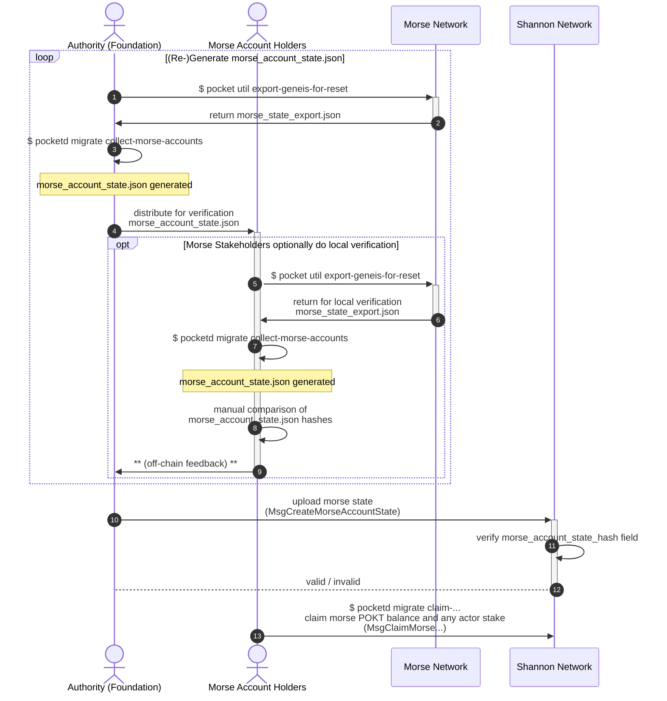

:::note

If you are a member of the migration working group, you can visit the [Notion docs](https://www.notion.so/buildwithgrove/Morse-to-Shannon-Migration-173a36edfff6809cb1cbe10827c040de?pvs=4) for more detail.

:::

This page provides a high-level overview of the migration process from Morse to Shannon.

## Table of Contents <!-- omit in toc -->

- [Context](#context)
- [Constraints](#constraints)
  - ["Why can't this be done in Shannon genesis?"](#why-cant-this-be-done-in-shannon-genesis)
- [Disambiguation / Definitions](#disambiguation--definitions)
- [E2E User Flow](#e2e-user-flow)

## Context

The migration described here aims to migrate account state from the Morse to Shannon Pocket Networks.

Specifically, this document describes the `Migration & Cutover` -> `Judgement Day` sections as it relates to this
migration of account state as seen in the [Migration Roadmap](./roadmap)

Due to the nature of this account state migration (i.e. "Constraints" below), this account state migration functionality
can be supported indefinitely from a technical perspective, but can be deprecated through a protocol update when
the foundation deems it appropriate.

## Constraints

### "Why can't this be done in Shannon genesis?"

Since the Morse and Shannon accounts rely on different signing key algorithms, a new private key **MUST** be generated for use with the Shannon network.

This new (Shannon) key can then be used to "claim" the identity and any balance (staked and unstaked) of an existing Morse account (or actor).

:::tip Background on key schemes

If you consider yourself to be "**advanced**" in cryptography and are curious to learn more,
reach out to the team at **Grove** to get access to the [Background on Key Schemes](https://www.notion.so/buildwithgrove/Background-Addresses-Key-Schemes-175a36edfff680ff8f23fc7599fd9107?pvs=25) document.

:::

## Disambiguation / Definitions

Some terminology has been refined and update from Morse to Shannon.

The following disambiguation should be applied in the scope of this section (Morse -> Shannon Migration) of documentation.

| Morse Term           | Shannon Term | Disambiguation                                                                                                                                                                                                                                                                                                                                                                                                                                                                                                                                    |
| -------------------- | ------------ | ------------------------------------------------------------------------------------------------------------------------------------------------------------------------------------------------------------------------------------------------------------------------------------------------------------------------------------------------------------------------------------------------------------------------------------------------------------------------------------------------------------------------------------------------- |
| Servicer             | Supplier     | Refers to the onchain actor that provides services (e.g. data), as well as the APIs (i.e. RPCs) to the corresponding service provides. In Morse, this involves running the Tendermint stack alongside the Morse API. In Shannon, this MUST include the ["Relayminer"](/operate/walkthroughs/supplier_walkthrough) alongside a Full CometBFT Node that could be owned by the RelayMiner (preferable) or delegated to an external RPC provider.                                                                                                     |
| Node                 | Full Node    | In Morse, this refers to a Tendermint full node running the Pocket Network Morse AppChain. In Shannon, this refers to a CometBFT full node running the Pocket Network Shannon AppChain. It is important to note that in Morse, in some instances, Servicers are sometimes referred to as Nodes which reflect the naming in the underlying implementation.                                                                                                                                                                                         |
| Validator / Servicer | Validator    | In Morse, staked Servicers are also Validators (in onchain data structure terms), where only the top 1000 (by stake) make up the active consensus set (potential block proposers). In Shannon, it is an independent actor that must explicitly stake and join the network as a Validator. Their role as a Supplier (if present) in Shannon is completely decoupled. Both leverage the Tendermint consensus mechanism to secure the network and propose blocks. The number of Validators in Morse is 1,000 and the number in Shannon is still TBD. |

## E2E User Flow

Given that Morse account claiming will be facilitated via "re-keying", the canonical "Morse migration state" need not be coordinated with Shannon MainNet lifecycle, other than to require that Shannon MainNet has launched.

Full details of the Shannon launch process can be found in [the overview](1_roadmap.md), but the token migration process can be split into four steps:

1. **Snapshot Selection**: The "authority" (i.e. Foundation / PNF) coordinates with Morse account/stake-holders **offchain** choose a height at which a snapshot will be taken.
2. **MorseAccountState proposal**: The "authority" retrieves the Morse snapshot and uses it to derive the "canonical" MorseAccountState for offchain validation by Morse account/stake-holders.
3. **MorseAccountState validation**: Morse account/stake-holders retrieve the Morse snapshot and use it to validate the proposed "canonical" MorseAccountState, providing offchain feedback (TODO_MAINNET_MIGRATION(@Olshansk): where/how?) if necessary.
4. **MorseAccountState import**: The "authority" imports the "canonical" MorseAccountState onchain (on Shannon).

**The following is a visual user story of the complete end-to-end migration process:**

