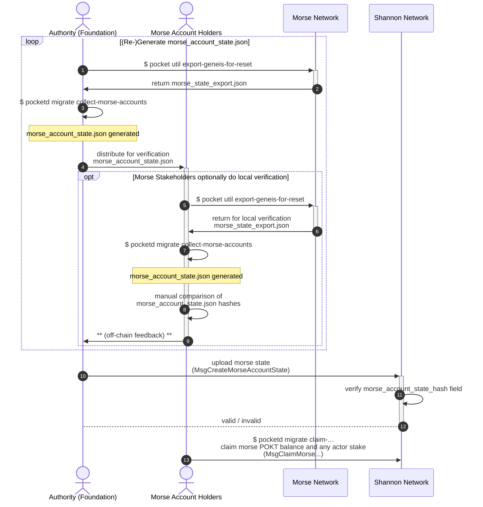

:::note
If you're in the migration working group, check the [Notion docs](https://www.notion.so/buildwithgrove/Morse-to-Shannon-Migration-173a36edfff6809cb1cbe10827c040de?pvs=4) for more detail.
:::

This page provides a basic introduction for the Morse -> Shannon Migration.

---

## Table of Contents <!-- omit in toc -->

- [Context](#context)
- [Constraints](#constraints)
  - ["Why can't this be done in Shannon genesis?"](#why-cant-this-be-done-in-shannon-genesis)
- [Disambiguation / Definitions](#disambiguation--definitions)
- [E2E User Flow](#e2e-user-flow)
  - [Token Migration: 4 Steps](#token-migration-4-steps)

---

## Context

- **The goal**: migrate account state from Morse to Shannon Pocket Networks.
- **Focus**: The `Migration & Cutover` → `Judgement Day` sections (see [Migration Roadmap](./roadmap)).
- **Note**: This migration approach can be supported indefinitely (tech-wise), but can be turned off later by protocol update.

---

## Constraints

### "Why can't this be done in Shannon genesis?"

- Morse and Shannon use different signing key algorithms.
- You **MUST** generate a new private key for Shannon.
- Use your new Shannon key to "claim" your Morse account identity and balance (staked & unstaked).

:::tip Background on key schemes
If you're **advanced** in crypto and want more info, ask the Grove team for access to the [Background on Key Schemes](https://www.notion.so/buildwithgrove/Background-Addresses-Key-Schemes-175a36edfff680ff8f23fc7599fd9107?pvs=25) doc.
:::

---

## Disambiguation / Definitions

- Some terms changed from Morse to Shannon.
- Use this mapping for this migration section:

| Morse Term           | Shannon Term | What It Means                                                                                                                                                                                                                                                                                                                           |
| -------------------- | ------------ | --------------------------------------------------------------------------------------------------------------------------------------------------------------------------------------------------------------------------------------------------------------------------------------------------------------------------------------- |
| Servicer             | Supplier     | - Onchain actor providing services (e.g. data) and APIs (RPCs). - **Morse**: runs Tendermint stack + Morse API. - **Shannon**: MUST run ["Relayminer"](/operate/walkthroughs/supplier_walkthrough) + Full CometBFT Node (owned or delegated).                                                                                 |
| Node                 | Full Node    | - **Morse**: Tendermint full node (Morse AppChain). - **Shannon**: CometBFT full node (Shannon AppChain). - **NOTE**: In Morse, "Servicers" are sometimes called "Nodes" (matches underlying implementation naming).                                                                                                          |
| Validator / Servicer | Validator    | - **Morse**: Staked Servicers = Validators (top 1000 by stake = consensus set). - **Shannon**: Validator is an independent actor, must explicitly stake & join. - Supplier role (if present) is decoupled. - Both use Tendermint consensus. - **Morse**: 1,000 Validators. - **Shannon**: Validator count TBD. |

---

## E2E User Flow

- Morse account claiming uses "re-keying".
- Migration state doesn't need to sync with Shannon MainNet launch — just wait until Shannon MainNet is live.
- Full Shannon launch details: see [the overview](1_roadmap.md).

### Token Migration: 4 Steps

1. **Snapshot Selection**

   - Foundation/PNF coordinates with Morse account holders **offchain**.
   - Choose a block height for the snapshot.

2. **MorseAccountState Proposal**

   - Foundation/PNF retrieves snapshot.
   - Derives "canonical" MorseAccountState for offchain validation by Morse account holders.

3. **MorseAccountState Validation**

   - Morse account holders retrieve snapshot.
   - Validate the proposed MorseAccountState.
   - Provide offchain feedback if needed.
     `TODO_MAINNET_MIGRATION(@Olshansk): where/how?`

4. **MorseAccountState Import**
   - Foundation/PNF imports canonical MorseAccountState onchain (Shannon).

---

**Visual: End-to-End Migration Process**

