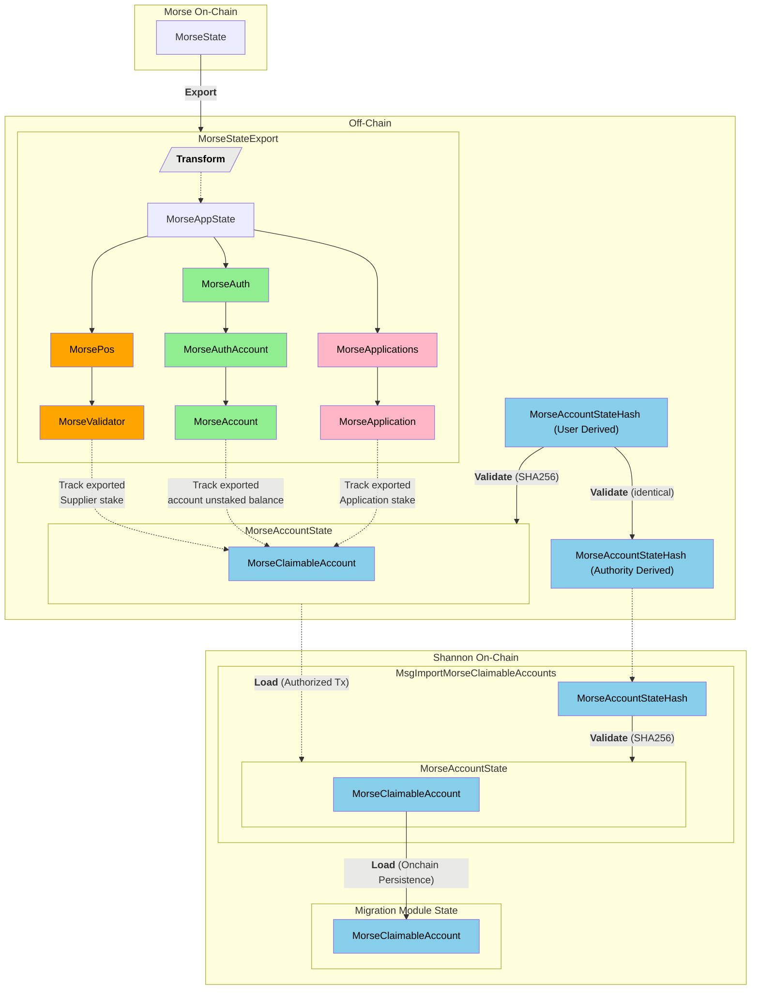

ETVL stands for Export -> Transform -> Validate -> Load.

## Table of Contents <!-- omit in toc -->

- [ETVL Overview](#etvl-overview)
- [ETVL Technical Design Considerations \& Constraints](#etvl-technical-design-considerations--constraints)
- [ETVL High-Level Flow](#etvl-high-level-flow)

### ETVL Overview

Given that this migration involves representing the state of one network (Morse) in another (Shannon), and that the migration process is ongoing (i.e. not a re-genesis; see [constraints](#constraints)),
there is an opportunity to optimize the exported Morse state with respect to its (very long-term) impact on Shannon.

### ETVL Technical Design Considerations & Constraints

In order to streamline the migration process for end users, as well as expedite a high quality implementation, the following design considerations were applied:

1. **Re-use existing Morse tooling**:

   - Using the Morse CLI to export the canonical `MorseStateExport` from the Morse network (`pocket util export-genesis-for-reset`).
   - Using the Morse CLI to export (armored) Morse account keys for use with the Shannon claiming CLI (`pocketd migrate claim-...`).

2. **Facilitate offchain social consensus on MorseAccountState**:

   - Using social consensus and cryptographic hash verification
   - Offchain agreement (i.e. feedback loop) on the "canonical" `MorseAccountState`

3. Minimize Shannon onchain state bloat

   - Minimize the size & optimize performance of (Shannon) persisted onchain data
   - Transform (offchain) the `MorseStateExport` into a `MorseAccountState`
   - Persist minimal Morse account representations as individual `MorseClaimableAccount`s

### ETVL High-Level Flow

