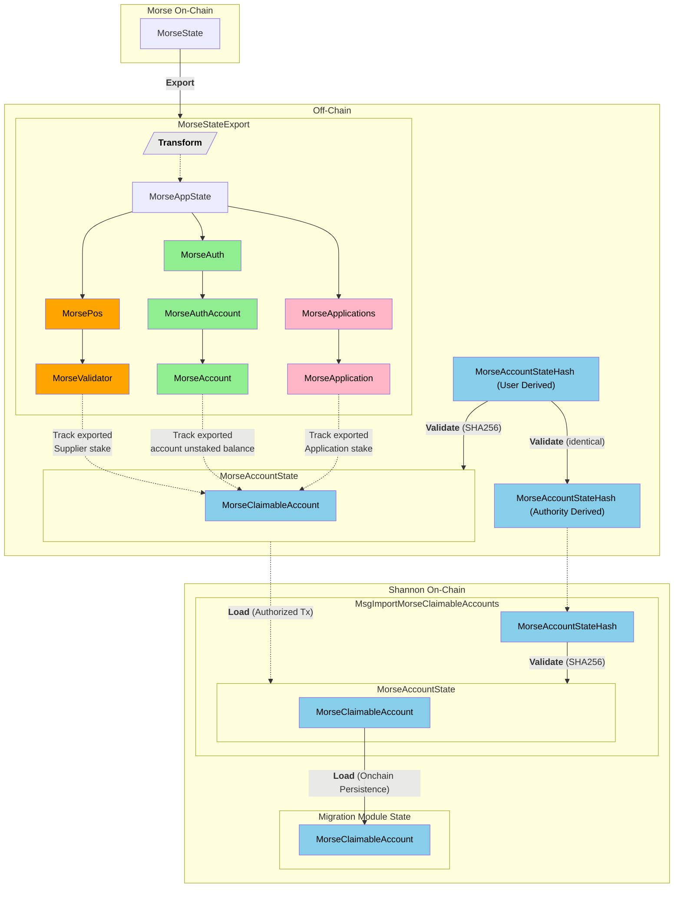

**ETVL = Export → Transform → Validate → Load**

---

## Table of Contents <!-- omit in toc -->

- [What is ETVL?](#what-is-etvl)
- [Design Considerations \& Constraints](#design-considerations--constraints)
- [ETVL High-Level Flow](#etvl-high-level-flow)

---

## What is ETVL?

- ETVL is the process for migrating state from the Morse network to the Shannon network.
- This is **not** a full restart (not a re-genesis).
- Goal: Optimize the exported Morse state for long-term impact on Shannon.

---

## Design Considerations & Constraints

1. **Re-use Morse CLI tooling**

   - Export Morse state:

     ```bash
     pocket util export-genesis-for-reset ...
     ```

   - Export Morse account keys for Shannon claims:

     ```bash
     pocketd txmigrate claim-...
     ```

2. **Offchain social consensus**

   - Use cryptographic hash verification
   - Community agrees offchain on the canonical `MorseAccountState`

3. **Minimize Shannon onchain state bloat**

   - Keep onchain data small and fast
   - Transform Morse export into minimal `MorseClaimableAccount` objects
   - Only store what’s needed for claims

---

## ETVL High-Level Flow


