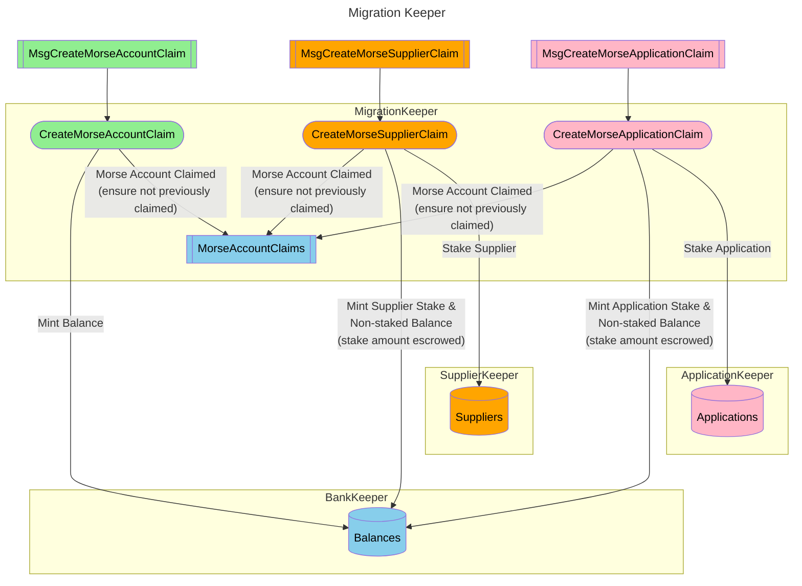

## Table of Contents <!-- omit in toc -->

- [Quick Overview](#quick-overview)
- [Prerequisites - What you will need](#prerequisites---what-you-will-need)
- [Morse → Shannon Account \& Balance Mapping](#morse--shannon-account--balance-mapping)
- [Keyrings: What \& How](#keyrings-what--how)
  - [How to export a Morse Key?](#how-to-export-a-morse-key)
  - [How to create a Shannon Key?](#how-to-create-a-shannon-key)

---

## Quick Overview

**_TL;DR: You run a claim command on Shannon using keys from both Morse & Shannon keyrings_**

This document provides an introduction with background and prerequisites on
how to claim your Morse account on Shannon.

## Prerequisites - What you will need

You will need:

1. A private Morse key (to prove you own the old account); _ed25519_
2. A private Shannon key (to receive the new balance); _secp256k1_
3. Morse's [`pocket` CLI (Morse)](https://github.com/pokt-network/homebrew-pocket-core)

   ```bash
   brew tap pokt-network/pocket-core
   brew install pocket
   ```

4. Shannon's [`pocketd` CLI (Shannon)](https://github.com/pokt-network/homebrew-pocketd)

   ```bash
   brew tap pokt-network/pocketd
   brew install pocketd
   ```

5. An understanding of what a keyring is
6. The ability to create new accounts in a Shannon keyring (explained below)
7. The ability to export a private key from a Morse keyring (explained below)

:::tip Shannon CLI

You can find more details about the Shannon CLI [here](../../tools/user_guide/pocketd_cli.md).

:::

---

## Morse → Shannon Account & Balance Mapping

:::note tl;dr

- **Staked Morse Application** → claim as Shannon Application (staked tokens + unstaked balance)
- **Staked Morse Servicer** → claim as Shannon Supplier (staked tokens + unstaked balance)
- **Unstaked Morse Account** → claim as Shannon Account (unstaked balance only)

:::

**How to read the following table:**

- Use this table to see how your Morse account type maps to Shannon
- Only the types/balances shown transfer over—read carefully!
- 1:1 = balance/stake is identical after migration

---

| Morse Account Type             | Shannon Account (Unstaked) | Shannon Application (Staked) | Shannon Supplier (Staked) |
| ------------------------------ | -------------------------- | ---------------------------- | ------------------------- |
| **Morse Account** (Unstaked)   | ✅ 1:1 unstaked balance    | ❌ N/A                       | ❌ N/A                    |
| **Morse Application** (Staked) | ✅ 1:1 unstaked balance    | ✅ 1:1 app stake             | ❌ N/A                    |
| **Morse Servicer**             | ✅ 1:1 unstaked balance    | ❌ N/A                       | ✅ 1:1 supplier stake     |

---



---

## Keyrings: What & How

:::tip Cosmos SDK Keyring

Shannon inherits mature keyring from the [Cosmos SDK](https://docs.cosmos.network/v0.46/run-node/keyring.html). You can reference their docs for more details.

:::

**Background on Keyrings**:

- A keyring is a piece of software that holds your private/public keys for a particular chain
- Morse and Shannon have **completely separate keyrings**
- To claim your Morse POKT tokens on Shannon, you will need BOTH Morse & Shannon keys:
  - **Morse key**: signs the `morse_signature` field within the full claim message
  - **Shannon key**: signs the full claim message on Shannon

---

### How to export a Morse Key?

- You **must** export your Morse private key (from `pocket`) to use with `pocketd`
- This is needed for the `morse_signature` field

The following command will export your Morse key:

```bash
./pocket accounts export ${MORSE_HEX_ADDRESS}
```

And should export the following file in the current directory: `pocket-account-<morse_address>.json`

To set a custom file name/location, you can run:

```bash
./pocket accounts export ${MORSE_HEX_ADDRESS} --path /your/custom/path.json
```

:::note

- The exported file is encrypted with the passphrase you set at export time
- You will need this passphrase when using the exported key with `pocketd`

:::

---

### How to create a Shannon Key?

You must have a named Shannon key in your keyring for `pocketd`

To create a new key, run:

```bash
pocketd keys add <key_name>
```

- Use any key name you want (e.g. `examplekey`)
- The key name (not the address) is required for claiming

:::important

**Save your mnemonic phrase somewhere safe!**

You need it to recover your account if you forget your password.

:::
