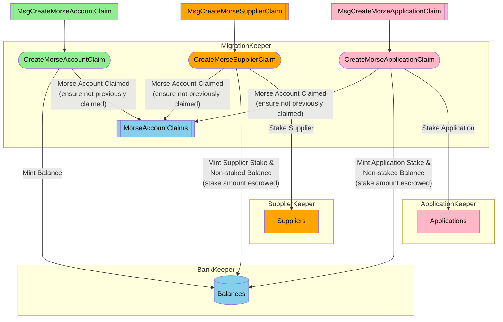

## Table of Contents <!-- omit in toc -->

- [Overview](#overview)
- [Summary - Morse to Shannon Account Type Mapping](#summary---morse-to-shannon-account-type-mapping)
  - [Summary - Important Notes](#summary---important-notes)
- [Morse \& Shannon CLIs](#morse--shannon-clis)
- [Onchain Actors \& Messages for Claiming](#onchain-actors--messages-for-claiming)
  - [Onchain Actors \& Messages Overview](#onchain-actors--messages-overview)
- [Morse \& Shannon Keyrings](#morse--shannon-keyrings)
  - [Morse Keyring CLI - Exporting Existing Account Keys](#morse-keyring-cli---exporting-existing-account-keys)
  - [Shannon Keyring CLI - Create New Account Keys](#shannon-keyring-cli---create-new-account-keys)
  - [Migration Module Tx CLI: `pocketd tx migrate`](#migration-module-tx-cli-pocketd-tx-migrate)

---

## Overview

- See [Authoritative Migration Overview](./overview) for the full migration process (Export, Transform, Validate, Load)
- This doc = how Morse account holders "claim" their balances on Shannon **AFTER** migration is done

---

## Summary - Morse to Shannon Account Type Mapping

- Use this table to see how your Morse account type maps to Shannon
- Only the types/balances shown transfer over—read carefully!
- 1:1 means your balance/stake is identical after migration

| Morse Account Type             | Shannon Account                                                                             | Shannon Application                                                               | Shannon Supplier                                                                                               |
| ------------------------------ | ------------------------------------------------------------------------------------------- | --------------------------------------------------------------------------------- | -------------------------------------------------------------------------------------------------------------- |
| **Morse Account** (Unstaked)   | ✅ Unstaked balance 1:1; E.g. 1000 uPOKT in Morse → 1000 uPOKT in Shannon                   | ❌ N/A                                                                            | ❌ N/A                                                                                                         |
| **Morse Application** (Staked) | ✅ Unstaked balance 1:1; E.g. 500 uPOKT unstaked in Morse → 500 uPOKT unstaked in Shannon   | ✅ App stake 1:1 E.g. 15000 uPOKT staked in Morse → 15000 uPOKT staked in Shannon | ❌ N/A                                                                                                         |
| **Morse Servicer**             | ✅ Unstaked balance 1:1; E.g. 2000 uPOKT unstaked in Morse → 2000 uPOKT unstaked in Shannon | ❌ N/A                                                                            | ✅ Servicer stake 1:1 E.g. 15000 uPOKT staked as Servicer in Morse → 15000 uPOKT staked as Supplier in Shannon |

---

### Summary - Important Notes

- **Account Claiming:**
  - Morse account (unstaked) → can ONLY claim as Shannon account
  - Only unstaked balance transfers (1:1)
- **Application Claiming:**
  - Morse Application → can ONLY claim as Shannon Application
  - Both unstaked balance and app stake transfer (1:1)
  - You MUST provide a Shannon service ID at claim time
- **Servicer to Supplier Claiming:**
  - Morse Servicer → can ONLY claim as Shannon Supplier
  - Both unstaked balance and staked amount transfer (1:1)
  - You MUST provide a Shannon supplier stake config at claim time
- **Claim Process Requirements:**
  - You MUST use private keys from BOTH Morse and Shannon keyrings
  - Morse key = generates `morse_signature` field
  - Shannon key = signs the claim message broadcast to Shannon network

---

## Morse & Shannon CLIs

- You will use **two CLI tools**:
  - `pocket` (Morse CLI)
    - Download: `brew install pokt-network/pocket-core/pocket`
    - Source: [`pokt-network/homebrew-pocket-core`](https://github.com/pokt-network/homebrew-pocket-core)
    - Acts as Morse keyring (ed25519)
    - Inspired by Cosmos SDK (2020)
  - `pocketd` (Shannon CLI)
    - Download: `brew install pokt-network/pocketd/pocketd`
    - Source: [`pokt-network/homebrew-pocketd`](https://github.com/pokt-network/homebrew-pocketd)
    - Acts as Shannon keyring (secp256k1)
    - Cosmos SDK (2025) + Pocket mods
    - More info: [pocketd CLI docs](../../tools/user_guide/pocketd_cli.md)

---

## Onchain Actors & Messages for Claiming

- If you were staked as an Application or Supplier ("Servicer") on Morse, you can claim your account as a staked actor on Shannon and keep your stake
- Which claim message to use depends on your Morse account type (see below)
- **Unstaked accounts CANNOT claim as staked actors**
- **Staked accounts MUST claim as their actor type**
- You CAN adjust your balances and stakes (on Morse) before "Judgement Day" and after claiming (on Shannon)

:::note tl;dr in other words

- `Morse` **Application** → claim as staked **Application** on `Shannon` (staked + unstaked balance)
- `Morse` **Servicer** → claim as staked **Supplier** on `Shannon` (staked + unstaked balance)
- `Morse` **Account** (no stake) → claim as **Account** on `Shannon` (unstaked balance only)
  :::

---

### Onchain Actors & Messages Overview



---

## Morse & Shannon Keyrings

:::tip Cosmos SDK Keyring
See [Cosmos SDK Keyrings](https://docs.cosmos.network/v0.46/run-node/keyring.html)
:::

- A **keyring** holds the private/public keypairs used to interact with a node
- `Morse` and `Shannon` each have their own **COMPLETELY INDEPENDENT** keyrings
- **ALL claim operations** require a private key from **BOTH** keyrings:
  - `Morse` key: generates the `morse_signature` field (required for all claim messages)
  - `Shannon` key: signs the `MsgClaimMorse...` message broadcast to the Shannon network

**Before you claim:**

- Export your Morse key (securely) from `pocket` (Morse CLI) so it can be used by `pocketd` (Shannon CLI)
- Make sure the desired Shannon destination account key exists in the Shannon keyring

---

### Morse Keyring CLI - Exporting Existing Account Keys

- To claim any Morse account on Shannon, you MUST export the private key from `pocket` CLI so it can be used by `pocketd`
- This is needed to sign the claim message's `morse_signature` field (proves authenticity)
- Export with:

  ```shell
  ./pocket accounts export ${MORSE_HEX_ADDRESS}
  ```

- The exported file is written to the current directory as `pocket-account-<morse_address>.json`
- To change the file name/location, use the `--path` flag (see `pocket accounts export --help`)

:::tip Updating the Exported File Name

- Use `--path` to set a custom file name/location

:::

- Example output:

  ```shell
  2025/03/13 10:10:50 Initializing Pocket Datadir
  2025/03/13 10:10:50 datadir = /home/bwhite/.pocket
  Enter Decrypt Passphrase # the account key's passphrase
  Enter Encrypt Passphrase # new export file encryption passphrase
  Enter an optional Hint for remembering the Passphrase # optional export file encryption passphrase hint
  Exported Armor Private Key:
  {"kdf":"scrypt","salt":"FACF0D1F9C12F151ABA2C67A708D4066","secparam":"12","hint":"","ciphertext":"b7NaRbigK2iAdVSOvRyhfYednXU5Dl9yP+RxrSRbAgVa6h5SOwBi+tBxF/8Bz7Uu/t/1x4yo1CQ9glTZF7Sq4MnKwFVwbCYtOHLCfBrDkQuG9O9jxgdQUk07Vw0KXCFw9yuRO+ktYX0brVj8Nh7asemX5VM8w0IHZmArZIuOftUxWDEQNe4/77HQFpFeFSbc"}
  Export Completed
  ```

:::note

- The exported file is encrypted with the passphrase you set at export time
- You will need this passphrase when using the exported key with `pocketd`
  :::

---

### Shannon Keyring CLI - Create New Account Keys

:::tip
See [pocketd CLI section](../../category/pocketd-cli) for more info on the Shannon CLI
:::

- You MUST have a named Shannon key in your local keyring for the environment where you'll use `pocketd`
- To create a new key:

  ```shell
  pocketd keys add <key_name>
  ```

- Example output:

  ```shell
  - address: pokt1090dvkv2me66ascnhw3fc3fpnk34l32wftzsu0
    name: examplekey
    pubkey: '{"@type":"/cosmos.crypto.secp256k1.PubKey","key":"A44Fk+fQwbZe4xto/DqOxMdy/YKI68yH4IfNRPB/23nW"}'
    type: local

  **Important** write this mnemonic phrase in a safe place.
  It is the only way to recover your account if you ever forget your password.

  bring iron tattoo denial extend federal aim best need all prosper draw learn possible tennis confirm vehicle inspire spoon stamp elbow rally behind supply
  ```

:::important

- You can use any key name you want (e.g. `examplekey` above)
- The key name (not address) will be required later when claiming the account
  :::

---

### Migration Module Tx CLI: `pocketd tx migrate`

- The `pocketd` CLI provides subcommands to claim Morse accounts on Shannon
- Each subcommand maps 1:1 to a different claim message (see diagram above)
- Which subcommand to use depends on whether the Morse account is staked, and as what actor type
- To see all available subcommands:

  ```shell
  pocketd tx migration --help
  ```

- Example output:

  ```shell
    claim-account
    claim-application
    claim-supplier
    collect-morse-accounts Collect account balances and stakes from [morse-state-export-path] JSON file and output to [morse-account-state-path] as JSON
    import-morse-accounts
    validate-morse-accounts
  ```

:::important

- Use the **`--from=<shannon_key_name>`** flag to specify which key in the `pocketd` keyring signs the Morse claim message
- This determines the Shannon "destination" address (where the Morse account balance will be minted/transferred)

:::
