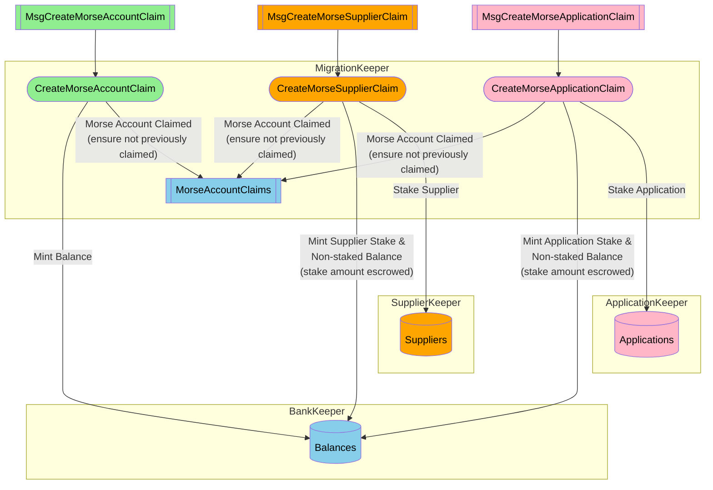

## Table of Contents <!-- omit in toc -->

- [Overview](#overview)
- [Summary - Morse to Shannon Account Type Mapping](#summary---morse-to-shannon-account-type-mapping)
  - [Summary - Important Notes](#summary---important-notes)
- [Morse \& Shannon CLIs](#morse--shannon-clis)
- [Onchain Actors \& Messages for Claiming](#onchain-actors--messages-for-claiming)
  - [Onchain Actors \& Messages Overview](#onchain-actors--messages-overview)
- [Morse \& Shannon Keyrings](#morse--shannon-keyrings)
  - [Morse Keyring CLI - Exporting Existing Account Keys](#morse-keyring-cli---exporting-existing-account-keys)
  - [Shannon Keyring CLI - Create New Account Keys](#shannon-keyring-cli---create-new-account-keys)
- [Claiming Morse Accounts](#claiming-morse-accounts)
  - [Migration Module Tx CLI: `pocketd tx migrate`](#migration-module-tx-cli-pocketd-tx-migrate)
  - [Claim a Basic Morse Account (Unstaked, Non-Actor)](#claim-a-basic-morse-account-unstaked-non-actor)
  - [Claim a Morse Application (Staked, Actor)](#claim-a-morse-application-staked-actor)
  - [Claim a Morse Supplier (Staked, Actor)](#claim-a-morse-supplier-staked-actor)
    - [Critical Analogy: Morse Servicer to Shannon Supplier](#critical-analogy-morse-servicer-to-shannon-supplier)
    - [Instructions to Claim A Morse Servicer as a Shannon Supplier](#instructions-to-claim-a-morse-servicer-as-a-shannon-supplier)

## Overview

See the [Authoritative Migration Overview](./overview) on how state is Exported, Transformed, Validated and Loaded from Morse to Shannon.

This document covers how individual Morse account/stake-holders can "claim" their Morse account balances on Shannon AFTER that process is complete.

## Summary - Morse to Shannon Account Type Mapping

This table illustrates how different Morse account types map to Shannon account types during the migration process, including which balances transfer over.

| Morse Account Type             | Shannon Account                                                                             | Shannon Application                                                               | Shannon Supplier                                                                                               |
| ------------------------------ | ------------------------------------------------------------------------------------------- | --------------------------------------------------------------------------------- | -------------------------------------------------------------------------------------------------------------- |
| **Morse Account** (Unstaked)   | ✅ Unstaked balance 1:1; E.g. 1000 uPOKT in Morse → 1000 uPOKT in Shannon                   | ❌ N/A                                                                            | ❌ N/A                                                                                                         |
| **Morse Application** (Staked) | ✅ Unstaked balance 1:1; E.g. 500 uPOKT unstaked in Morse → 500 uPOKT unstaked in Shannon   | ✅ App stake 1:1 E.g. 15000 uPOKT staked in Morse → 15000 uPOKT staked in Shannon | ❌ N/A                                                                                                         |
| **Morse Servicer**             | ✅ Unstaked balance 1:1; E.g. 2000 uPOKT unstaked in Morse → 2000 uPOKT unstaked in Shannon | ❌ N/A                                                                            | ✅ Servicer stake 1:1 E.g. 15000 uPOKT staked as Servicer in Morse → 15000 uPOKT staked as Supplier in Shannon |

### Summary - Important Notes

1. **Account Claiming:**

   - A basic Morse account (unstaked) MAY ONLY claim as a Shannon account
   - Only the unstaked balance transfers over (1:1 ratio)

2. **Application Claiming:**

   - A Morse Application MAY ONLY claim as a Shannon Application
   - Both unstaked balance and application stake transfer over (1:1 ratio)
   - While stake amounts remain the same, a Shannon service ID is required and must be provided at the time of claiming.

3. **Servicer to Supplier Claiming:**

   - A Morse Servicer MAY ONLY claim as a Shannon Supplier
   - Both unstaked balance and staked amount transfer over (1:1 ratio)
   - While stake amounts remain the same, a Shannon supplier stake configuration is required and must be provided at the time of claiming

4. **Claim Process Requirements:**
   - All claim operations require using private keys from both Morse and Shannon keyrings
   - Morse key generates the `morse_signature` field
   - Shannon key signs the claim message broadcast to the Shannon network

## Morse & Shannon CLIs

In this document, we will refer to two CLI tools:

1. `pocket`: The Morse CLI which can be downloaded using `homebrew` form the [`pokt-network/homebrew-pocket-core` tap](https://github.com/pokt-network/homebrew-pocket-core).

   - This CLI was "rolled in house" but heavily inspired by the Cosmos SDK circa 2020
   - This CLI acts as a keyring for Morse accounts (i.e. ed25519)

2. `pocketd`: The Shannon CLI which can be downloaded using `homebrew` form the [`pokt-network/homebrew-pocketd` tap](https://github.com/pokt-network/homebrew-pocketd).

   - This CLI is compliant with the latest Cosmos SDK (circa 2025) but modified to account for Pocket specific operations
   - This CLI acts as a keyring for Shannon accounts (i.e. secp256k1) and more (outside the scope of this document)
   - Additional documentation can be found [here](../../tools/user_guide/pocketd_cli.md).

## Onchain Actors & Messages for Claiming

Morse account holders who are staked as either Applications or Suppliers (aka "Servicers") on Morse, can claim their
accounts **as a staked actor** on Shannon; maintaining their existing actor stake.

Depending on whether the account is staked, and as which actor type, the corresponding claim message **MUST** be used.

An unstaked account **CANNOT** claim as a staked actor, and staked accounts **MUST** claim as their actor type.

Morse account/stake-holders **MAY** adjust their balances and stakes (on Morse) prior to **"Judgement Day"** **AND** after claiming (on Shannon).

:::note tl;dr in other words

- A `Morse` **Application** must claims its staked and unstaked balance as a staked **Application** on `Shannon`.
- A `Morse` **Servicer** must claim its staked and unstaked balance as a staked **Supplier** on `Shannon`.
- A `Morse` **Account** (no stake) must claim its unstaked balance as an **Account** on `Shannon`.

:::

### Onchain Actors & Messages Overview



## Morse & Shannon Keyrings

:::tip Cosmos SDK Keyring

You can learn more about Cosmos SDK Keyrings [here](https://docs.cosmos.network/v0.46/run-node/keyring.html)

:::

A **keyring** holds the private/public keypairs used to interact with a node.

Both `Morse` and `Shannon` have their own **COMPLETELY INDEPENDENT** keyrings which they use to manage their respective account keys.

**ALL claim operations** require the use of a private key from **BOTH** of these keyrings:

- The `Morse` key is used to generate the `morse_signature` field which is common to all claim messages.
- The `Shannon` key is used to sign the `MsgClaimMorse...` message which is broadcast to the Shannon network.

Since the Shannon CLI (`pocketd`) is used to broadcast the `ClaimTx`, the prerequisites are:

1. Export the `Morse` key (securely) from `pocket` (i.e. Morse CLI) so that it can be used by `pocketd` (i.e. Shannon CLI).
2. Ensure that the desired `Shannon` destination account key exists in the `Shannon` keyring.

### Morse Keyring CLI - Exporting Existing Account Keys

In order to claim any Morse (staked or not) account on Shannon, the corresponding private key MUST be exported from the `pocket` CLI such that it can be used by `pocketd` CLI.

It is necessary to sign the respective claim message's `morse_signature` field. This cryptographic primitive is critical as it establishes the authenticity of the claim.

The Morse CLI provides a subcommand which exports a given Morse account private key as an encrypted file: `pocket accounts export <morse_address>`.

The exported file is written to the current working directory with a name that follows the pattern `pocket-account-<morse_address>.json`.

:::tip Updating the Exported File Name

The exported file name and location can be changed by using the `--path` flag; see `pocket accounts export --help` for more details.

:::

For example, running the following command:

```shell
./pocket accounts export ${MORSE_HEX_ADDRESS}
```

Should produce output similar to the following:

```shell
2025/03/13 10:10:50 Initializing Pocket Datadir
2025/03/13 10:10:50 datadir = /home/bwhite/.pocket
Enter Decrypt Passphrase # the account key's passphrase
Enter Encrypt Passphrase # new export file encryption passphrase
Enter an optional Hint for remembering the Passphrase # optional export file encryption passphrase hint

Exported Armor Private Key:
{"kdf":"scrypt","salt":"FACF0D1F9C12F151ABA2C67A708D4066","secparam":"12","hint":"","ciphertext":"b7NaRbigK2iAdVSOvRyhfYednXU5Dl9yP+RxrSRbAgVa6h5SOwBi+tBxF/8Bz7Uu/t/1x4yo1CQ9glTZF7Sq4MnKwFVwbCYtOHLCfBrDkQuG9O9jxgdQUk07Vw0KXCFw9yuRO+ktYX0brVj8Nh7asemX5VM8w0IHZmArZIuOftUxWDEQNe4/77HQFpFeFSbc"}
Export Completed
```

:::note

The exported file is encrypted using the "encrypt passphrase" provided when the key was exported.

This passphrase will be required in subsequent steps when using the exported key with `pocketd`.

:::

### Shannon Keyring CLI - Create New Account Keys

:::tip

See the [pocketd CLI section](../../category/pocketd-cli) for more information on the Shannon CLI.

:::

In order to claim any Morse account, a named Shannon key MUST exist in the local keyring with respect to the environment where `pocketd` will be used.

To create a new key, use the `pocketd keys add <name>` subcommand:

```shell
pocketd keys add examplekey
```

Should produce output similar to the following:

```shell
- address: pokt1090dvkv2me66ascnhw3fc3fpnk34l32wftzsu0
  name: examplekey
  pubkey: '{"@type":"/cosmos.crypto.secp256k1.PubKey","key":"A44Fk+fQwbZe4xto/DqOxMdy/YKI68yH4IfNRPB/23nW"}'
  type: local


**Important** write this mnemonic phrase in a safe place.
It is the only way to recover your account if you ever forget your password.

bring iron tattoo denial extend federal aim best need all prosper draw learn possible tennis confirm vehicle inspire spoon stamp elbow rally behind supply
```

:::important

You can replace the key name (i.e. `examplekey` in the example above) with any name you choose.

The key name (not address) will be required later when claiming the account to indicate the Shannon destination account.
:::

## Claiming Morse Accounts

### Migration Module Tx CLI: `pocketd tx migrate`

The `pocketd` CLI provides a set of subcommands which can be used to claim Morse accounts on Shannon.

These subcommands map 1:1 to the different claim messages (see image above) which are used, depending on whether the Morse account being claimed is staked, and if so, as what actor type.

You can run the following command to see all available subcommands:

```shell
pocketd tx migrate --help
```

Which should produce output similar to the following:

```shell
  claim-account
  claim-application
  claim-supplier
  collect-morse-accounts Collect account balances and stakes from [morse-state-export-path] JSON file and output to [morse-account-state-path] as JSON
  import-morse-accounts
  validate-morse-accounts
```

:::important

The **`--from=<shannon_key_name>`** flag is used to specify which key in the `pocketd` keyring is used to sign any given Morse claim message.

**This determines and corresponds to the Shannon "destination" address; i.e., where the Morse account balance will be minted/transferred to.**

:::

### Claim a Basic Morse Account (Unstaked, Non-Actor)

:::note

If the Morse account is not staked as an Application or Supplier, it is considered an "unstaked" or "non-actor" account.

:::

Claiming an unstaked account will mint the unstaked balance of the Morse account being claimed to the Shannon account which the signer of the `MsgClaimMorseAccount`.

This unstaked balance amount is retrieved from the corresponding onchain `MorseClaimableAccount` which was imported by the foundation.

For example, running the following command:

```bash
pocketd migrate claim-account \
  ./pocket-account-8b257c7f4e884e49bafc540d874f33f91436e1dc.json \
  --from app1
```

Should prompt for a passphrase and produce output similar to the following:

```shell
Enter Decrypt Passphrase:
MsgClaimMorseAccount {
  "shannon_dest_address": "pokt1mrqt5f7qh8uxs27cjm9t7v9e74a9vvdnq5jva4",
  "morse_src_address": "8B257C7F4E884E49BAFC540D874F33F91436E1DC",
  "morse_signature": "hLGhLRjP6jgP6wgOIaYFxIxT3z4jb4IBDKovMkX5AqUsOqdF+rEIO5aofOKnmYW9BkqL0v2DfUfE3nj25FNhBA=="
}
Confirm MsgClaimMorseAccount: y/[n]:
```

### Claim a Morse Application (Staked, Actor)

Claiming a Morse Application account will:

1. **Mint Unstaked Balance**: The unstaked balance of the Morse Account being claimed will transfer to the unstaked balance of the Shannon account (i.e. signer of `MsgClaimMorseAccount`).
2. **Stake a new Application**: The staked balance of the Morse Application being claimed will stake the corresponding Shannon "destination" account as an Application.

:::note Same Balance, New Configurations

Note that even though the staked & unstaked balance map identically from Morse to Shannon, Shannon actors can modify the actual staking configurations (e.g. `service_id`).

:::

Recall that the unstaked balance and application stake amounts are retrieved from the corresponding onchain `MorseClaimableAccount` imported by the foundation.

For example, running the following command:

```bash
pocketd migrate claim-application \
  ./pocket-account-8b257c7f4e884e49bafc540d874f33f91436e1dc.json \
  anvil \
  --from app1
```

Should prompt for a passphrase and produce output similar to the following:

```shell
Enter Decrypt Passphrase: 
MsgClaimMorseApplication {
  "shannon_dest_address": "pokt1mrqt5f7qh8uxs27cjm9t7v9e74a9vvdnq5jva4",
  "morse_src_address": "1A0BB8623F40D2A9BEAC099A0BAFDCAE3C5D8288",
  "morse_signature": "6kax1TKdvP1sIGrz8lW8jH/jQxv5OiPiFq0/BG5sEfLwVyVNVXihDhJNXd0cQtwDiMPB88PCkvWZOdY/WMY4Dg==",
  "service_config": {
    "service_id": "anvil"
  }
}
Confirm MsgClaimMorseApplication: y/[n]: 
```

:::tip

See `pocketd tx migrate claim-application --help` for more details.

:::

### Claim a Morse Supplier (Staked, Actor)

:::warning TODO_MAINNET_MIGRATION(@bryanchriswhite, #1126)

Update with respect to owner/operator custodia/non-custodial addresses.

:::

#### Critical Analogy: Morse Servicer to Shannon Supplier

_tl;dr Claiming a Morse Servicer as a Shannon Supplier is like staking a new Shannon Supplier without explicitly specifying the `stake_amount`_

Claiming a Morse supplier requires a supplier config that is identical to that used by the Shannon CLI when staking a supplier (as opposed to claiming). See the [supplier staking config](../configs/supplier_staking_config.md).

The only difference between staking a new supplier on Shannon and **claiming** an existing supplier from Morse to Shannon is that the `stake_amount` is determined by the corresponding onchain `MorseClaimableAccount`'s supplier stake amount.

:::important Omit `stake_amount`

Omit the `stake_amount` field in a supplier config; providing it in when claiming a Morse supplier is an error.

:::

#### Instructions to Claim A Morse Servicer as a Shannon Supplier

Claiming a Morse supplier account will:

1. **Mint** the unstaked balance of the Morse account being claimed to the Shannon account; the signer of the `MsgClaimMorseAccount` is the Shannon "destination" account.
2. **Stake** the corresponding Shannon "destination" account as a supplier (on Shannon) with the given services configuration and same stake amount as the Morse application being claimed had (on Morse).

Both the unstaked balance and supplier stake amounts are retrieved from the corresponding onchain `MorseClaimableAccount` imported by the foundation.

For example, running the following command:

```bash
pocketd migrate claim-application \
  ./pocket-account-8b257c7f4e884e49bafc540d874f33f91436e1dc.json \
  ./supplier_service_configs.yaml \
  --from app1
```

Should prompt for a passphrase and produce output similar to the following:

```shell
Enter Decrypt Passphrase:
MsgClaimMorseAccount {
  "shannon_dest_address": "pokt1mrqt5f7qh8uxs27cjm9t7v9e74a9vvdnq5jva4",
  "morse_src_address": "8B257C7F4E884E49BAFC540D874F33F91436E1DC",
  "morse_signature": "hLGhLRjP6jgP6wgOIaYFxIxT3z4jb4IBDKovMkX5AqUsOqdF+rEIO5aofOKnmYW9BkqL0v2DfUfE3nj25FNhBA=="
}
Confirm MsgClaimMorseAccount: y/[n]:
```

:::tip

See: `pocketd tx migrate claim-supplier --help` for more details.

:::
