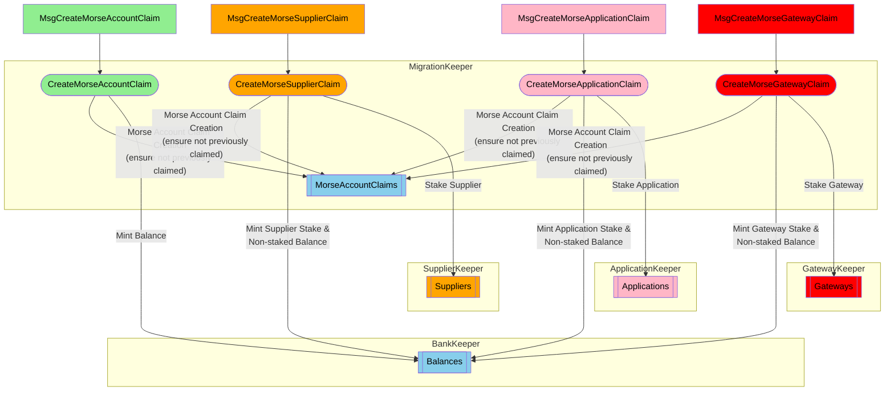

AFTER the canonical `MorseAccountState` has been imported onchain by the authority (see: [State Export / Transform / Import](./morse-migration.md#state-export--transform--validate)), Morse account/stake-holders can "claim" their Morse accounts onchain on Shannon.

### Onchain Actors & Messages

Morse account holders who are staked as either applications or suppliers (aka "servicers") on Morse, can claim their accounts **as a staked actor** on Shannon; maintaining their existing actor stake.
Depending on whether the account is staked, and as which actor type, the corresponding claim message MUST be used.

:::important
I.e.: An unstaked account CANNOT claim as a staked actor, and staked accounts MUST claim as their actor type.
:::

:::note
Account balances and stakes MAY be adjusted prior to "Judgement Day" OR after claiming on Shannon.
:::



:::warning TODO_IN_THIS_COMMIT: add structure and copy...

- CLI use cases and examples
    - account
    - application
    - supplier
:::

```bash
$ poktrolld migrate claim-account ./pocket-account-8b257c7f4e884e49bafc540d874f33f91436e1dc.json --from app1
Enter Decrypt Passphrase: 
MsgClaimMorseAccount {
  "shannon_dest_address": "pokt1mrqt5f7qh8uxs27cjm9t7v9e74a9vvdnq5jva4",
  "morse_src_address": "8B257C7F4E884E49BAFC540D874F33F91436E1DC",
  "morse_signature": "hLGhLRjP6jgP6wgOIaYFxIxT3z4jb4IBDKovMkX5AqUsOqdF+rEIO5aofOKnmYW9BkqL0v2DfUfE3nj25FNhBA=="
}
Confirm MsgClaimMorseAccount: y/[n]: 
```
