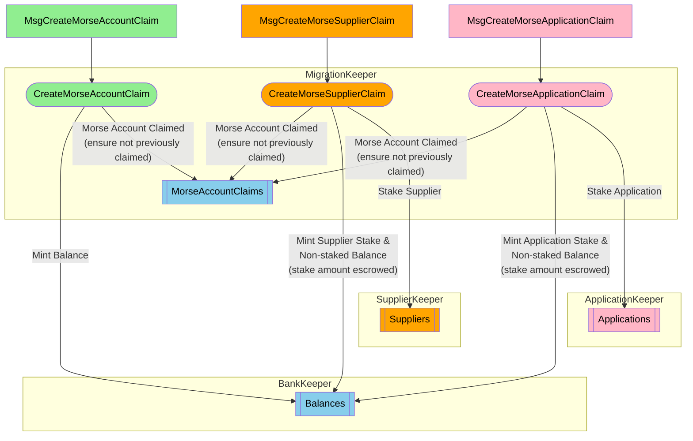

## Table of Contents <!-- omit in toc -->

- [Onchain Actors & Messages](#onchain-actors--messages)
- [Morse & Shannon Keyrings](#morse--shannon-keyrings)
  - [Exporting Morse Account Keys](#exporting-morse-account-keys)
  - [Shannon Keyring CLI](#shannon-keyring-cli)
- [Claiming Morse Accounts](#claiming-morse-accounts)
  - [Migration Module Tx CLI](#migration-module-tx-cli)
  - [Claim an Unstaked/non-Actor Account](#claim-an-unstakednonactor-account)
  - [Claim an Application Staked Account](#claim-an-application-staked-account)
  - [Claim a Supplier (Servicer) Staked Account](#claim-a-supplier-servicer-staked-account)

AFTER the canonical `MorseAccountState` has been imported onchain by the authority (see: [State Export / Transform / Import](./migration.md#state-export--transform--validate)), Morse account/stake-holders can "claim" their Morse accounts onchain on Shannon.

## Onchain Actors & Messages

Morse account holders who are staked as either applications or suppliers (aka "servicers") on Morse, can claim their accounts **as a staked actor** on Shannon; maintaining their existing actor stake.
Depending on whether the account is staked, and as which actor type, the corresponding claim message MUST be used.

:::important
I.e.: An unstaked account CANNOT claim as a staked actor, and staked accounts MUST claim as their actor type.
:::

:::note
Morse account/stake-holders MAY adjust their balances and stakes (on Morse) prior to "Judgement Day" AND after claiming (on Shannon).
:::



## Morse & Shannon Keyrings

Both Morse and Shannon have their own keyring which they use to manage their respective account keys.
ALL claim operations require the use of a private key from BOTH of these keyrings.
The morse key is used to generate the `morse_signature` field which is common to all claim messages.
The shannon key is used to sign the `MsgClaimMorse...` message which is broadcast to the Shannon network.

Since the Shannon CLI (`poktrolld`) is used to broadcast the claim tx, the prerequisites are:
1. To export the Morse key (securely) so that it can be used by `poktrolld`.
2. Ensure that the desired Shannon destination account key exists in the Shannon keyring.

### Exporting Morse Account Keys

In order to claim any Morse account, the corresponding private key MUST be exported such that it can be used by `poktrolld` to sign the respective claim message's `morse_signature` field.
This cryptographic primitive is critical as it establishes the authenticity of the claim.

The Morse CLI provides a subcommand which exports a given Morse account private key as an encrypted file `pocket accounts export <morse_address>`:

```shell
$ ./pocket accounts export ${MORSE_HEX_ADDRESS}
2025/03/13 10:10:50 Initializing Pocket Datadir
2025/03/13 10:10:50 datadir = /home/bwhite/.pocket
Enter Decrypt Passphrase # the account key's passphrase
Enter Encrypt Passphrase # new export file encryption passphrase
Enter an optional Hint for remembering the Passphrase # optional export file encryption passphrase hint

Exported Armor Private Key:
{"kdf":"scrypt","salt":"FACF0D1F9C12F151ABA2C67A708D4066","secparam":"12","hint":"","ciphertext":"b7NaRbigK2iAdVSOvRyhfYednXU5Dl9yP+RxrSRbAgVa6h5SOwBi+tBxF/8Bz7Uu/t/1x4yo1CQ9glTZF7Sq4MnKwFVwbCYtOHLCfBrDkQuG9O9jxgdQUk07Vw0KXCFw9yuRO+ktYX0brVj8Nh7asemX5VM8w0IHZmArZIuOftUxWDEQNe4/77HQFpFeFSbc"}
Export Completed
```

:::note
The exported file is encrypted using the "encrypt passphrase" provided when the key was exported.
This passphrase will be required in subsequent steps when using the exported key with `poktrolld`.
:::

By default, the exported file is written to the current working directory with a name that follows the pattern `pocket-account-<morse_address>.json`.
The exported file name and location can be changed by using the `--path` flag; see `pocket accounts export --help` for more details.

### Shannon Keyring CLI

In order to claim any Morse account, a named Shannon key MUST exist in the local keyring, with respect to the environment where `poktrolld` will be used.
To create a new key, use the `poktrolld keys add <name>` subcommand:

```shell
$poktrolld keys add examplekey                                                                             ✔  1.23.0  

- address: pokt1090dvkv2me66ascnhw3fc3fpnk34l32wftzsu0
  name: examplekey
  pubkey: '{"@type":"/cosmos.crypto.secp256k1.PubKey","key":"A44Fk+fQwbZe4xto/DqOxMdy/YKI68yH4IfNRPB/23nW"}'
  type: local


**Important** write this mnemonic phrase in a safe place.
It is the only way to recover your account if you ever forget your password.

bring iron tattoo denial extend federal aim best need all prosper draw learn possible tennis confirm vehicle inspire spoon stamp elbow rally behind supply
```

:::important
The key name (not address) will be required later when claiming the account to indicate the Shannon destination account.
:::

See: `poktrolld keys add --help` for more details.

## Claiming Morse Accounts

### Migration Module Tx CLI

The `poktrolld` CLI provides a set of subcommands which can be used to claim Morse accounts on Shannon.
These subcommands map 1:1 to the different claim messages (see above) which are used, depending on whether the Morse account being claimed is staked, and if so, as what actor type.

```bash
$ poktrolld tx migrate --help
  claim-account          
  claim-application          
  claim-supplier          
  collect-morse-accounts Collect account balances and stakes from [morse-state-export-path] JSON file and output to [morse-account-state-path] as JSON

# TODO_MAINNET(@bryanchriswhite, #1034): Update this once the CLI is available.
```

:::important
The **`--from=<shannon_key_name>`** flag is used to specify which key in the `poktrolld` keyring is used to sign any given Morse claim message.

**This determines and corresponds to the Shannon "destination" address; i.e., where the Morse account balance will be minted.**
:::

### Claim an Unstaked/non-actor Account

:::note
If the Morse account is not staked as an application or supplier, it is considered an "unstaked" or "non-actor" account.
:::

Claiming an unstaked account will mint the unstaked balance of the Morse account being claimed to the Shannon account which the signer of the `MsgClaimMorseAccount`.

This unstaked balance amount is retrieved from the corresponding onchain `MorseClaimableAccount` which was imported by the foundation (see: [State Export / Transform / Import](./migration.md#state-export--transform--validate)).

```bash
$ poktrolld migrate claim-account \
  ./pocket-account-8b257c7f4e884e49bafc540d874f33f91436e1dc.json \
  --from app1
Enter Decrypt Passphrase: 
MsgClaimMorseAccount {
  "shannon_dest_address": "pokt1mrqt5f7qh8uxs27cjm9t7v9e74a9vvdnq5jva4",
  "morse_src_address": "8B257C7F4E884E49BAFC540D874F33F91436E1DC",
  "morse_signature": "hLGhLRjP6jgP6wgOIaYFxIxT3z4jb4IBDKovMkX5AqUsOqdF+rEIO5aofOKnmYW9BkqL0v2DfUfE3nj25FNhBA=="
}
Confirm MsgClaimMorseAccount: y/[n]: 
```

### Claim an Application Staked Account

Claiming a Morse application account will:
1. Mint the unstaked balance of the Morse account being claimed to the Shannon account which the signer of the `MsgClaimMorseAccount`.
2. Stake the corresponding Shannon "destination" account as an application (on Shannon) for the given `<service_id>` and with the same stake amount as the Morse application being claimed had (on Morse).

Both the unstaked balance and application stake amounts are retrieved from the corresponding onchain `MorseClaimableAccount` which was imported by the foundation (see: [State Export / Transform / Import](./migration.md#state-export--transform--validate)).

```bash
$ poktrolld migrate claim-application \
  ./pocket-account-8b257c7f4e884e49bafc540d874f33f91436e1dc.json \
  svc1 \
  --from app1
Enter Decrypt Passphrase: 
MsgClaimMorseAccount {
  "shannon_dest_address": "pokt1mrqt5f7qh8uxs27cjm9t7v9e74a9vvdnq5jva4",
  "morse_src_address": "8B257C7F4E884E49BAFC540D874F33F91436E1DC",
  "morse_signature": "hLGhLRjP6jgP6wgOIaYFxIxT3z4jb4IBDKovMkX5AqUsOqdF+rEIO5aofOKnmYW9BkqL0v2DfUfE3nj25FNhBA=="
}
Confirm MsgClaimMorseAccount: y/[n]: 
```

See: `poktrolld tx migrate claim-application --help` for more details.

### Claim a Supplier (Servicer) Staked Account

:::important
Claiming a Morse supplier requires a supplier config that is identical to that used by the Shannon CLI when staking a supplier (as opposed to claiming): [Supplier staking config](../configs/supplier_staking_config.md).

The only difference when **claiming** a supplier is that the `stake_amount` is determined by the corresponding onchain `MorseClaimableAccount`'s supplier stake amount.

**Omit the `stake_amount` field in a supplier config; providing it in when claiming a Morse supplier is an error.**
:::

:::warning TODO_MAINNET(@bryanchriswhite, #1126)
Update with respect to owner/operator addresses.
:::

Claiming a Morse supplier account will:
1. Mint the unstaked balance of the Morse account being claimed to the Shannon account which the signer of the `MsgClaimMorseAccount`.
2. Stake the corresponding Shannon "destination" account as a supplier (on Shannon) with the given services configuration and same stake amount as the Morse application being claimed had (on Morse).

Both the unstaked balance and supplier stake amounts are retrieved from the corresponding onchain `MorseClaimableAccount` which was imported by the foundation (see: [State Export / Transform / Import](./migration.md#state-export--transform--validate)).

```bash
$ poktrolld migrate claim-application \
  ./pocket-account-8b257c7f4e884e49bafc540d874f33f91436e1dc.json \
  ./supplier_service_configs.yaml \
  --from app1
Enter Decrypt Passphrase: 
MsgClaimMorseAccount {
  "shannon_dest_address": "pokt1mrqt5f7qh8uxs27cjm9t7v9e74a9vvdnq5jva4",
  "morse_src_address": "8B257C7F4E884E49BAFC540D874F33F91436E1DC",
  "morse_signature": "hLGhLRjP6jgP6wgOIaYFxIxT3z4jb4IBDKovMkX5AqUsOqdF+rEIO5aofOKnmYW9BkqL0v2DfUfE3nj25FNhBA=="
}
Confirm MsgClaimMorseAccount: y/[n]: 
```

See: `poktrolld tx migrate claim-supplier --help` for more details.
