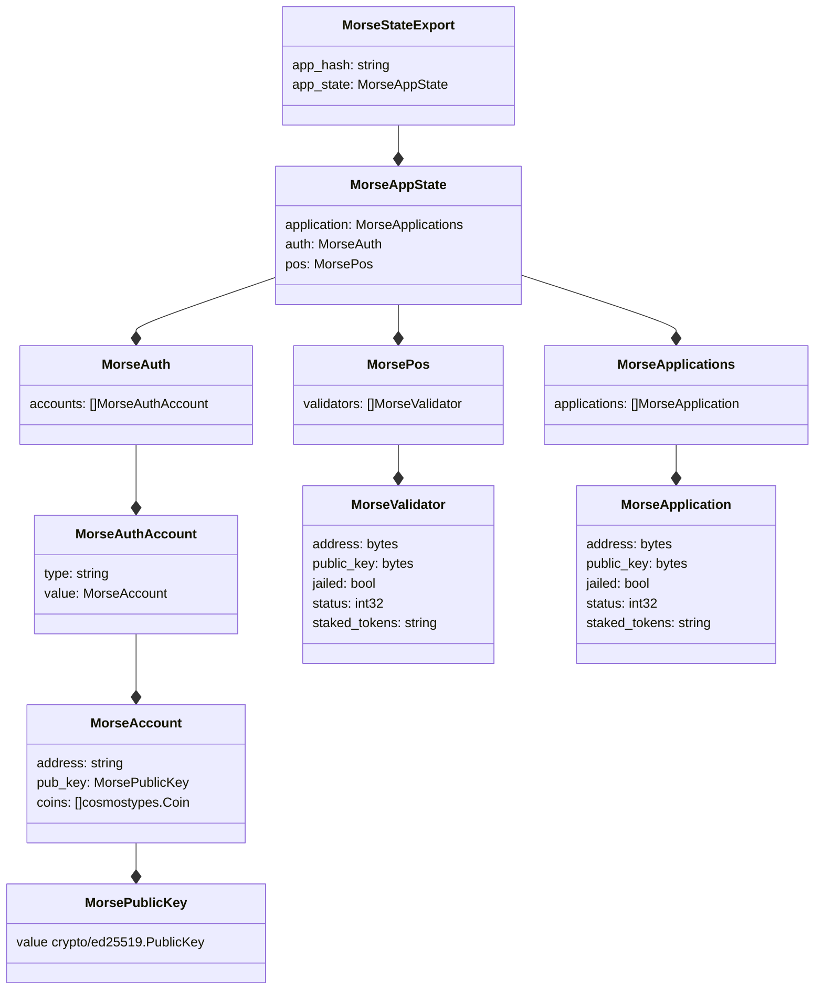
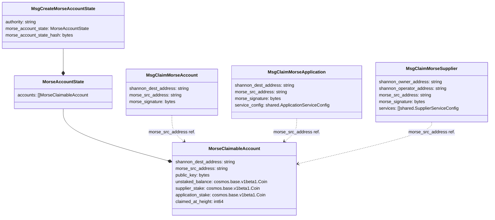

## Table of Contents <!-- omit in toc -->

- [Offchain Shannon Structure(s)](#offchain-shannon-structures)
- [Onchain Shannon Structure(s)](#onchain-shannon-structures)

## Offchain Shannon Structure(s)

## Onchain Shannon Structure(s)

For more info regarding onchain message usage, see [onchain actors & messages](./claiming.md#onchain-actors--messages).
