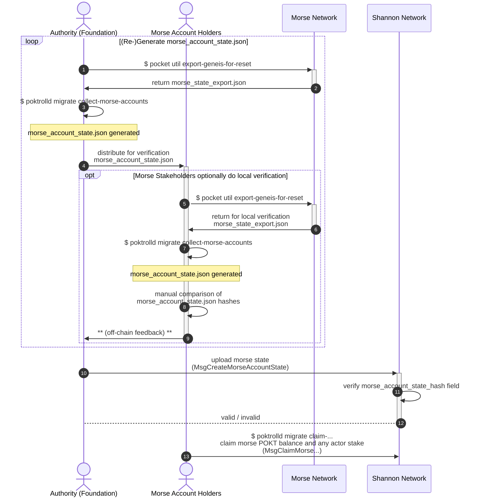
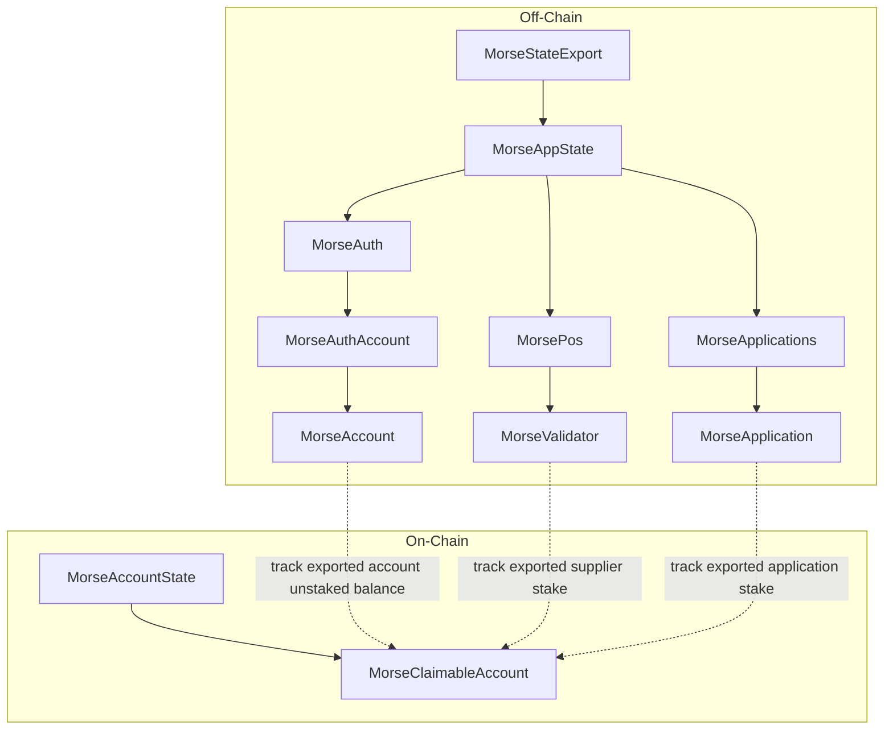

## Table of Contents <!-- omit in toc -->

- [Overview](#overview)
    - [Purpose](#purpose)
    - [Context](#context)
    - [Constraints](#constraints)
- [Disambiguation / Definitions](#disambiguation--definitions)
- [E2E Process](#e2e-process)
    - [Complete E2E User Sequence](#complete-e2e-user-sequence)
- [State Export / Transform / Validate](#state-export--transform--validate)
    - ["Authority" (PNF) Actions](#authority-pnf-actions)
    - [Morse Account Holder Actions](#morse-account-holder-actions)

:::warning TODO_MAINNET(@olshanksy)
Add FAQ and roadmap / strategy sections.
:::

## Overview

### Purpose

Define the approach, flow, steps we’ll take to migrate all POKT stakeholders from Morse to Shannon.

### Context

The migration described in here is in the context of the migration of account state from the Morse to Shannon networks.
Specifically, this document describes the "Migration & Cutover" -> "Judgement Day" section as it relates to this
migration of account state.

:::warning TODO_MAINNET(@olshanksy)
Link to higher-level Shannon MainNet launch / migration strategy docs once available.
:::

Due to the nature of this account state migration (see "Constraints", below), this account state migration functionality
is intended to be supported indefinitely.

### Constraints

#### "Why can't this be done in Shannon genesis?"

Since the Morse and Shannon accounts rely on different signing key algorithms, a new key MUST be generated for use with the Shannon network.
This new key (Shannon) key can then be used to "claim" the identity and any balance or stake of an existing Morse account.

## Disambiguation / Definitions

Since some terminology has been refined/updated between the Morse and Shannon protocol implementations, the following disambiguation should be applied in the scope of this section (Morse -> Shannon Migration) of documentation.

| Morse Term(s)                | Shannon Term(s) | Disambiguation                                                                                                                                                                                                                                                                                                                                                |
|------------------------------| --------------- |---------------------------------------------------------------------------------------------------------------------------------------------------------------------------------------------------------------------------------------------------------------------------------------------------------------------------------------------------------------|
| Servicer, Node, Validator* | Supplier | Refers to the onchain actor, as well as the APIs the corresponding operator operates. In Morse, this includes the tendermint stack (API, RPC, P2P) as well as the Morse API. In Shannon, this MUST include the ["Relayminer"](/operate/walkthroughs/supplier_walkthrough), and SHOULD include a `poktrolld` (cosmos-sdk node), which MAY be exposed publicly. |

_*NOTE: "Validator" in the Morse context refers to ALL accounts which are staked as servicer actors but is **not to be confused with the "active validator set"**, which defines the subset of validators which actively engage in block production._

## E2E Process

Given that Morse account claiming will be facilitated via re-keying, the canonical "Morse migration state" need not be coordinated with Shannon MainNet lifecycle, other than to require that Shannon MainNet has launched.

The migration process can be broken down into two main phases:

1. The "authority" (i.e. PNF / the foundation) coordinates with Morse account/stake-holders **offchain** to validate and import the "canonical" `MorseAccountState` **onchain**.
2. Morse account holders MAY claim their balances and/or re-stake as Shannon actors.

### Complete E2E User Sequence



## State Export / Transform / Validate

Given that this migration involves representing the state of one network (Morse) in another (Shannon), and that the migration process is ongoing (i.e. not a re-genesis; see [constraints](#constraints)),
there is an opportunity to optimize the exported Morse state with respect to its (very long-term) impact on Shannon.

In order to streamline the migration process for end users, as well as expedite high quality implementation, the following design considerations were applied:

1. Re-use existing tooling:
    - Using the Morse CLI to export the canonical `MorseStateExport` from the Morse network (`pocket util export-genesis-for-reset`).
    - Using the Morse CLI to export (armored) Morse account keys for use with the Shannon claiming CLI (`poktrolld migrate claim-...`).
2. Facilitate an offchain consensus (i.e. feedback loop) on the "canonical" `MorseAccountState`:
    - Using social consensus and cryptographic hash verification.
3. Minimize the size & optimize performance of (Shannon) persisted onchain data:
    - Transform (offchain) the `MorseStateExport` into a `MorseAccountState`.
    - Persist minimal Morse account representations as individual `MorseClaimableAccount`s.



### "Authority" (PNF) Actions

1. Export the canonical `MorseStateExport` from the Morse network:
        ```bash
        pocket util export-genesis-for-reset <published canonical export height> poktroll > morse_state_export.json
        ```
2. Transform the `MorseStateExport` into the proposed canonical `MorseAccountState`:
        ```bash
        poktrolld migrate collect-morse-accounts morse_state_export.json morse_account_state.json
        ```
3. Distribute the `MorseAccountState` and its hash for verification by Morse account/stake-holders.
4. Reach a time-bounded consensus on the canonical `MorseAccountState`, reacting to any feedback offchain as necessary.
5. Import the canonical `MorseAccountState` on Shannon:
        ```bash
        # TODO_MAINNET(@bryanchriswhite, #1034): Reference respective cmd or make target, once available.
        ```

:::warning TODO_MAINNET
Replace `<published canonical export height>` with the actual height once known.
:::

### Morse Account Holder Actions

Since the result of the export / transform / validate process effectively determines the canonical set of claimable Morse accounts (and their balances/stakes) on Shannon, it is important that Morse account/stake-holders confirm that the proposed `MsgImportMorseClaimableAccounts` includes an accurate representation of their account(s).

:::info
It's like making sure you and your friends (your accounts) are on "the list" before it gets printed out and handed to the crypto-club bouncer.
You'd be wise to double-check that all the names are on the list and are spelled correctly; the bouncer at crypto-club is brutally strict.
:::

Morse account/stake-holders who wish to participate in the social consensus process for the "canonical" `MorseAccountState` can do so by:
1. Downloading the proposed `MsgImportMorseClaimableAccounts` (which encapsulates both the `MorseAccountState` and its hash).
    :::warning TODO_MAINNET
    Link to latest published [`MsgImportMorseClaimableAccounts`](https://github.com/pokt-network/poktroll/blob/main/proto/poktroll/migration/tx.proto#L50) proposal.
    :::
2. Use the Shannon CLI to validate the proposed `MsgImportMorseClaimableAccounts` (e.g. `./msg_import_morse_claimable_accounts.json`):
    :::note
    Multiple Morse addresses MAY be passed to the `validate-morse-accounts` command.
    For each, the corresponding `MorseClaimableAccount` is printed for the purpose of manual inspection and validation.
    :::

    ```bash
    poktrolld tx migration validate-morse-accounts ./msg_import_morse_claimable_accounts.json [morse_hex_address1, ...]
    # TODO_MAINNET(@bryanchriswhite, #1034): Complete this example once the CLI is available.
    ```

    :::important
    Transactions which were committed after "Judgement Day" are NOT represented in the canonical `MorseAccountState` which is used in Shannon to validate claims.

    **When validating Morse account balance(s)/stake(s), keep this in mind!**
    :::