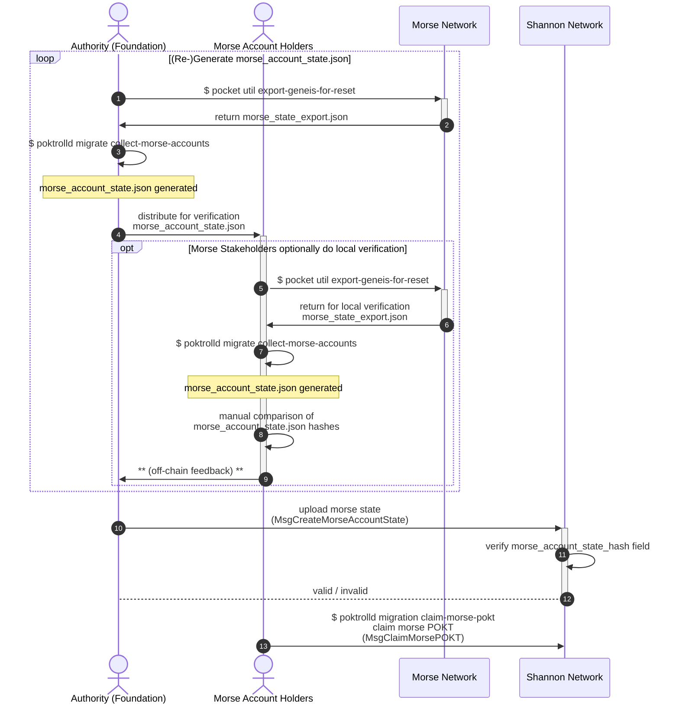
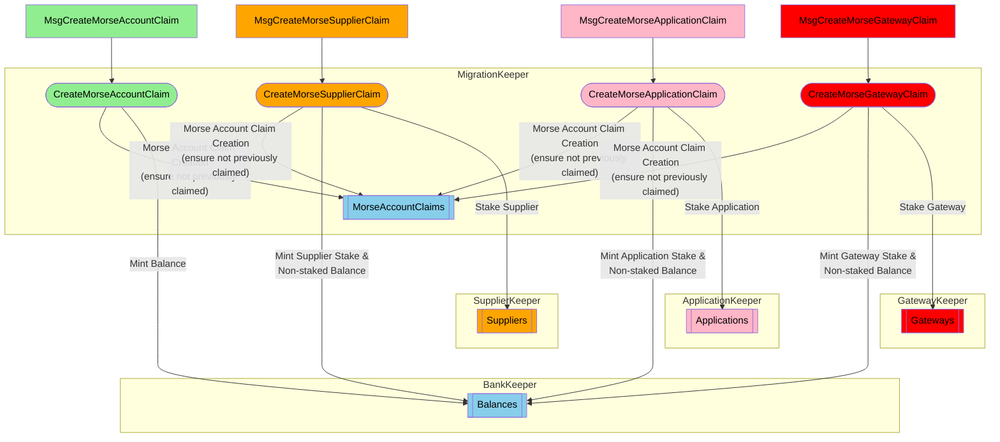
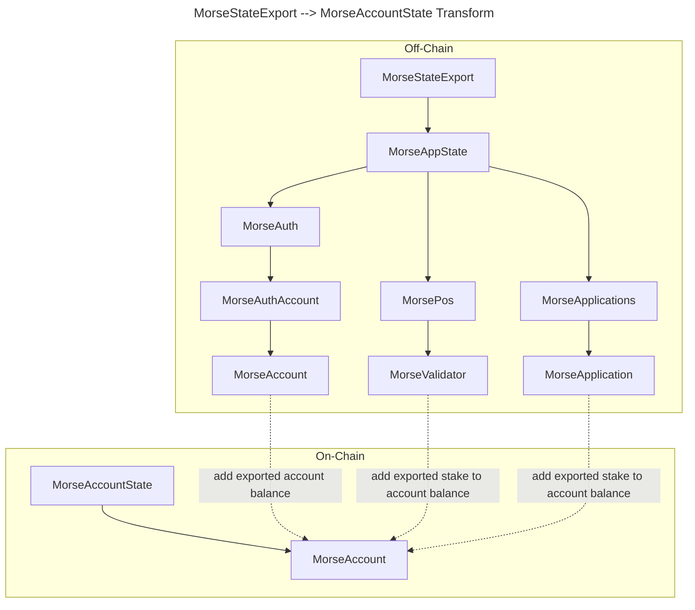
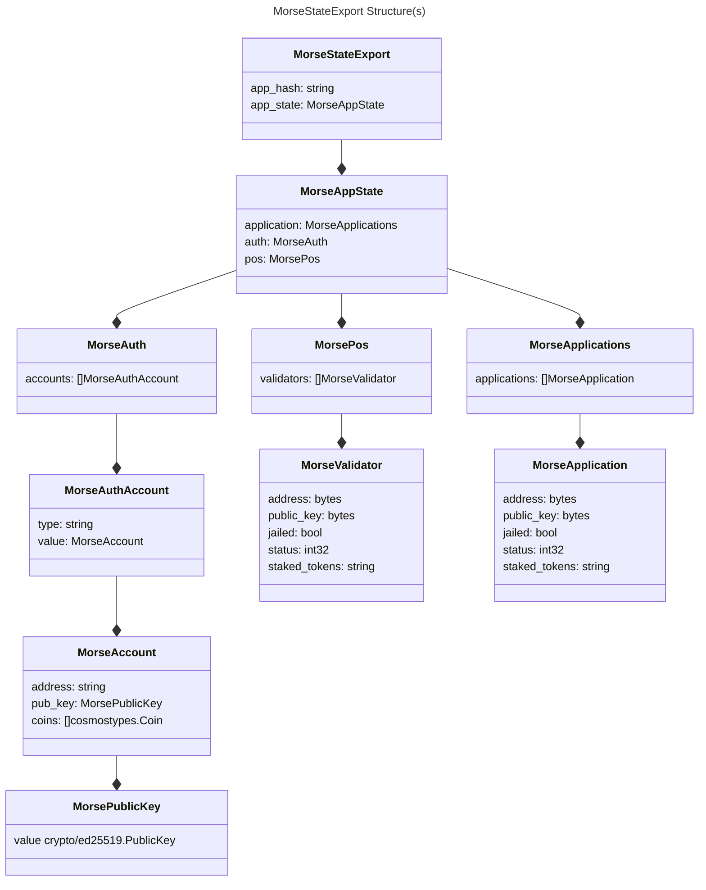
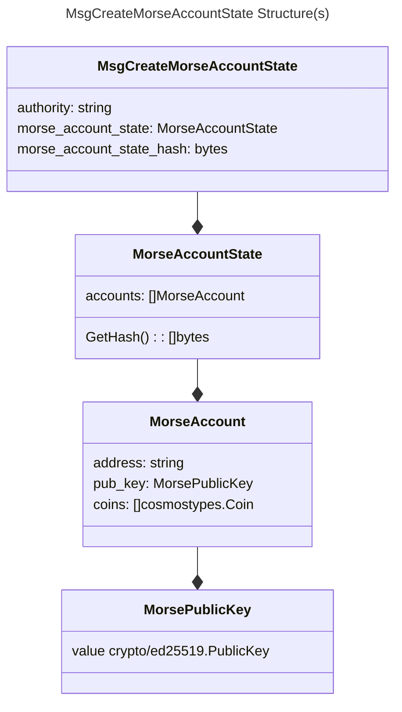

:::warning TODO_UPNEXT(@bryanchriswhite,#1034)
Expand migration docs and re-organize this page.

    All migration documents can be found on notion [here](https://www.notion.so/buildwithgrove/Morse-to-Shannon-Migration-173a36edfff6809cb1cbe10827c040de?pvs=4).

:::

## Table of Contents <!-- omit in toc -->

- [Complete E2E User Sequence](#complete-e2e-user-sequence)
- [Onchain Actors \& Messages](#onchain-actors--messages)
- [Shannon Data Structures to Represent Morse State](#shannon-data-structures-to-represent-morse-state)

## Complete E2E User Sequence

## Onchain Actors & Messages

## Shannon Data Structures to Represent Morse State

