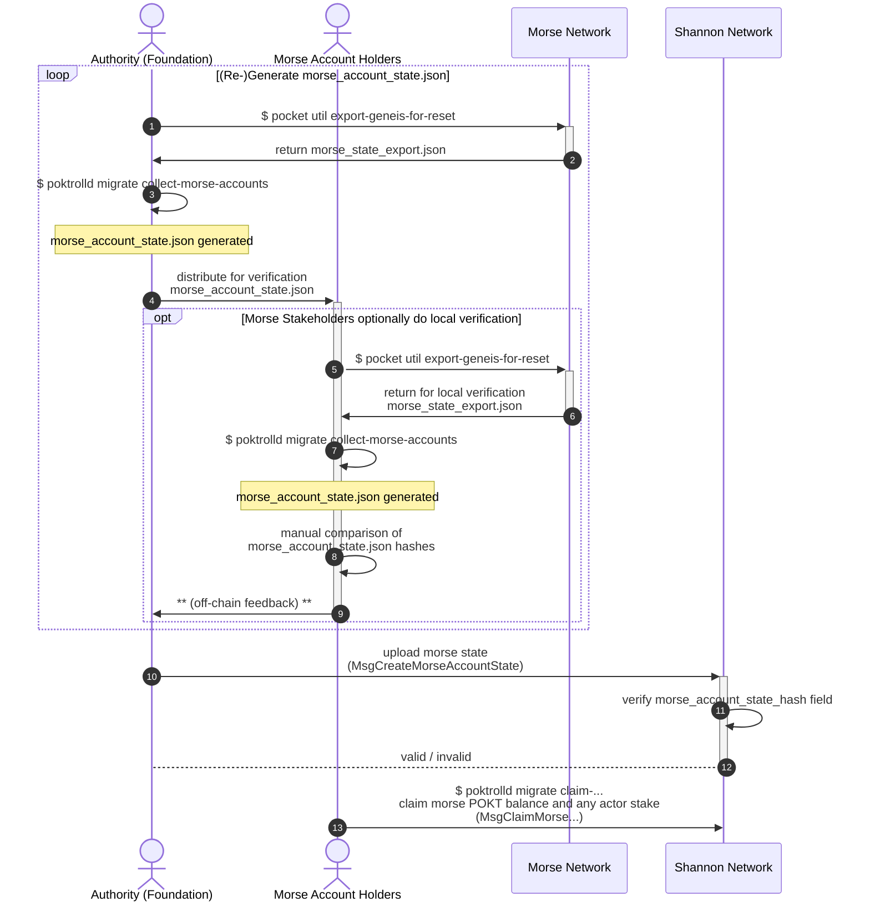
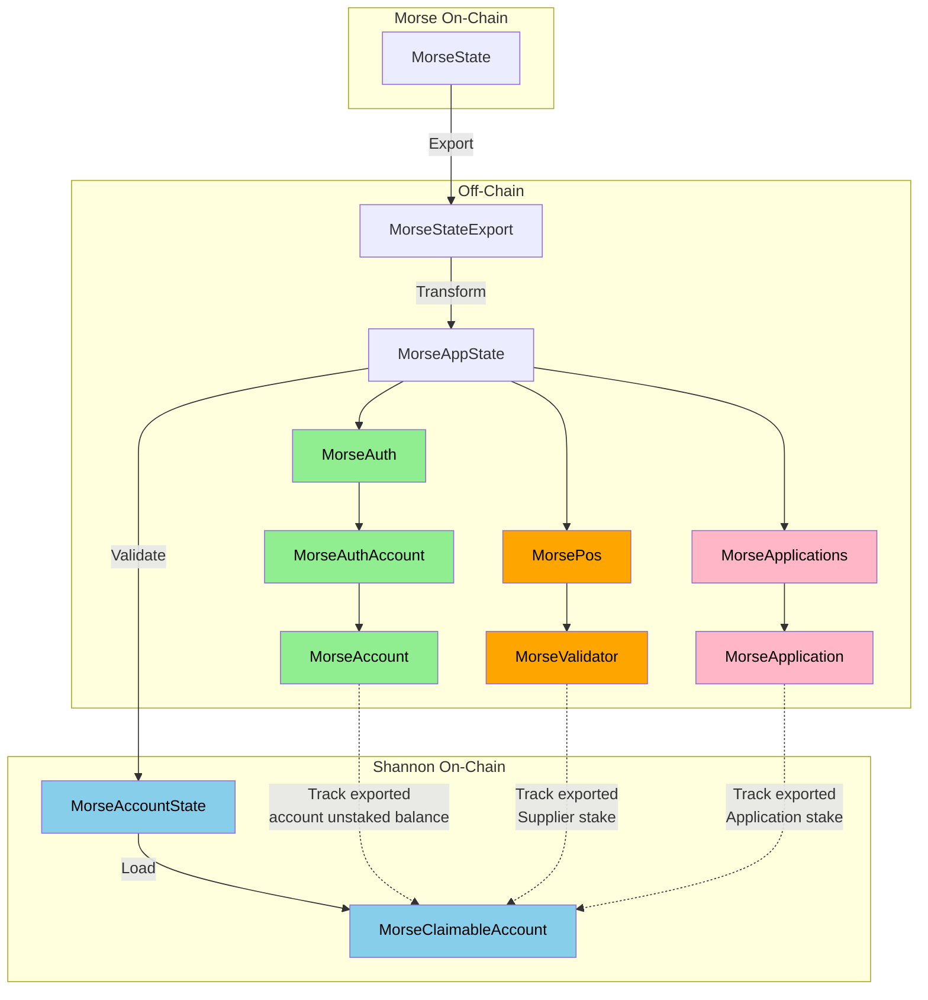

:::note

If you are a member of the migration working group, you can visit the [Notion docs](https://www.notion.so/buildwithgrove/Morse-to-Shannon-Migration-173a36edfff6809cb1cbe10827c040de?pvs=4) for more detail.

:::

## Table of Contents <!-- omit in toc -->

- [Disambiguation / Definitions](#disambiguation--definitions)
- [E2E User Flow](#e2e-user-flow)
  - [Complete E2E User Sequence](#complete-e2e-user-sequence)
- [State ETVL: Export -\> Transform -\> Validate -\> Load](#state-etvl-export---transform---validate---load)
  - [ETFVL Technical Design Considerations \& Constraints](#etfvl-technical-design-considerations--constraints)
  - [ETVL High-Level Flow](#etvl-high-level-flow)
  - [High-Level State Transport Playbook for Authority (i.e. Foundation)](#high-level-state-transport-playbook-for-authority-ie-foundation)
  - [High-Level State Validation Playbook for Morse Account oolders](#high-level-state-validation-playbook-for-morse-account-oolders)

## Overview <!-- omit in toc -->

### Purpose

The purpose of this overview is to define the approach, flow, steps necessary to
migrate POKT stakeholders from Morse to Shannon.

### Context

The migration described here aims to migrate account state from the Morse to Shannon Pocket Networks.

Specifically, this document describes the `Migration & Cutover` -> `Judgement Day` sections as it relates to this
migration of account state as seen in the [Migration Roadmap](./roadmap)

Due to the nature of this account state migration (i.e. "Constraints" below), this account state migration functionality
can be supported indefinitely from a technical perspective, but can be deprecated through a protocol update when
the foundation deems it appropriate.

### Constraints

#### "Why can't this be done in Shannon genesis?"

Since the Morse and Shannon accounts rely on different signing key algorithms, a new private key **MUST** be generated for use with the Shannon network.

This new (Shannon) key can then be used to "claim" the identity and any balance (staked and unstaked) of an existing Morse account (or actor).

:::tip Background on key schemes

If you consider yourself to be "**advanced**" in cryptography and are curious to learn more,
reach out to the team at **Grove** to get access to the [Background on Key Schemes](https://www.notion.so/buildwithgrove/Background-Addresses-Key-Schemes-175a36edfff680ff8f23fc7599fd9107?pvs=25) document.

:::

## Disambiguation / Definitions

Some terminology has been refined and update from Morse to Shannon.

The following disambiguation should be applied in the scope of this section (Morse -> Shannon Migration) of documentation.

| Morse Term           | Shannon Term | Disambiguation                                                                                                                                                                                                                                                                                                                                                                                                                                       |
| -------------------- | ------------ | ---------------------------------------------------------------------------------------------------------------------------------------------------------------------------------------------------------------------------------------------------------------------------------------------------------------------------------------------------------------------------------------------------------------------------------------------------- |
| Servicer             | Supplier     | Refers to the onchain actor that provides services (e.g. data), as well as the APIs (i.e. RPCs) to the corresponding service provides. In Morse, this involves running Tendermint stack alongside the Morse API. In Shannon, this MUST include the ["Relayminer"](/operate/walkthroughs/supplier_walkthrough) alongside a Full CometBFT Node that could be owned by the RelayMiner (preferable) or delegated to an external RPC.                     |
| Node                 | Full Node    | In Morse, this refers to a Tendermint full node running the Pocket Network Morse AppChain. In Shannon, this refers to a CometBFT full node running the Pocket Network Shannon AppChain. It is important to note that in Morse, in some instances, Servicers are sometimes referred to as Nodes which reflect the naming in the underlying implementation.                                                                                            |
| Validator / Servicer | Validator    | In Morse, Validators are the top 1000 staked Servicers that participate in consensus. In Shannon, it is an independent actor that must explicitly stake and join the network as a Validator. Their role as a Supplier (if present) in Shannon is completely decoupled. Both leverage the Tendermint consensus mechanism to secure the network and propose blocks. The number of Validators in Morse is 1,000 and the number in Shannon is still TBD. |

## E2E User Flow

Given that Morse account claiming will be facilitated via "re-keying", the canonical "Morse migration state" need not be coordinated with Shannon MainNet lifecycle, other than to require that Shannon MainNet has launched.

Full details of the Shannon launch process can be found in [the overview](./roadmap.md), but the token migration process can be split into two main phases:

1. **Snapshot Selection**: The "authority" (i.e. Foundation / PNF) coordinates with Morse account/stake-holders **offchain** choose a height at which a snapshot will be taken.
2. **Snapshot Migration**: The authority retrieves the Morse snapshot, validates it **offchain** as "canonical" `MorseAccountState` and uploads it **onchain** to Shannon.
3. **Token Claims**: Morse account holders MAY claim their balances on Shannon as either liquid or staked POKT depending on the state of their staked/unstaked balance at the time of snapshot on Morse.

### Complete E2E User Sequence

The following is a visual user story of the complete end-to-end migration process:



## State ETVL: Export -> Transform -> Validate -> Load

Given that this migration involves representing the state of one network (Morse) in another (Shannon), and that the migration process is ongoing (i.e. not a re-genesis; see [constraints](#constraints)),
there is an opportunity to optimize the exported Morse state with respect to its (very long-term) impact on Shannon.

### ETFVL Technical Design Considerations & Constraints

In order to streamline the migration process for end users, as well as expedite a high quality implementation, the following design considerations were applied:

1. **Re-use existing Morse tooling**:

   - Using the Morse CLI to export the canonical `MorseStateExport` from the Morse network (`pocket util export-genesis-for-reset`).
   - Using the Morse CLI to export (armored) Morse account keys for use with the Shannon claiming CLI (`poktrolld migrate claim-...`).

2. **Facilitate offchain social consensus on MorseAccountState**:

   - Using social consensus and cryptographic hash verification
   - Offchain agreement (i.e. feedback loop) on the "canonical" `MorseAccountState`

3. Minimize Shannon onchain state bloat

   - Minimize the size & optimize performance of (Shannon) persisted onchain data
   - Transform (offchain) the `MorseStateExport` into a `MorseAccountState`
   - Persist minimal Morse account representations as individual `MorseClaimableAccount`s

### ETVL High-Level Flow



### High-Level State Transport Playbook for Authority (i.e. Foundation)

:::warning TODO_MAINNET: This playbook is a WIP

This playbook is an early WIP and will be updated and moved elsewhere once the process is finalized.

:::

1. **Export** the canonical `MorseStateExport` from the Morse network:

   ```bash
   pocket util export-genesis-for-reset <published canonical export height> poktroll > morse_state_export.json
   ```

2. **Transform** the `MorseStateExport` into the proposed canonical `MorseAccountState`:

   ```bash
   poktrolld migrate collect-morse-accounts morse_state_export.json morse_account_state.json
   ```

3. **Distribute** the `MorseAccountState` and its hash for verification by Morse account/stake-holders.
4. **Wait for consensus** after an offchain time-bounded period on the `MorseAccountState`, reacting to any feedback offchain as necessary.
5. **Load** (i.e. import) the canonical `MorseAccountState` on Shannon

   ```bash
   TODO_MAINNET(@bryanchriswhite, #1034): Reference respective cmd or make target, once available.
   ```

:::danger TODO_MAINNET: Select snapshot height

Replace `<published canonical export height>` with the actual height once known.

:::

### High-Level State Validation Playbook for Morse Account oolders

:::info Fun Analogy 👯

It's like making sure you and your friends (your accounts) are on "the list" before it gets printed out and handed to the crypto-club bouncer.

You'd be wise to double-check that all the names are on the list and are spelled correctly; **the bouncer at crypto-club is brutally strict**.

:::

Since the result of the ETVL process effectively determines the canonical set of claimable Morse accounts (and their balances/stakes) on Shannon,
it is critical that Morse account/stake-holders confirm that the proposed `MsgImportMorseClaimableAccounts` includes an accurate representation of their account(s).

Morse account/stake-holders who wish to participate in the social consensus process for the "canonical" `MorseAccountState` can do so by:

1. **Downloading the proposed `MsgImportMorseClaimableAccounts`**: this encapsulates both the `MorseAccountState` and its hash

   :::warning TODO_MAINNET
   Link to latest published [`MsgImportMorseClaimableAccounts`](https://github.com/pokt-network/poktroll/blob/main/proto/poktroll/migration/tx.proto#L50) proposal.
   :::

2. **Use the Shannon CLI to validate the proposed `MsgImportMorseClaimableAccounts`**: See `./msg_import_morse_claimable_accounts.json` as an example.

   ```bash
   # TODO_MAINNET(@bryanchriswhite, #1034): Complete this example once the CLI is available.
   poktrolld tx migration validate-morse-accounts ./msg_import_morse_claimable_accounts.json [morse_hex_address1, ...]
   ```

   :::note

   Multiple Morse addresses MAY be passed to the `validate-morse-accounts` command.
   For each, the corresponding `MorseClaimableAccount` is printed for the purpose of manual inspection and validation.

   :::
