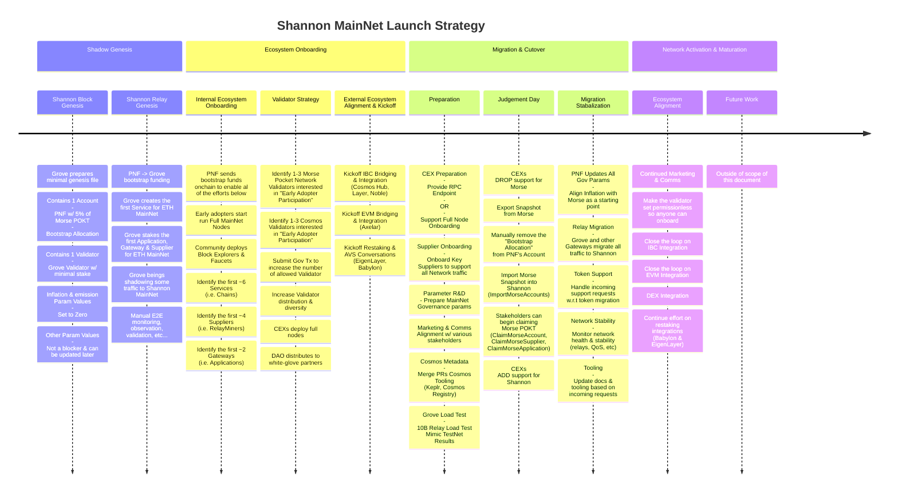

The `Morse` to `Shannon` migration is not a one day cutover. It is a process that
will span multiple weeks involving many stakeholders. It includes,
but is not limited to things like Genesis, Preparation, Onboarding, Cutover, etc...

The following diagram provides a high level overview of the migration process:

## Static Image

You can use [mermaid.live](https://mermaid.live/) to copy, paste, edit and zoom in on the source code for the diagram above.

Alternatively, you can use the following static image:

