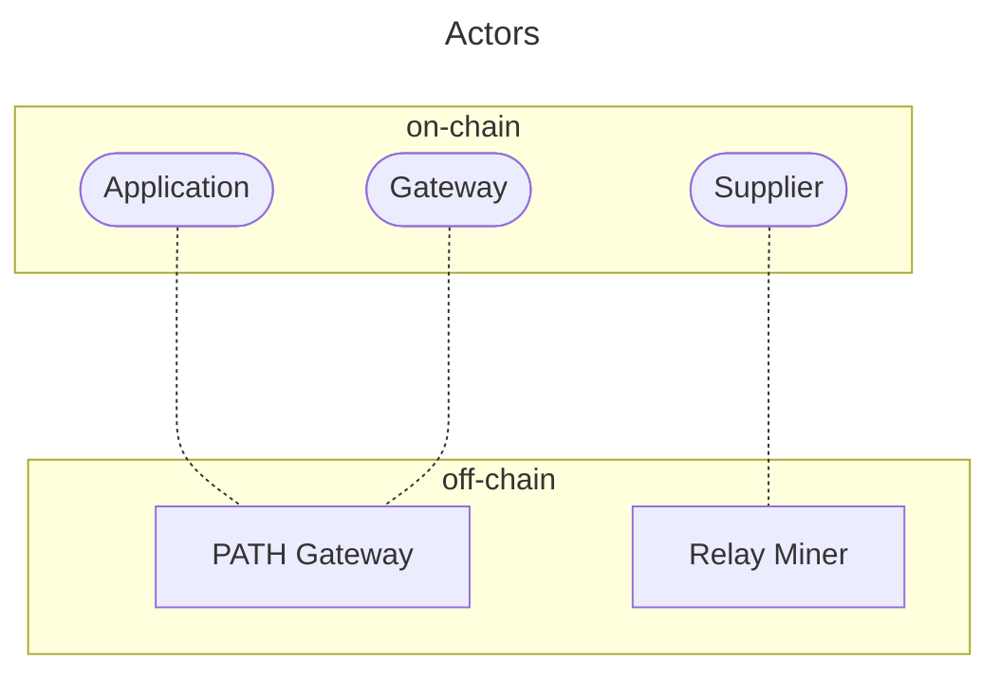

import ReactPlayer from "react-player";

# Docker Compose Walkthrough <!-- omit in toc -->

- [Introduction and Cheat Sheet](#introduction-and-cheat-sheet)
- [Key Terms in Morse and Shannon](#key-terms-in-morse-and-shannon)
- [Understanding Actors in the Shannon upgrade](#understanding-actors-in-the-shannon-upgrade)
- [Prerequisites](#prerequisites)
- [A. Deploying a Full Node](#a-deploying-a-full-node)
- [B. Creating a Supplier and Deploying a RelayMiner](#b-creating-a-supplier-and-deploying-a-relayminer)
- [C. Creating an Application, a Gateway and Deploying a PATH Gateway](#c-creating-an-application-a-gateway-and-deploying-a-path-gateway)

<!--

TODO(@okdas):

- [ ] Simplify the copy-pasta commands by leveraging `helpers.sh`
- [ ] Consider publicly expose [this document](https://www.notion.so/buildwithgrove/How-to-re-genesis-a-Shannon-TestNet-a6230dd8869149c3a4c21613e3cfad15?pvs=4)
      on how to do a re-genesis
- [ ] Pre-stake some applications on TestNet others can reuse to get started sooner

-->

## Introduction and Cheat Sheet

This document uses the [poktroll-docker-compose-example](https://github.com/pokt-network/poktroll-docker-compose-example)
to help stake and deploy every actor in the Pocket Network ecosystem.

It also provides some intuition for those already familiar with `Morse` and are
transitioning to `Shannon`.

:::tip

This document has a lot of details and explanations. If you're looking for a
copy-paste quickstart guide to set all of it up on a Debian server, check out
the [Debian cheat sheet](./docker_compose_debian_cheatsheet.md).

:::

This is a text heavy walkthrough, but if all goes well, you should have something like the following:

<ReactPlayer
  playing={false}
  controls
  url="https://github.com/user-attachments/assets/11f5ae68-f8c1-4e12-99ec-641495c2dfb7"
/>

## Key Terms in Morse and Shannon

- `Morse` - The current version of the Pocket Network MainNet (a.k.a v0).
- `Shannon` - The upcoming version of the Pocket Network MainNet (a.k.a v1).
- `Validator` - A node that participates in the consensus process.
  - In `Morse`Same in `Morse` and `Shannon`.
  - In `Shannon`
- `Node` - A `Morse` actor that stakes to provide Relay services.
  - In `Morse` - All `Validator` are nodes but only the top 1000 stakes `Node`s are `Validator`s
  - This actor is not present in `Shannon` and decoupled into `Supplier` and a `RelayMiner`.
- `Supplier` - The on-chain actor that stakes to provide Relay services.
  - In `Shannon` - This actor is responsible needs access to a Full Node (sovereign or node).
- `RelayMiner` - The off-chain service that provides Relay services on behalf of a `Supplier`.
  - In `Shannon` - This actor is responsible for providing the Relay services.
- `PATH Gateway` - The off-chain service that provides Relay services on behalf of an `Application` or `Gateway`.

For more details, please refer to the [Shannon actors documentation](https://dev.poktroll.com/actors).

## Understanding Actors in the Shannon upgrade

For those familiar with `Morse`, Pocket Network Mainnet, the introduction of
multiple node types in the upcoming `Shannon` requires some explanation.

In `Shannon`, the `Supplier` role is separated from the `Full node` role.

In `Morse`, a `Validator` or a staked `Node` was responsible for both holding
a copy of the on-chain data, as well as performing relays. With `Shannon`, the
`RelayMiner` software, which runs the supplier logic, is distinct from the full-node/validator.

Furthermore, `Shannon` uses [`PATH Gateway`](https://github.com/buildwithgrove/path),
a software component that acts on behalf of either `Applications` or `Gateways`
to access services provided by Pocket Network `Supplier`s via `RelayMiners`.

The following diagram from the [actors](../../protocol/actors/) page captures the relationship
between on-chain records (actors) and off-chain operators (servers).



## Prerequisites

_Note: the system must be capable of exposing ports to the internet for
peer-to-peer communication._

### Software & Tooling <!-- omit in toc -->

Ensure the following software is installed on your system:

- [git](https://github.com/git-guides/install-git)
- [Docker](https://docs.docker.com/engine/install/)
- [docker-compose](https://docs.docker.com/compose/install/#installation-scenarios)

### [Optional] Create a new user <!-- omit in toc -->

:::note

Make sure to replace `olshansky` with your username.

:::

You can generally do everything as the `root` user, but it's recommended to
create a new user and give it sudo permissions.

This is necessary, in particular, if you want to use [homebrew](https://brew.sh/) [to install `poktrolld`](../user_guide/install.md).

```bash
# Create a new user and give sudo permissions
export USERNAME=olshansky
adduser $USERNAME
usermod -aG sudo,docker $USERNAME
```

You can also avoid needing to pass in the password each time by running the following:

```bash
# Optionally avoid needing to provide a password
vi /etc/sudoers

# Add the following line to the end of the file
olshansky ALL=(ALL) NOPASSWD:ALL
```

Then, switch to the new user:

```bash
su - $USERNAME
```

### Clone the Repository <!-- omit in toc -->

```bash
git clone https://github.com/pokt-network/poktroll-docker-compose-example.git
cd poktroll-docker-compose-example
```

### Operational Helpers <!-- omit in toc -->

Run the following command, or add it to your `~/.bashrc` to have access to helpers:

```bash
source helpers.sh
```

### Environment Variables <!-- omit in toc -->

Create and configure your `.env` file from the sample:

```bash
cp .env.sample .env
```

Update `NODE_HOSTNAME` in `.env` to the IP address or hostname of your node. For example:

```bash
sed -i -e s/NODE_HOSTNAME=/NODE_HOSTNAME=69.42.690.420/g .env
```

## A. Deploying a Full Node

### Launch the Node <!-- omit in toc -->

:::warning
The Alpha TestNet currently requires manual steps to sync the node to the latest block. Please find the affected block(s)
in [this document](../../protocol/upgrades/upgrade_list.md), which leads to the manual upgrade instructions.
:::

_Note: You may need to replace `docker compose` with `docker-compose` if you are
running an older version of Docker where `docker-compose` is not integrated into `docker` itself yet._

Initiate the node with:

```bash
docker compose up -d full-node
```

Monitor node activity through logs with:

```bash
docker compose logs -f --tail 100 full-node
```

### Inspecting the Full Node <!-- omit in toc -->

If you run `docker ps`, you should see a `full-node` running which you can inspect
using the commands below.

### CometBFT Status <!-- omit in toc -->

```bash
curl -s -X POST localhost:26657/status | jq
```

### gRPC <!-- omit in toc -->

To inspect the gRPC results on port 9090 you may [install grpcurl](https://github.com/fullstorydev/grpcurl?tab=readme-ov-file#installation).

Once installed:

```bash
grpcurl -plaintext localhost:9090 list
```

### Latest Block <!-- omit in toc -->

```bash
curl -s -X POST localhost:26657/block | jq
```

### Watch the height <!-- omit in toc -->

```bash
watch -n 1 "curl -s -X POST localhost:26657/block | jq '.result.block.header.height'"
```

You can compare the height relative to the [shannon testnet explorer](https://shannon.beta.testnet.pokt.network/poktroll/block).

### Get a way to fund your accounts <!-- omit in toc -->

Throughout these instructions, you will need to fund your account with tokens
at multiple points in time.

#### 3.1 Funding using a Faucet <!-- omit in toc --> <!-- omit in toc -->

When you need to fund an account, you can make use of the [Faucet](https://faucet.beta.testnet.pokt.network/).

#### [Requires Grove Team Support] 3.2 Funding using faucet account <!-- omit in toc --> <!-- omit in toc -->

If you require a larger amount of tokens or are a core contributor, you can add the `faucet`
account to fund things yourself directly.

```bash
poktrolld keys add --recover -i faucet
```

When you see the `> Enter your bipmnemonic` prompt, paste the mnemonic
provided by the Pocket team for testnet.

When you see the `> Enter your bippassphrase. This is combined with the mnemonic to derive the seed. Most users should just hit enter to use the default, ""`
prompt, hit enter without adding a passphrase. Finish funding your account by using the command below:

You can view the balance of the faucet address at [shannon.beta.testnet.pokt.network/](https://shannon.beta.testnet.pokt.network/poktroll).

### Restarting a full node after re-genesis <!-- omit in toc -->

If the team has completed a re-genesis, you will need to wipe existing data
and restart your node from scratch. The following is a quick and easy way to
start from a clean slate:

```bash

# Stop & remove existing containers
docker compose down
docker rm $(docker ps -aq) -f

# Remove existing data and renew genesis
rm -rf poktrolld-data/config/addrbook.json poktrolld-data/config/genesis.json poktrolld-data/config/genesis.seeds poktrolld-data/data/ poktrolld-data/cosmovisor/ poktrolld-data/config/node_key.json poktrolld-data/config/priv_validator_key.json

# Re-start the node
docker compose up -d
docker compose logs -f --tail 100
```

### Docker image updates <!-- omit in toc -->

The `.env` file contains `POKTROLLD_IMAGE_TAG` which can be updated based on the
images available on [poktroll ghcr](https://github.com/pokt-network/poktroll/pkgs/container/poktrolld/versions)
to update the version of the `full_node` deployed. As well as the `PATH_GATEWAY_IMAGE_TAG`
which can be updated based on the `PATH Gateway` images available at
[path ghcr](https://github.com/buildwithgrove/path/pkgs/container/path/versions)

## B. Creating a Supplier and Deploying a RelayMiner

A Supplier is an on-chain record that advertises services it'll provide.

A RelayMiner is an operator / service that provides services to offer on the Pocket Network.

### Prerequisites for a RelayMiner <!-- omit in toc -->

- **Full Node**: This RelayMiner deployment guide assumes the Full Node is
  deployed in the same `docker compose` stack; see section (A).
- **A poktroll account with uPOKT tokens**: Tokens can be acquired by contacting
  the team or using the faucet. You are going to need a BIPmnemonic phrase for
  an existing funded account before continuing below.

### Create and fund a Supplier account <!-- omit in toc -->

On the host where you started the full node container, run the commands below to
create your account.

Create a new `supplier` account:

```bash
poktrolld keys add supplier-1
```

Copy the mnemonic that's printed to the screen to the `SUPPLIER_MNEMONIC`
variable in your `.env` file.

```bash
export SUPPLIER_MNEMONIC="foo bar ..."
```

Save the outputted address to a variable for simplicity::

```bash
export SUPPLIER_ADDR="pokt1..."
```

Make sure to:

```bash
source .env
```

Add funds to your supplier account by either going to the [faucet](https://faucet.testnet.pokt.network)
or using the `faucet` account directly if you have access to it:

```bash
poktrolld tx bank send faucet $SUPPLIER_ADDR 10000upokt --chain-id=pocket-beta --yes
```

You can check that your address is funded correctly by running:

```bash
poktrolld query bank balances $SUPPLIER_ADDR
```

_Note: You must wait until `full-node` has synced up to the [current block #](https://shannon.testnet.pokt.network/poktroll/block) before this command and the stake command below (`poktrolld tx supplier stake-supplier...`) will work successfully. Watch your node's block height [here.](https://dev.poktroll.com/operate/quickstart/docker_compose_walkthrough#watch-the-height-)_

If you're waiting to see if your transaction has been included in a block, you can run:

```bash
poktrolld query tx --type=hash <hash>
```

### Configure and stake your Supplier <!-- omit in toc -->

:::tip Supplier staking config

[dev.poktroll.com/operate/configs/supplier_staking_config](https://dev.poktroll.com/operate/configs/supplier_staking_config)
explains what supplier staking config is and how it can be used.

:::

Verify that the account you're planning to use for `SUPPLIER` (created above)
is available in your local Keyring:

```bash
poktrolld keys list --list-names | grep "supplier-1"
```

Update the provided example supplier stake config:

```bash
sed -i -e s/YOUR_NODE_IP_OR_HOST/$NODE_HOSTNAME/g ./stake_configs/supplier_stake_config_example.yaml
sed -i -e s/YOUR_OWNER_ADDRESS/$SUPPLIER_ADDR/g ./stake_configs/supplier_stake_config_example.yaml
```

Use the configuration to stake your supplier:

```bash
poktrolld tx supplier stake-supplier \
  --config=/poktroll/stake_configs/supplier_stake_config_example.yaml \
  --from=supplier-1 \
  --gas=auto \
  --gas-prices=1upokt \
  --gas-adjustment=1.5 \
  --chain-id=pocket-beta \
  --yes
```

:::warning Upstaking to restake

If you need to change any of the configurations in your staking config, you MUST
increase the stake by at least one uPOKT. This is the `stake_amount` field
in the `supplier_stake_config_example.yaml` file above.

:::

Verify your supplier is staked:

```bash
poktrolld query supplier show-supplier $SUPPLIER_ADDR
```

### Configure and run your RelayMiner <!-- omit in toc -->

:::tip RelayMiner operation config

[dev.poktroll.com/operate/configs/relayminer_config](https://dev.poktroll.com/operate/configs/relayminer_config)
explains what the RelayMiner operation config is and how it can be used.

:::

Update the provided example RelayMiner operation config:

```bash
sudo sed -i -e s/YOUR_NODE_IP_OR_HOST/$NODE_HOSTNAME/g relayminer/config/relayminer_config.yaml
```

Update the `backend_url` in `relayminer_config.yaml` with a valid `F00C` (i.e. ETH MainNet)
service URL. We suggest using your own node, but you can get one from Grove for testing purposes.

```bash
sudo sed -i 's|backend_url: ".*"|backend_url: "https://eth-mainnet.rpc.grove.city/v1/<APP_ID>"|g' relayminer/config/relayminer_config.yaml
```

Start up the RelayMiner:

```bash
docker compose up -d relayminer
```

Check logs and confirm the node works as expected:

```bash
docker compose logs -f --tail 100 relayminer
```

## C. Creating an Application, a Gateway and Deploying a PATH Gateway

### Create and fund your Application <!-- omit in toc -->

On the host where you started the full node container, run the commands below to
create your account.

Create a new `application` account:

```bash
poktrolld keys add application-1
```

Copy the outputted address to the `APPLICATION_ADDR` variable in your `.env` file:

Copy the private key to the `APPLICATION_PRIV_KEY_HEX` variable in your `.env` file
which can be obtained by running:

```bash
export_priv_key_hex application-1
```

Make sure to:

```bash
  source .env
```

Add funds to your application account by either going to the [faucet](https://faucet.beta.testnet.pokt.network/)
or using the `faucet` account directly if you have access to it:

```bash
poktrolld tx bank send faucet $APPLICATION_ADDR 10000upokt --chain-id=pocket-beta --yes
```

You can check that your address is funded correctly by running:

```bash
poktrolld query bank balances $APPLICATION_ADDR
```

### Configure and stake your Application <!-- omit in toc -->

:::tip Application staking config

[dev.poktroll.com/operate/configs/application_staking_config](https://dev.poktroll.com/operate/configs/app_staking_config)
explains what application staking config is and how it can be used.

:::

Verify that the account you're planning to use for `APPLICATION` (created above)
is available in your local Keyring:

```bash
poktrolld keys list --list-names | grep "application-1"
```

Use the configuration to stake your application:

```bash
poktrolld tx application stake-application \
  --config=/poktroll/stake_configs/application_stake_config_example.yaml \
  --from=application-1 \
  --gas=auto \
  --gas-prices=1upokt \
  --gas-adjustment=1.5 \
  --chain-id=pocket-beta \
  --yes
```

Verify your application is staked

```bash
poktrolld query application show-application $APPLICATION_ADDR
```

### Create and fund your Gateway <!-- omit in toc -->

On the host where you started the full node container, run the commands below to
create your account.

Create a new `gateway` account:

```bash
poktrolld keys add gateway-1
```

Copy the outputted address to the `GATEWAY_ADDR` variable in your `.env` file:

Copy the private key to the `GATEWAY_PRIV_KEY_HEX` variable in your `.env` file
which can be obtained by running:

```bash
export_priv_key_hex gateway-1
```

Make sure to:

```bash
  source .env
```

Add funds to your gateway account by either going to the [faucet](https://faucet.beta.testnet.pokt.network/)
or using the `faucet` account directly if you have access to it:

```bash
poktrolld tx bank send faucet $GATEWAY_ADDR 10000upokt --chain-id=pocket-beta --yes
```

You can check that your address is funded correctly by running:

```bash
poktrolld query bank balances $GATEWAY_ADDR
```

### Configure and stake your Gateway <!-- omit in toc -->

:::tip Gateway staking config

[dev.poktroll.com/operate/configs/gateway_staking_config](https://dev.poktroll.com/operate/configs/gateway_staking_config)
explains what gateway staking config is and how it can be used.

:::

Verify that the account you're planning to use for `GATEWAY` (created above)
is available in your local Keyring:

```bash
poktrolld keys list --list-names | grep "gateway-1"
```

Use the configuration to stake your gateway:

```bash
poktrolld tx gateway stake-gateway \
  --config=/poktroll/stake_configs/gateway_stake_config_example.yaml \
  --from=gateway-1 \
  --gas=auto \
  --gas-prices=1upokt \
  --gas-adjustment=1.5 \
  --chain-id=pocket-beta \
  --yes
```

Verify your gateway is staked

```bash
poktrolld query gateway show-gateway $GATEWAY_ADDR
```

### Delegate your Application to the Gateway <!-- omit in toc -->

```bash
poktrolld tx application delegate-to-gateway $GATEWAY_ADDR \
  --from=application-1 \
  --gas=auto \
  --gas-prices=1upokt \
  --gas-adjustment=1.5 \
  --chain-id=pocket-beta \
  --yes
```

### Configure and run your `PATH Gateway` <!-- omit in toc -->

`PATH Gateway` allows to use services provided by other operators on Pocket Network.

:::tip PATH Gateway operation config

[path.grove.city/operate](https://path.grove.city/operate)
explains what the `PATH Gateway` operation config is and how it can be used.

:::

Update the provided example PATH Gateway operation config:

```bash
sudo sed -i -e s/YOUR_PATH_GATEWAY_ADDRESS/$GATEWAY_ADDR/g gateway/config/gateway_config.yaml
sudo sed -i -e s/YOUR_PATH_GATEWAY_PRIVATE_KEY/$GATEWAY_PRIV_KEY_HEX/g gateway/config/gateway_config.yaml
sudo sed -i -e s/YOUR_OWNED_APP_PRIVATE_KEY/$APPLICATION_PRIV_KEY_HEX/g gateway/config/gateway_config.yaml
```

Start up the RelayMiner:

```bash
docker compose up -d gateway
```

Check logs and confirm the node works as expected:

```bash
docker compose logs -f --tail 100 gateway
```

### Send a relay <!-- omit in toc -->

You can send requests to the newly deployed `PATH Gateway`. If there are any
Suppliers on the network that can provide the service, the request will be
routed to them.

The endpoint you want to send request to is: `http://service_alias.your_node:path_gateway_port/v1`.
For example, this is how the request can be routed to `ethereum` represented by the alias `eth`:

:::warning
`PATH` uses subdomains to route requests to the correct service, which means
you need to have a domain name that resolves to the IP address of your node.
:::

```bash
curl http://eth.localhost:3000/v1 \
  -X POST \
  -H "Content-Type: application/json" \
  --data '{"method":"eth_blockNumber","params":[],"id":1,"jsonrpc":"2.0"}'
```

You should expect a result that looks like so:

```bash
{"jsonrpc":"2.0","id":1,"result":"0x1289571"}
```

#### Ensure you get a response <!-- omit in toc -->

To ensure you get a response, you may need to run the request a few times:

```bash
for i in {1..10}; do
  curl http://eth.localhost:3000/v1 \
    -X POST \
    -H "Content-Type: application/json" \
    --data '{"method":"eth_blockNumber","params":[],"id":1,"jsonrpc":"2.0"}' \
    --max-time 1
  echo ""
done
```

Why?

- Suppliers may have been staked, but the RelayMiner is no longer running.
- Pocket does not currently have on-chain quality-of-service
- Pocket does not currently have supplier jailing
