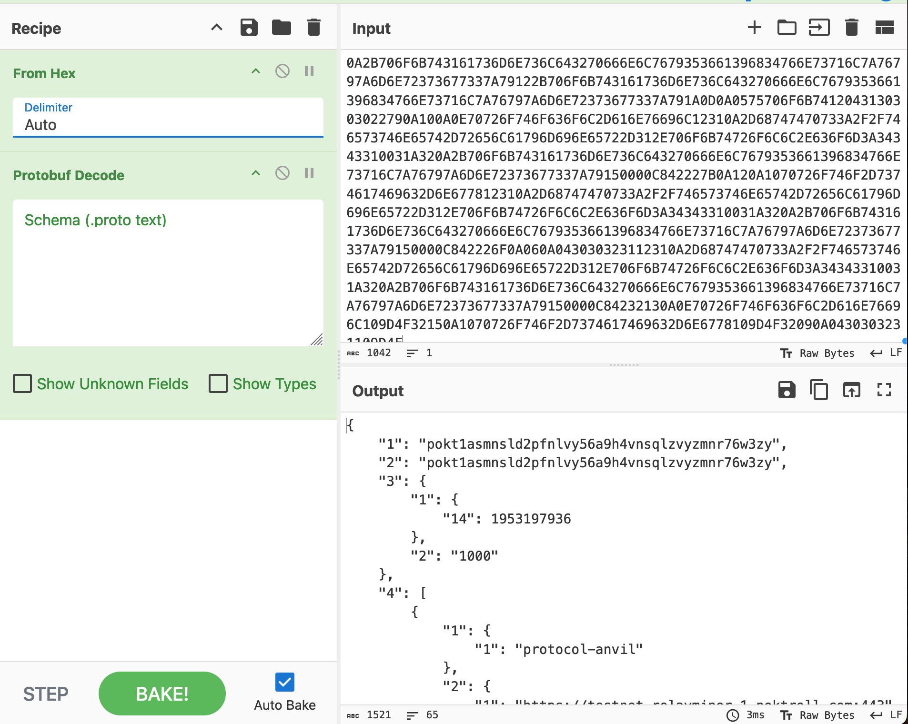
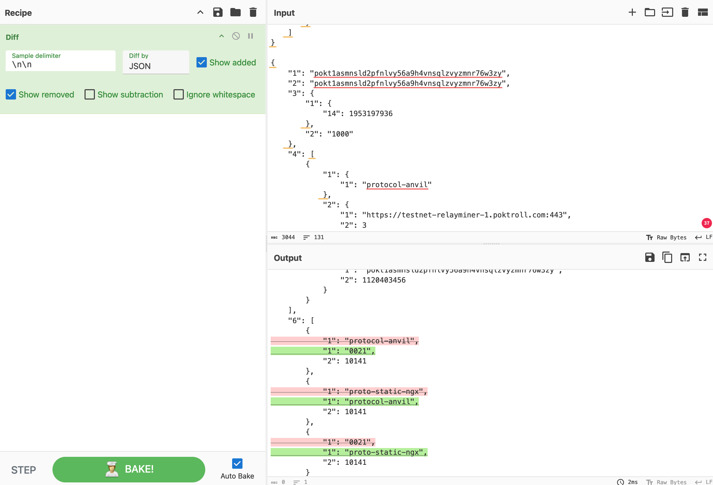

## Chain Halt Troubleshooting <!-- omit in toc -->

- [Understanding Chain Halts](#understanding-chain-halts)
  - [Definition and Causes](#definition-and-causes)
  - [Impact on Network](#impact-on-network)
- [Troubleshooting `wrong Block.Header.AppHash`](#troubleshooting-wrong-blockheaderapphash)
  - [Step 1: Identifying the Issue](#step-1-identifying-the-issue)
  - [Step 2: Collecting Node Data](#step-2-collecting-node-data)
  - [Step 3: Analyzing Discrepancies](#step-3-analyzing-discrepancies)
  - [Step 4: Decoding and Interpreting Data](#step-4-decoding-and-interpreting-data)
  - [Step 5: Comparing Records](#step-5-comparing-records)
  - [Step 6: Investigation and Resolution](#step-6-investigation-and-resolution)
- [Troubleshooting `wrong Block.Header.LastResultsHash`](#troubleshooting-wrong-blockheaderlastresultshash)
- [Syncing from genesis](#syncing-from-genesis)

## Understanding Chain Halts

### Definition and Causes

Chain halts are critical events in blockchain networks that occur when validators fail to reach consensus. In our Cosmos SDK-based chain, consensus requires agreement from at least 67% of the voting power to produce new blocks.

These halts typically arise from non-deterministic scenarios, where different validators have conflicting views of the blockchain state. Common causes include:

1. Inconsistent application of state transition rules
2. Divergent interpretations of transaction data
3. Synchronization issues between nodes
4. Software bugs leading to inconsistent state calculations

### Impact on Network

Chain halts can have severe consequences for the network:

- Transaction processing comes to a standstill
- Users cannot interact with the blockchain
- Potential loss of confidence in the network's reliability
- Financial implications for stakeholders and users

Given these impacts, swift and effective troubleshooting is crucial to maintain network health and user trust.

## Troubleshooting `wrong Block.Header.AppHash`

### Step 1: Identifying the Issue

When a chain halt occurs, the first step is to identify the specific error message or symptom. A common indicator is the `wrong Block.Header.AppHash` error, which suggests a mismatch in the calculated state between nodes.

### Step 2: Collecting Node Data

To investigate the discrepancy:

1. Locate the database directory on the affected node (typically `$HOME/.pocket/data`).
2. Obtain the same directory from a healthy full node or one with a different `Block.Header.AppHash`.
3. Ensure you have appropriate permissions to access and copy this data.

### Step 3: Analyzing Discrepancies

Utilize the [iavl-tree-diff](https://github.com/pokt-network/poktroll/tree/main/tools/iavl-tree-diff) tool to compare the two database snapshots:

1. Clone the repository containing the tool.
2. Follow the tool's documentation to set up and run the comparison.
3. The tool will highlight specific areas where the two nodes' states diverge.

### Step 4: Decoding and Interpreting Data

The blockchain data is stored in `protobuf` format, encoded as hexadecimal.

To interpret this data:

1. Use [CyberChef](<https://gchq.github.io/CyberChef/#recipe=From_Hex('Auto')Protobuf_Decode('',false,false)>): a versatile data manipulation tool.
2. Input the hexadecimal data into CyberChef.
3. Apply the "From Hex" operation followed by "Protobuf Decode" to reveal the human-readable content.



### Step 5: Comparing Records

After decoding, compare the data from both nodes:

1. Use a diff tool (CyberChef can also be used for this purpose).
2. Identify specific fields or values that differ between the two records.
3. Pay close attention to timestamps, numerical values, and complex data structures.



The image above illustrates a difference in the JSON representation of an object, which is likely the root cause of the non-deterministic state breaking consensus between nodes.

### Step 6: Investigation and Resolution

Based on the identified discrepancies:

1. Investigate the underlying cause of the difference (e.g., race condition, improper state management).
2. Develop a fix or patch to address the issue.
3. If necessary, initiate discussions with the validator community to reach social consensus on how to proceed.
4. Implement the agreed-upon solution and monitor the network closely during and after the fix.

## Troubleshooting `wrong Block.Header.LastResultsHash`

Errors like the following can occur from using the incorrect binary version at a certain height.

```bash
reactor validation error: wrong Block.Header.LastResultsHash.
```

The solution is to use the correct binary version to sync the full node at the correct height.

Tools like [cosmosvisor](https://docs.cosmos.network/v0.45/run-node/cosmovisor.html) make it easier
to sync a node from genesis by automatically using the appropriate binary for each range of block heights.

## Syncing from genesis

If you're encountering any of the errors mentioned above while trying to sync the historical blocks - make sure you're running the correct version of the binary in accordance with this table [Upgrade List](4_upgrade_list.md).
