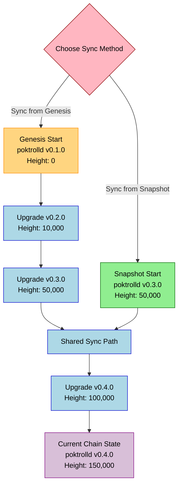

import Tabs from '@theme/Tabs';
import TabItem from '@theme/TabItem';

## Full Node Binary Walkthrough <!-- omit in toc -->

**🧑‍🔬 Detailed step-by-step instructions to get you up and running with a `Full Node` on Pocket Network ✅**

:::warning recommended for advanced linux users only

See the [Full Node Cheat Sheet](../cheat_sheets/full_node_cheatsheet.md) if you want to just copy-pasta a few commands.

**These instructions are intended for Debian-based systems.**

:::

---

## Table of Contents <!-- omit in toc -->

- [Why run a Full Node?](#why-run-a-full-node)
- [Pre-Requisites \& Requirements](#pre-requisites--requirements)
- [Instructions](#instructions)
  - [1. Install Dependencies](#1-install-dependencies)
  - [2. Create a New User](#2-create-a-new-user)
  - [3. Set Up Environment Variables for Cosmovisor](#3-set-up-environment-variables-for-cosmovisor)
  - [4. Install Cosmovisor](#4-install-cosmovisor)
  - [5. Retrieve the Genesis File](#5-retrieve-the-genesis-file)
  - [6. Choose Sync Method: Genesis vs Snapshot](#6-choose-sync-method-genesis-vs-snapshot)
    - [6.1 \[Slow \& Not Recommended\] Sync from Genesis](#61-slow--not-recommended-sync-from-genesis)
    - [6.2 \[Fast \& Recommended\] Sync from Snapshot](#62-fast--recommended-sync-from-snapshot)
  - [7. Install `poktrolld`](#7-install-poktrolld)
  - [8. Network Configuration](#8-network-configuration)
  - [9. Set Up `systemd` Service](#9-set-up-systemd-service)
  - [10. Configure your Firewall](#10-configure-your-firewall)
  - [11. Check \& Monitor the Status of your Node](#11-check--monitor-the-status-of-your-node)
- [Next Steps](#next-steps)

## Why run a Full Node?

This guide will walk you through, step-by-step, running a Full Node for Pocket Network.

Running a Full Node is the first step toward becoming a Validator, Supplier, or Gateway.

The instructions outlined here use [Cosmovisor](https://docs.cosmos.network/v0.45/run-node/cosmovisor.html)
to enable automatic binary upgrades.

## Pre-Requisites & Requirements

1. **Linux-based System**: Preferably Debian-based distributions (Ubuntu, Debian).
2. **Hardware Requirements**:
   - 4+ CPU cores
   - 8+ GB RAM
   - 200+ GB SSD storage (for chain data)
3. **Architecture Support**: Both x86_64 (amd64) and ARM64 architectures are supported.
4. **Root or Sudo Access**: Administrative privileges are required.
5. **Dedicated Server or Virtual Machine**: Any provider is acceptable.

:::tip Vultr Playbook

TODO_IN_THIS_PR(@olshansky)

:::

## Instructions

### 1. Install Dependencies

Install all the necessary CLI tools:

```bash
sudo apt-get update
sudo apt-get install -y curl tar wget jq zstd aria2
```

:::note Snapshot specific tooling

`zstd` is required for snapshot compression/decompression.

`aria2` is needed for efficient torrent downloads if you choose to sync from a snapshot.

:::

### 2. Create a New User

Create a dedicated user to run `poktrolld`:

```bash
sudo adduser poktroll
```

Set a password when prompted, and add the user to the sudo group:

```bash
sudo usermod -aG sudo poktroll
```

And switch to the `poktroll` user:

```bash
sudo su - poktroll
```

### 3. Set Up Environment Variables for Cosmovisor

Create a `.poktrollrc` file and set the following environment variables:

```bash
cat > ~/.poktrollrc << 'EOF'
export DAEMON_NAME=poktrolld
export DAEMON_HOME=$HOME/.poktroll
export DAEMON_RESTART_AFTER_UPGRADE=true
export DAEMON_ALLOW_DOWNLOAD_BINARIES=true
export UNSAFE_SKIP_BACKUP=false
export PATH=$HOME/.local/bin:$HOME/.poktroll/cosmovisor/current/bin:$PATH
EOF

echo "source ~/.poktrollrc" >> ~/.profile
source ~/.profile
```

### 4. Install Cosmovisor

:::note Alternative Instructions to install Cosmovisor

You can follow the official Cosmovisor installation instructions [here](https://docs.cosmos.network/main/build/tooling/cosmovisor#installation).

:::

Cosmovisor manages the binary upgrades for your node. Use the commands below to download and install Cosmovisor.

**Determine your architecture**:

```bash
mkdir -p $HOME/.local/bin
COSMOVISOR_VERSION="v1.7.1"
ARCH=$(uname -m)
if [ "$ARCH" = "x86_64" ]; then
    ARCH="amd64"
elif [ "$ARCH" = "aarch64" ]; then
    ARCH="arm64"
fi
```

Download and install Cosmovisor:

```bash
curl -L "https://github.com/cosmos/cosmos-sdk/releases/download/cosmovisor%2F${COSMOVISOR_VERSION}/cosmovisor-${COSMOVISOR_VERSION}-linux-${ARCH}.tar.gz" | tar -zxvf - -C $HOME/.local/bin
```

Verify the installation:

```bash
cosmovisor help
```

### 5. Retrieve the Genesis File

Genesis files and network configuration are stored in the [pokt-network/pocket-network-genesis](https://github.com/pokt-network/pocket-network-genesis) repository. This repository contains the official chain information for all Pocket Network chains.

Choose a network to join from the tabs below:

<Tabs groupId="network">
  <TabItem value="testnet-beta" label="Testnet Beta" default>

    ```bash
    # Set network to testnet-beta (stable testing network)
    NETWORK="testnet-beta"

    # Create config directory if it doesn't exist
    mkdir -p $HOME/.poktroll/config

    # Download genesis file from URL
    GENESIS_FILE_URL="https://raw.githubusercontent.com/pokt-network/pocket-network-genesis/master/shannon/${NETWORK}/genesis.json"
    curl -s -o $HOME/.poktroll/config/genesis.json "$GENESIS_FILE_URL"

    # Extract initial version of poktrolld to start synching from genesis
    POKTROLLD_GENESIS_VERSION=$(jq -r '.app_version' < $HOME/.poktroll/config/genesis.json)
    ```

  </TabItem>

  <TabItem value="testnet-alpha" label="Testnet Alpha">

    ```bash
    # Set network to testnet-alpha (unstable testing network)
    NETWORK="testnet-alpha"

    # Create config directory if it doesn't exist
    mkdir -p $HOME/.poktroll/config

    # Download genesis file from URL
    GENESIS_FILE_URL="https://raw.githubusercontent.com/pokt-network/pocket-network-genesis/master/shannon/${NETWORK}/genesis.json"
    curl -s -o $HOME/.poktroll/config/genesis.json "$GENESIS_FILE_URL"

    # Extract initial version of poktrolld to start synching from genesis
    POKTROLLD_GENESIS_VERSION=$(jq -r '.app_version' < $HOME/.poktroll/config/genesis.json)
    ```

  </TabItem>

  <TabItem value="mainnet" label="(Not live yet) Mainnet">

    ```bash
    # Set network to mainnet (production network)
    NETWORK="mainnet"

    # Create config directory if it doesn't exist
    mkdir -p $HOME/.poktroll/config

    # Download genesis file from URL
    GENESIS_FILE_URL="https://raw.githubusercontent.com/pokt-network/pocket-network-genesis/master/shannon/${NETWORK}/genesis.json"
    curl -s -o $HOME/.poktroll/config/genesis.json "$GENESIS_FILE_URL"

    # Extract initial version of poktrolld to start synching from genesis
    POKTROLLD_GENESIS_VERSION=$(jq -r '.app_version' < $HOME/.poktroll/config/genesis.json)
    ```

  </TabItem>
</Tabs>

### 6. Choose Sync Method: Genesis vs Snapshot

Before installing `poktrolld`, you need to decide whether to sync from genesis or use a snapshot. This decision will determine which version of `poktrolld` to install.

As the sync progresses from genesis (i.e. block zero) to the latest (i.e. current) height, Cosmosvisor automatically updates the `poktrolld` binary to the latest/necessary version at each particular height as a function of the network’s upgrade plan

The following diagram illustrates the two sync path with arbitrary version and height numbers:



#### 6.1 [Slow & Not Recommended] Sync from Genesis

The (static) genesis file contains the required initial version of poktrolld to start syncing from genesis.

```bash
POKTROLLD_VERSION=$POKTROLLD_GENESIS_VERSION
echo "Sync from genesis will use the following version of poktrolld as a starting point: $POKTROLLD_VERSION"
```

#### 6.2 [Fast & Recommended] Sync from Snapshot

:::info Snapshot Explorer

You can visit [snapshots.us-nj.poktroll.com](https://snapshots.us-nj.poktroll.com) directly in your browser to explore available snapshots.

:::

If you prefer to use a snapshot (recommended for faster setup), you need to check the snapshot version first:

<Tabs groupId="network">
  <TabItem value="testnet-beta" label="Testnet Beta" default>

    ```bash
    echo "############################################"

    # Base URL for snapshots
    SNAPSHOT_BASE_URL="https://snapshots.us-nj.poktroll.com"

    # Get latest snapshot information for testnet-beta
    LATEST_SNAPSHOT_HEIGHT=$(curl -s "$SNAPSHOT_BASE_URL/testnet-beta-latest-archival.txt")
    echo "Latest snapshot height: $LATEST_SNAPSHOT_HEIGHT"

    # Get snapshot version (important for compatibility)
    SNAPSHOT_VERSION=$(curl -s "$SNAPSHOT_BASE_URL/testnet-beta-${LATEST_SNAPSHOT_HEIGHT}-version.txt")
    echo "Snapshot version: $SNAPSHOT_VERSION"

    # Store the torrent URL for later use
    TORRENT_URL="${SNAPSHOT_BASE_URL}/testnet-beta-latest-archival.torrent"

    # Set the version to use for installation
    POKTROLLD_VERSION=$SNAPSHOT_VERSION
    echo "Sync from snapshot will use the following version of poktrolld as a starting point: $POKTROLLD_VERSION"

    echo "############################################"
    ```

  </TabItem>

  <TabItem value="testnet-alpha" label="Testnet Alpha">

    ```bash
    echo "############################################"

    # Base URL for snapshots
    SNAPSHOT_BASE_URL="https://snapshots.us-nj.poktroll.com"

    # Get latest snapshot information for testnet-alpha
    LATEST_SNAPSHOT_HEIGHT=$(curl -s "$SNAPSHOT_BASE_URL/testnet-alpha-latest-archival.txt")
    echo "Latest snapshot height: $LATEST_SNAPSHOT_HEIGHT"

    # Get snapshot version (important for compatibility)
    SNAPSHOT_VERSION=$(curl -s "$SNAPSHOT_BASE_URL/testnet-alpha-${LATEST_SNAPSHOT_HEIGHT}-version.txt")
    echo "Snapshot version: $SNAPSHOT_VERSION"

    # Store the torrent URL for later use
    TORRENT_URL="${SNAPSHOT_BASE_URL}/testnet-alpha-latest-archival.torrent"

    # Set the version to use for installation
    POKTROLLD_VERSION=$SNAPSHOT_VERSION
    echo "Sync from snapshot will use the following version of poktrolld as a starting point: $POKTROLLD_VERSION"

    echo "############################################"
    ```

  </TabItem>

  <TabItem value="mainnet" label="Mainnet">

    ```bash
    echo "############################################"

    # Base URL for snapshots
    SNAPSHOT_BASE_URL="https://snapshots.us-nj.poktroll.com"

    # Get latest snapshot information for mainnet
    LATEST_SNAPSHOT_HEIGHT=$(curl -s "$SNAPSHOT_BASE_URL/mainnet-latest-archival.txt")
    echo "Latest snapshot height: $LATEST_SNAPSHOT_HEIGHT"

    # Get snapshot version (important for compatibility)
    SNAPSHOT_VERSION=$(curl -s "$SNAPSHOT_BASE_URL/mainnet-${LATEST_SNAPSHOT_HEIGHT}-version.txt")
    echo "Snapshot version: $SNAPSHOT_VERSION"

    # Store the torrent URL for later use
    TORRENT_URL="${SNAPSHOT_BASE_URL}/mainnet-latest-archival.torrent"

    # Set the version to use for installation
    POKTROLLD_VERSION=$SNAPSHOT_VERSION
    echo "Sync from snapshot will use the following version of poktrolld as a starting point: $POKTROLLD_VERSION"

    echo "############################################"
    ```

  </TabItem>
</Tabs>

Then download the snapshot via torrent and apply it to your node:

:::warning Snapshot Download

This can take 10-20 minutes depending on your network speed.

Make sure you review the disk space requirements at the top of this guide before proceeding.

:::

```bash
# Create a directory for the snapshot download
SNAPSHOT_DIR="$HOME/poktroll_snapshot"
mkdir -p "$SNAPSHOT_DIR" "$HOME/.poktroll/data"
cd "$SNAPSHOT_DIR"

# Download via torrent
aria2c --seed-time=0 --file-allocation=none --continue=true \
       --max-connection-per-server=4 --max-concurrent-downloads=16 --split=16 \
       --bt-enable-lpd=true --bt-max-peers=100 --bt-prioritize-piece=head,tail \
       --bt-seed-unverified \
       "$TORRENT_URL"

# Find the downloaded file
DOWNLOADED_FILE=$(find . -type f -name "*.tar.*" | head -n 1)

# Extract the snapshot
if [[ "$DOWNLOADED_FILE" == *.tar.zst ]]; then
    echo "Extracting .tar.zst snapshot..."
    zstd -d "$DOWNLOADED_FILE" --stdout | tar -xf - -C $HOME/.poktroll/data
elif [[ "$DOWNLOADED_FILE" == *.tar.gz ]]; then
    echo "Extracting .tar.gz snapshot..."
    tar -zxf "$DOWNLOADED_FILE" -C $HOME/.poktroll/data
else
    echo "Unknown snapshot format: $DOWNLOADED_FILE"
    exit 1
fi

# Clean up
cd $HOME
rm -rf "$SNAPSHOT_DIR"

echo "###"
echo "Snapshot applied successfully"
echo "###"
```

### 7. Install `poktrolld`

Now that we've determined the correct version to use, we can install `poktrolld`:

```bash
# Determine your OS type and architecture
OS_TYPE=$(uname -s | tr '[:upper:]' '[:lower:]')
ARCH=$(uname -m)
if [ "$ARCH" = "x86_64" ]; then
    ARCH="amd64"
elif [ "$ARCH" = "aarch64" ]; then
    ARCH="arm64"
fi

# Download and install poktrolld with the version determined in the previous step
RELEASE_URL="https://github.com/pokt-network/poktroll/releases/download/v${POKTROLLD_VERSION}/poktroll_${OS_TYPE}_${ARCH}.tar.gz"
mkdir -p $HOME/.poktroll/cosmovisor/genesis/bin
curl -L "$RELEASE_URL" | tar -zxvf - -C $HOME/.poktroll/cosmovisor/genesis/bin
chmod +x $HOME/.poktroll/cosmovisor/genesis/bin/poktrolld

# Verify the installation
$HOME/.poktroll/cosmovisor/genesis/bin/poktrolld version

# Initialize Cosmovisor with the poktrolld binary
cosmovisor init $HOME/.poktroll/cosmovisor/genesis/bin/poktrolld
```

:::note Cosmosvisor poktrolld symlinks

The `cosmovisor init` command creates the necessary directory structure and symlinks and you can now use the `poktrolld` command directly.

:::

### 8. Network Configuration

Initialize your node and configure it to connect to the network:

<Tabs groupId="network">
  <TabItem value="testnet-beta" label="Testnet Beta" default>
    ```bash
    # Extract chain-id from existing genesis
    CHAIN_ID=$(jq -r '.chain_id' < $HOME/.poktroll/config/genesis.json)

    # Initialize the node with your chosen moniker (node name)
    poktrolld init "YourNodeMoniker" --chain-id="$CHAIN_ID" --home=$HOME/.poktroll

    # Get seeds from the official repository
    SEEDS_URL="https://raw.githubusercontent.com/pokt-network/pocket-network-genesis/master/shannon/testnet-beta/seeds"
    SEEDS=$(curl -s "$SEEDS_URL")
    sed -i -e "s|^seeds *=.*|seeds = \"$SEEDS\"|" $HOME/.poktroll/config/config.toml

    # Configure external address for P2P communication
    EXTERNAL_IP=$(curl -s https://api.ipify.org)
    sed -i -e "s|^external_address *=.*|external_address = \"${EXTERNAL_IP}:26656\"|" $HOME/.poktroll/config/config.toml
    ```

  </TabItem>

  <TabItem value="testnet-alpha" label="Testnet Alpha">
    ```bash
    # Extract chain-id from existing genesis
    CHAIN_ID=$(jq -r '.chain_id' < $HOME/.poktroll/config/genesis.json)

    # Initialize the node with your chosen moniker (node name)
    poktrolld init "YourNodeMoniker" --chain-id="$CHAIN_ID" --home=$HOME/.poktroll

    # Get seeds from the official repository
    SEEDS_URL="https://raw.githubusercontent.com/pokt-network/pocket-network-genesis/master/shannon/testnet-alpha/seeds"
    SEEDS=$(curl -s "$SEEDS_URL")
    sed -i -e "s|^seeds *=.*|seeds = \"$SEEDS\"|" $HOME/.poktroll/config/config.toml

    # Configure external address for P2P communication
    EXTERNAL_IP=$(curl -s https://api.ipify.org)
    sed -i -e "s|^external_address *=.*|external_address = \"${EXTERNAL_IP}:26656\"|" $HOME/.poktroll/config/config.toml
    ```

  </TabItem>

  <TabItem value="mainnet" label="Mainnet">
    ```bash
    # Extract chain-id from existing genesis
    CHAIN_ID=$(jq -r '.chain_id' < $HOME/.poktroll/config/genesis.json)

    # Initialize the node with your chosen moniker (node name)
    poktrolld init "YourNodeMoniker" --chain-id="$CHAIN_ID" --home=$HOME/.poktroll

    # Get seeds from the official repository
    SEEDS_URL="https://raw.githubusercontent.com/pokt-network/pocket-network-genesis/master/shannon/mainnet/seeds"
    SEEDS=$(curl -s "$SEEDS_URL")
    sed -i -e "s|^seeds *=.*|seeds = \"$SEEDS\"|" $HOME/.poktroll/config/config.toml

    # Configure external address for P2P communication
    EXTERNAL_IP=$(curl -s https://api.ipify.org)
    sed -i -e "s|^external_address *=.*|external_address = \"${EXTERNAL_IP}:26656\"|" $HOME/.poktroll/config/config.toml
    ```

  </TabItem>
</Tabs>

### 9. Set Up `systemd` Service

Create a `systemd` service to manage your node. You can customize the service name if you plan to run multiple nodes:

```bash
# Set a service name (change if running multiple nodes)
SERVICE_NAME="cosmovisor-poktroll"  # or another name like "cosmovisor-testnet"

# Store the current username for use in the service file
USERNAME=$(whoami)

sudo tee /etc/systemd/system/${SERVICE_NAME}.service > /dev/null <<EOF
[Unit]
Description=Cosmovisor daemon for poktrolld
After=network-online.target

[Service]
User=${USERNAME}
ExecStart=/home/${USERNAME}/.local/bin/cosmovisor run start --home=/home/${USERNAME}/.poktroll
Restart=always
RestartSec=3
LimitNOFILE=infinity
LimitNPROC=infinity
Environment="DAEMON_NAME=poktrolld"
Environment="DAEMON_HOME=/home/${USERNAME}/.poktroll"
Environment="DAEMON_RESTART_AFTER_UPGRADE=true"
Environment="DAEMON_ALLOW_DOWNLOAD_BINARIES=true"
Environment="UNSAFE_SKIP_BACKUP=true"

[Install]
WantedBy=multi-user.target
EOF
```

Enable and start the service:

```bash
sudo systemctl daemon-reload
sudo systemctl enable ${SERVICE_NAME}.service
sudo systemctl start ${SERVICE_NAME}.service
```

### 10. Configure your Firewall

To ensure your node can properly participate in the P2P network, you need to make port `26656` accessible from the internet. This is essential for communication with other nodes.

Choose the appropriate method for your system:

1. **[Required] Using UFW**:

   ```bash
   # [REQUIRED] Expose P2P
   sudo ufw allow 26656/tcp
   ```

2. **Using iptables**:

   ```bash
   sudo iptables -A INPUT -p tcp --dport 26656 -j ACCEPT
   sudo iptables-save > /etc/iptables/rules.v4  # Save rules (may require iptables-persistent package)
   ```

3. **Cloud Provider Settings**: If running on a cloud provider (AWS, GCP, Azure, etc.), configure security groups or firewall rules to allow inbound traffic on port 26656.

4. **Verify your port** is accessible:

- Install netcat if not already installed

  ```bash
  sudo apt install -y netcat
  # OR
  sudo apt install netcat-openbsd
  ```

- Use an external service to check port accessibility

  ```bash
  nc -zv portquiz.net 26656
  ```

- Alternatively, have someone from outside check your port:

  ```bash
  nc -zv YOUR_EXTERNAL_IP 26656
  ```

### 11. Check & Monitor the Status of your Node

View service status (e.g. `SERVICE_NAME=cosmovisor-poktroll`):

```bash
sudo systemctl status ${SERVICE_NAME}
```

View logs in real-time (e.g. `SERVICE_NAME=cosmovisor-poktroll`):

```bash
sudo journalctl -u ${SERVICE_NAME} -f
```

Check sync status using `poktrolld`:

```bash
poktrolld status | jq '.sync_info.catching_up'
```

Your node is fully synced when `catching_up` is `false`.

:::tip

Consider visiting one of our [explores](../../category/explorers-faucets-wallets-and-more) to compare their
block height against yours, which you can query via:

```bash
poktrolld status | jq '.sync_info.latest_block_height'
```

:::

## Next Steps

You have now successfully set up a Full Node on the Pocket Network! This node can be used as a foundation to set up a validator, supplier, or gateway in the future.
