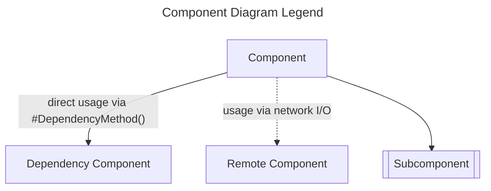
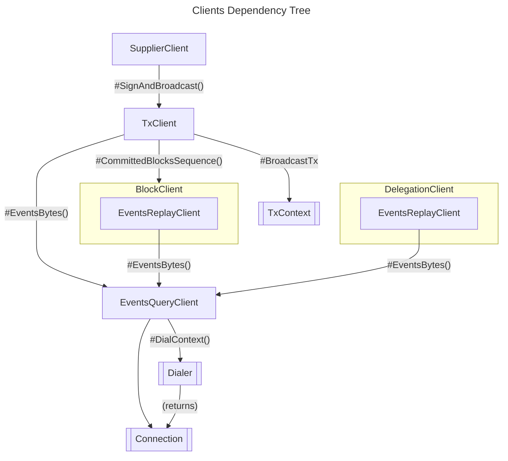
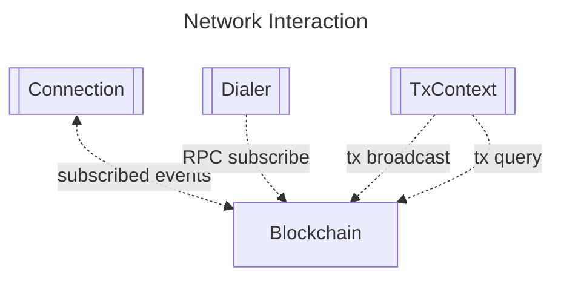

# Package `pkg/client` <!-- omit in toc -->

- [Overview](#overview)
- [Features](#features)
- [Architecture Overview](#architecture-overview)
- [Installation](#installation)
- [Usage (Supplier Client)](#usage-supplier-client)
  - [Basic Example (CLI command)](#basic-example-cli-command)
  - [Advanced Usage](#advanced-usage)
- [Usage (Transaction Client)](#usage-transaction-client)
  - [Basic Example (CLI command)](#basic-example-cli-command-1)
  - [Advanced Usage](#advanced-usage-1)
- [Configuration](#configuration)
- [API Reference](#api-reference)
- [Best Practices](#best-practices)
- [FAQ](#faq)
  - [How does the `TxClient` interface differ from `TxContext`?](#how-does-the-txclient-interface-differ-from-txcontext)
  - [Can I extend or customize the provided interfaces?](#can-i-extend-or-customize-the-provided-interfaces)

## Overview

The `client` package exposes go APIs to facilitate interactions with the Pocket network.
It includes lower-level interfaces for working with transactions and subscribing to events generally, as well as higher-level interfaces for tracking blocks and broadcasting protocol-specific transactions.

| Interface               | Description                                                                                        |
| ----------------------- | -------------------------------------------------------------------------------------------------- |
| **`SupplierClient`**    | A high-level client for use by the "supplier" actor.                                               |
| **`TxClient`**          | A high-level client used to build, sign, and broadcast transaction from cosmos-sdk messages.       |
| **`TxContext`**         | Abstracts and encapsulates the transaction building, signing, encoding, and broadcasting concerns. |
| **`BlockClient`**       | Exposes methods for receiving notifications about newly committed blocks.                          |
| **`DelegationClient`**  | Exposes methods for receiving notifications about new delegation changes from application.         |
| **`EventsQueryClient`** | Encapsulates blockchain event subscriptions.                                                       |
| **`Connection`**        | A transport agnostic communication channel for sending and receiving messages.                     |
| **`Dialer`**            | Abstracts the establishment of connections.                                                        |

## Architecture Overview



> **Figure 1**: A legend for the component diagrams in this document.



> **Figure 2**: An overview which articulates the dependency relationships between the various client interfaces and their subcompnents.



> **Figure 3**: An overview of how client subcomponents interact with the network.

## Installation

```bash
go get github.com/pokt-network/poktroll/pkg/client
```

## Usage (Supplier Client)

### Basic Example (CLI command)

```go
package main

import (
  "context"
  "log"
  "net/url"

  sdkflags "github.com/cosmos/cosmos-sdk/client/flags"
  "github.com/spf13/cobra"

  "github.com/pokt-network/poktroll/pkg/client/supplier"
  "github.com/pokt-network/poktroll/pkg/deps/config"
  sessiontypes "github.com/pokt-network/poktroll/x/session/types"
)

var cmd = &cobra.Command{RunE: runCommand}

func main() {
  if err := cmd.ExecuteContext(context.Background()); err != nil {
    log.Fatal(err)
  }
}

func init() {
  // IMPORTANT!: In order to take advantage of cosmos-sdk helpers which take
  // the cobra command object  as an input, some flags MUST be registered and
  // populated as expected by such helpers.
  // See:
  //   - https://pkg.go.dev/github.com/cosmos/cosmos-sdk@v0.50.3/client#GetClientContextFromCmd
  //   - https://pkg.go.dev/github.com/cosmos/cosmos-sdk@v0.50.3/client/tx#NewFactoryCLI
  cmd.Flags().String(sdkflags.FlagNode, "", "Register the default Cosmos node flag, which is needed to initialize the Cosmos query and tx contexts correctly.")
  cmd.Flags().String(sdkflags.FlagGRPC, "", "Register the default Cosmos node grpc flag, which is needed to initialize the Cosmos query context with grpc correctly.")
}

func runCommand(cmd *cobra.Command, args []string) error {
  // NOTE: interstitial `err` returns are ignored for brevity.
  ctx := context.Background()

  // Use the websocket URL of a trusted pocket network node.
  pocketNodeWebsocketURL, _ := url.Parse("ws://localhost:35567/websocket")

  deps, _ := config.SupplyConfig(
    ctx, cmd,
    config.NewSupplyEventsQueryClientFn(pocketNodeWebsocketURL),
  )
  supplierClient, _ := supplier.NewSupplierClient(deps)

  // NOTE: merkle root hash must be valid.
  merkleRootHash := []byte("some merkle root hash")

  // NOTE: session header must be valid.
  sessionHeader := sessiontypes.SessionHeader{}

  return supplierClient.CreateClaim(ctx, sessionHeader, merkleRootHash)
}
```

### Advanced Usage

```go
// TODO(@bryanchriswhite #159): Example illustrating advanced features or edge cases of the package.
```

## Usage (Transaction Client)

### Basic Example (CLI command)

```go
package main

import (
  "context"
  "log"
  "net/url"
  "time"

  "cosmossdk.io/depinject"
  sdkclient "github.com/cosmos/cosmos-sdk/client"
  sdkflags "github.com/cosmos/cosmos-sdk/client/flags"
  sdktx "github.com/cosmos/cosmos-sdk/client/tx"
  "github.com/spf13/cobra"
  "github.com/spf13/pflag"
  "github.com/stretchr/testify/require"

  "github.com/pokt-network/poktroll/pkg/client/block"
  "github.com/pokt-network/poktroll/pkg/client/events"
  "github.com/pokt-network/poktroll/pkg/client/tx"
  "github.com/pokt-network/poktroll/pkg/deps/config"
  apptypes "github.com/pokt-network/poktroll/x/application/types"
)

// Arbitrary timeout duration for the transaction to complete.
const txTimeoutDuration = 10 * time.Second

var (
  // GRPC URL of trusted pocket network node, used for querying chain state.
  queryNodeGRPCURLFlag string
  // GRPC URL of trusted pocket network node, used for submitting transactions to the network.
  txNodeGRPCURLFlag string
  signingKeyNameFlag string
  cmd               = &cobra.Command{RunE: runCommand}
)

func main() {
  if err := cmd.ExecuteContext(context.Background()); err != nil {
    log.Fatal(err)
  }
}

func init() {
  // IMPORTANT!: In order to take advantage of cosmos-sdk helpers which take
  // the cobra command object  as an input, some flags MUST be registered and
  // populated as expected by such helpers.
  // See:
  //   - https://pkg.go.dev/github.com/cosmos/cosmos-sdk@v0.50.3/client#GetClientContextFromCmd
  //   - https://pkg.go.dev/github.com/cosmos/cosmos-sdk@v0.50.3/client/tx#NewFactoryCLI
  cmd.Flags().StringVar(&queryNodeGRPCURLFlag, sdkflags.FlagNode, "", "Register the default Cosmos node flag, which is needed to initialize the Cosmos query and tx contexts correctly.")
  cmd.Flags().StringVar(&txNodeGRPCURLFlag, sdkflags.FlagGRPC, "", "Register the default Cosmos node grpc flag, which is needed to initialize the Cosmos query context with grpc correctly.")

  cmd.Flags().StringVar(&signingKeyNameFlag, "signing-key-name", "", "Name of a key in the keyring to use for signing transactions.")
}

func runCommand(cmd *cobra.Command, args []string) error {
  // NOTE: interstitial `err` returns are ignored for brevity.
  ctx := context.Background()

  // Use the websocket URL of a trusted pocket network node.
  pocketQueryNodeWebsocketURL, _ := url.Parse("ws://localhost:35567/websocket")
  pocketQueryNodeGRPCURL, _ := url.Parse("ws://localhost:35567/websocket")
  pocketTxNodeGRPCURL, _ := url.Parse("ws://localhost:35567/websocket")

  deps, _ := config.SupplyConfig(
    ctx, cmd,
    // Construct and inject the events query client dependency.
    config.NewSupplyEventsQueryClientFn(pocketQueryNodeWebsocketURL),
    // Construct and inject the block client dependency.
    config.NewSupplyBlockClientFn(),
    // Construct and inject the tx context, and cosmos-sdk client context and tx factory dependencies.
    config.NewSupplyTxClientContextFn(pocketQueryNodeGRPCURL, pocketTxNodeGRPCURL),
  )

  // Add the signing key name option to specify which keyring key should
  // be used to sign transactions made with the transaction client.
  signingKeyOpt := tx.WithSigningKeyName(signingKeyNameFlag)

  // Construct the transaction client.
  txClient, err := tx.NewTxClient(ctx, deps, signingKeyOpt)
  require.NoError(t, err)

  // Construct a message to sign, encode, and broadcast.
  appStakeMsg := &apptypes.MsgStakeApplication{
    // ...
  }

  // Sign and broadcast the message.
  eitherErr := txClient.SignAndBroadcast(ctx, appStakeMsg)
  err, asyncErrCh := eitherErr.SyncOrAsyncError()

  // Handle synchronous error
  if err != nil {
    // ...
  }

  // Handle asynchronous error
  select {
  case asyncErr := <-asyncErrCh:
    if asyncErr != nil {
      log.Fatal(asyncErr)
    }
  case <-time.After(txTimeoutDuration):
    log.Fatal("timed out waiting for tx to complete or error")
  }
}
```

### Advanced Usage

```go
package main

import (
  "context"
  "log"
  "time"

  "cosmossdk.io/depinject"
  sdkclient "github.com/cosmos/cosmos-sdk/client"
  sdktx "github.com/cosmos/cosmos-sdk/client/tx"
  "github.com/spf13/pflag"
  "github.com/stretchr/testify/require"

  "github.com/pokt-network/poktroll/pkg/client/block"
  "github.com/pokt-network/poktroll/pkg/client/events"
  "github.com/pokt-network/poktroll/pkg/client/tx"
  apptypes "github.com/pokt-network/poktroll/x/application/types"
)

// Arbitrary timeout duration for the transaction to complete.
const txTimeoutDuration = 10 * time.Second

func main() {
  // NOTE: `err` returns are ignored for brevity.
  ctx := context.Background()

  // Use the websocket URL of a trusted pocket network node.
  pocketNodeWebsocketURL := "ws://localhost:35567/websocket"
  eventsQueryClient := events.NewEventsQueryClient(pocketNodeWebsocketURL)

  // Construct a depinject config with the events query client.
  deps := depinject.Supply(&eventsQueryClient)
  blockClient, _ := block.NewBlockClient(ctx, deps)

  // Typically, the sdkclient.Context would be derived from a cosmos-sdk cobra command object.
  // See: https://pkg.go.dev/github.com/cosmos/cosmos-sdk@v0.50.3/client#GetClientContextFromCmd
  cosmosContext := sdkclient.Context{
    // ... see: https://pkg.go.dev/github.com/cosmos/cosmos-sdk@v0.50.3/client#Context
  }

  // Typically, the FlagSet would be derived from a cosmos-sdk cobra command object.
  // See: https://pkg.go.dev/github.com/spf13/cobra#Command.Flags
  flagSet := pflag.NewFlagSet("example", pflag.ExitOnError)
  cosmosTxFactory, _ := sdktx.NewFactoryCLI(cosmosContext, flagSet)

  // Add a cosmos-sdk client context and tx factory to the depinject config.
  deps = depinject.Configs(deps, depinject.Supply(&cosmosContext, &cosmosTxFactory))

  // Construct a poktroll `TxContext`.
  txCtx, _ := tx.NewTxContext(deps)

  // Add the poktroll block client and tx context to the depinject config.
  deps = depinject.Configs(deps, depinject.Supply(&blockClient, &txCtx))

  // Add the signing key name option to specify which keyring key should
  // be used to sign transactions made with the transaction client.
  signingKeyOpt := tx.WithSigningKeyName("signing-key-name-in-keyring")

  // Construct the transaction client.
  txClient, err := tx.NewTxClient(ctx, deps, signingKeyOpt)
  require.NoError(t, err)

  // Construct any message to sign, encode, and broadcast.
  appStakeMsg := &apptypes.MsgStakeApplication{
    // ...
  }

  // Sign and broadcast the message.
  eitherErr := txClient.SignAndBroadcast(ctx, appStakeMsg)
  err, asyncErrCh := eitherErr.SyncOrAsyncError()

  // Handle synchronous error
  if err != nil {
    // ...
  }

  // Handle asynchronous error
  select {
  case asyncErr := <-asyncErrCh:
    if asyncErr != nil {
      log.Fatal(asyncErr)
    }
  case <-time.After(txTimeoutDuration):
    log.Fatal("timed out waiting for tx to complete or error")
  }
}
```

## Configuration

- **TxClientOption**: Function type that modifies the `TxClient` allowing for flexible and optional configurations.
- **EventsQueryClientOption**: Modifies the `EventsQueryClient` to apply custom behaviors or configurations.

## API Reference

For the complete API details, see the [godoc](https://pkg.go.dev/github.com/pokt-network/poktroll/pkg/client).

## Best Practices

- **Use Abstractions**: Instead of directly communicating with blockchain platforms, leverage the provided interfaces for consistent and error-free interactions.
- **Stay Updated**: With evolving blockchain technologies, ensure to keep the package updated for any new features or security patches.

## FAQ

#### How does the `TxClient` interface differ from `TxContext`?

While `TxClient` is centered around signing and broadcasting transactions, `TxContext` consolidates operational dependencies for the transaction lifecycle, like building, encoding, and querying.

#### Can I extend or customize the provided interfaces?

Yes, the package is designed with modularity in mind. You can either implement the interfaces based on your requirements or extend them for additional functionalities.
