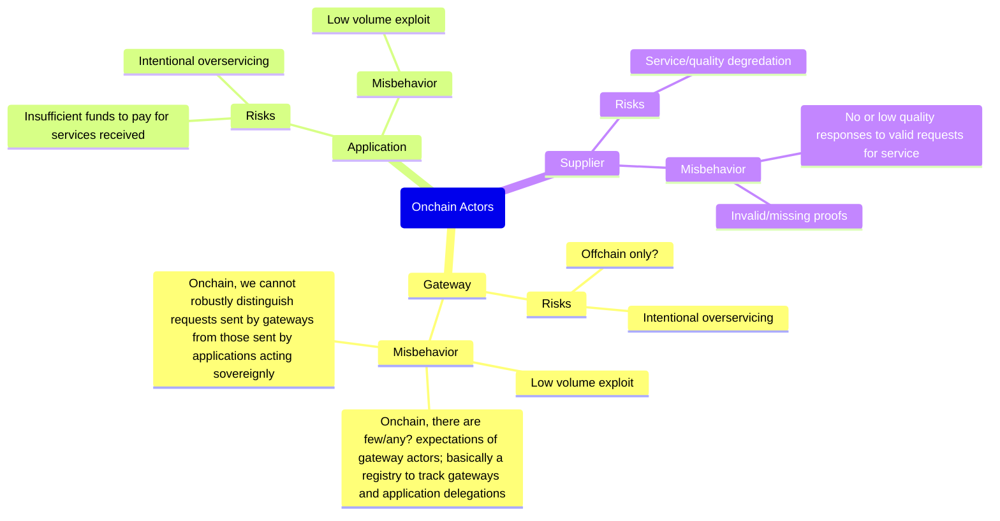

# Pocket Network Actors <!-- omit in toc -->

- [Overview](#overview)
- [Onchain Actors](#onchain-actors)
  - [Risks \& Misbehavior](#risks--misbehavior)
- [Offchain Actors](#offchain-actors)

## Overview

Pocket Network protocol is composed of both onchain and offchain actors.

There are 3 onchain actors:

- [Applications](./application.md)
- [Suppliers](./supplier.md)
- [Gateways](./gateway.md)

There are 2 offchain actors:

- [RelayMiners](./relay_miner.md)
- [PATH Gateways](./path_gateway.md)

## Onchain Actors

Onchain actors are part of the Pocket Network distributed ledger. They are the
_"Web3"_ part of Pocket.

They can thought of as a `record`, a `registration` or a piece of `state` at a
certain point in time. They have an `address`, an `account`, a `balance` and often
also have a `stake`.

### Risks & Misbehavior

:::warning
This is an open work in progress and an active area of research.
:::

## Offchain Actors

Offchain actors are all the operators that make up Pocket Network. They are the
_"Web2"_ part of Pocket.

They can be thought of as `servers`, `processes` or `clients`.

Offchain actors play a key role in executing offchain business logic that is
verified onchain and drives onchain state transitions.
