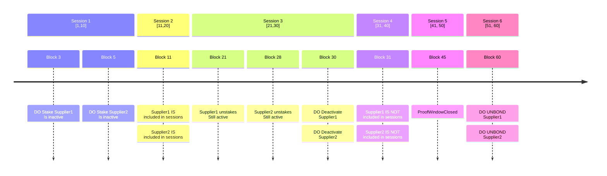

# Supplier Actor <!-- omit in toc -->

- [Overview](#overview)
- [Schema](#schema)
- [Configuration](#configuration)
- [Modules](#modules)
  - [Supplier Module](#supplier-module)
  - [Proof Module](#proof-module)
- [CLI](#cli)
- [Supplier lifecycle](#supplier-lifecycle)
  - [1. Staking Initiation:](#1-staking-initiation)
  - [2. Activation:](#2-activation)
  - [3. Unsaking Initiation:](#3-unsaking-initiation)
  - [4. Unbonding Phase:](#4-unbonding-phase)
  - [5. Completion of Unbonding:](#5-completion-of-unbonding)
  - [Timeline of Events](#timeline-of-events)

## Overview

A `Supplier` is responsible for staking POKT in order to earn POKT in exchange for
providing services as a function of volume and time.

## Schema

The on-chain representation of a `Supplier` can be found at [supplier.proto](https://github.com/pokt-network/poktroll/blob/main/proto/poktroll/shared/supplier.proto).

## Configuration

Configurations to stake an `Supplier` can be found at [supplier_staking_config.md](../../operate/configs/supplier_staking_config.md).

## Modules

The `Supplier` actor depends on both the [`supplier`](https://github.com/pokt-network/poktroll/tree/main/x/supplier)
and [`proof`](https://github.com/pokt-network/poktroll/tree/main/x/proof) on-chain modules.
These two modules' concerns are separated as follows:

### Supplier Module

- Supplier (un/)staking
- Supplier querying

### Proof Module

- Claim creation & querying
- Proof submission & querying

## CLI

All of the read (i.e. query) based operations for the `Supplier` actor can be
viewed by running the following:

```bash
poktrolld query supplier
```

or

```bash
poktrolld query proof
```

All of the write (i.e. tx) based operations for the `Supplier` actor can be
viewed by running the following:

```bash
poktrolld tx supplier
```

or

```bash
poktrolld tx proof
```

## Supplier lifecycle

The lifecycle of a `Supplier` in the network involves several phases, each
with specific actions and status changes. Here’s a detailed breakdown:

### 1. Staking Initiation:

  * The `Supplier` sends a `MsgStakeSupplier` message to the network, initiating
    the staking process.
  * The `Supplier` remains inactive until the beginning of the next session.

### 2. Activation:

  * The `Supplier` becomes active at the start of the new session and can now
    provide services to the network.

### 3. Unsaking Initiation:

  * The `Supplier` sends a `MsgUnstakeSupplier` message to the network to start
    the unstaking process.
  * The `Supplier` continues to be active until the end of the current session.

### 4. Unbonding Phase:

  * In the following session, the `Supplier` enters the unbonding phase, becoming
    inactive and no longer participating in sessions or providing services.
  * During this phase, the staked funds are locked, and any pending claims are settled.

### 5. Completion of Unbonding:

  * After the unbonding period ends, the staked funds are transferred back to the
    `Supplier`'s account, and the `Supplier`'s record is removed from the network.

### Timeline of Events

Here’s a visual representation of the `Supplier` lifecycle from staking to unbonding
with the following example parameters:

* **Unbonding Period**: 3 sessions
* **Number of Blocks per Session**: 10 blocks
* **Session End Height to Proof Window Close Height**: 15 blocks


