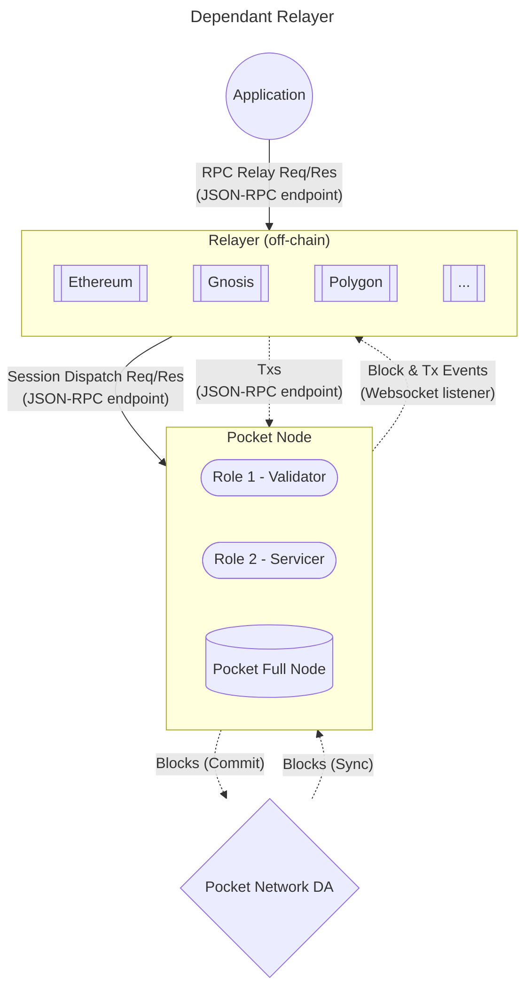
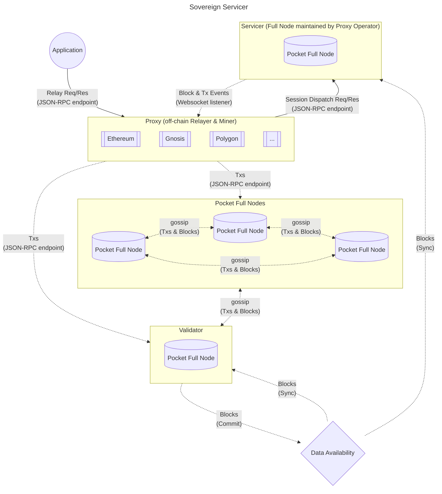

:::danger
TODO(@Olshansk): This file was copied over from the `poktroll-alpha` repo and has
not been updated to reflect recent changse & learnings.
:::

# Pocket Nodes & Validators <!-- omit in toc -->

- [Dependant Node](#dependant-node)
- [Sovereign Node](#sovereign-node)

This document aims to show a high level diagram of the nodes participating in the Pocket Network.

It includes the flow of Requests, Data, Transactions, and Blocks.

## Dependant Node

The diagram below shows the absolute base case where there is:

1. Pocket Full Node
2. The Full Node is also the Single Validator in the network
3. The Single Validator is also the Proxy's (i.e. Relayer/Miner) source of data and events

A Dependant Relayer is one that:

- Sends Txs to the validator (or another node that gossips with the validator)
- Trusts another node to:
  - read on-chain data
  - listen for on-chain events

## Sovereign Node

The diagram below shows the Pocket Network DA, Validators, Full Nodes and Actors.

A Sovereign Relayer is one that:

- Sends Txs to the validator (or a node that gossips with the validators)
- Runs it's own Pocket Full Node to:
  - read on-chain data
  - listen for on-chain events

