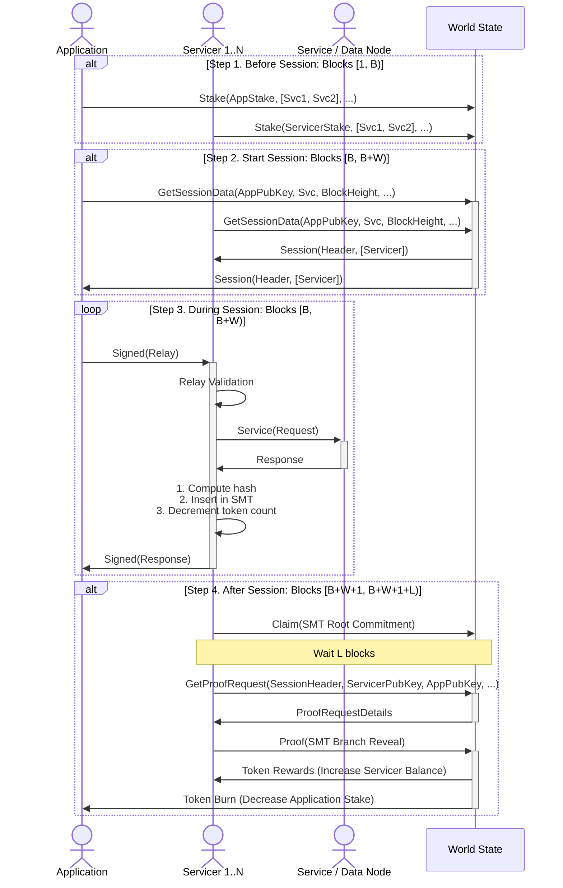
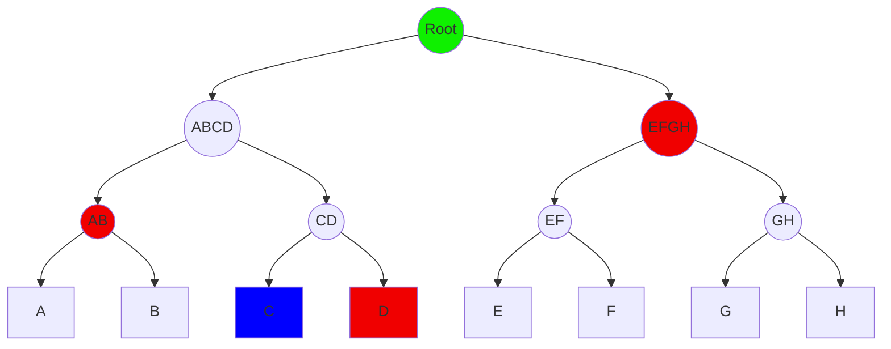
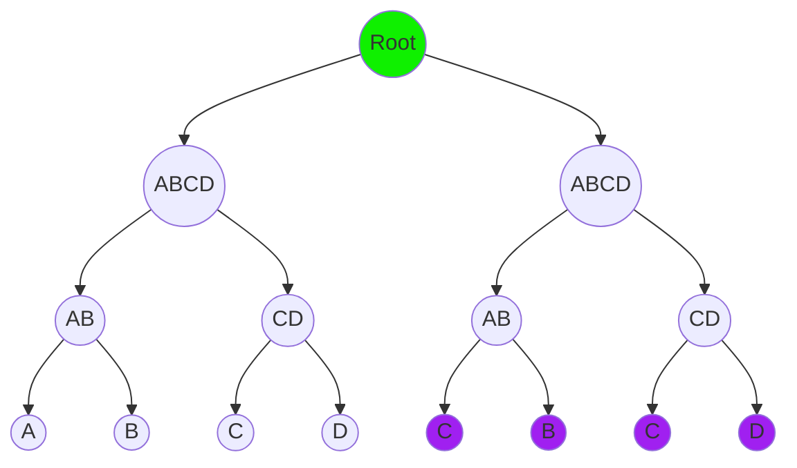

```mermaid
sequenceDiagram
    actor A as Application
    actor S as Servicer 1..N
    actor Svc as Service / Data Node
    participant W as World State

    alt Step 1. Before Session: Blocks [1, B)
        A ->> W: Stake(AppStake, [Svc1, Svc2], ...)
        S ->> W: Stake(ServicerStake, [Svc1, Svc2], ...)
    end

    alt Step 2. Start Session: Blocks [B, B+W)
        A ->> +W: GetSessionData(AppPubKey, Svc, BlockHeight, ...)
        S ->> W: GetSessionData(AppPubKey, Svc, BlockHeight, ...)
        W ->> S: Session(Header, [Servicer])
        W ->> -A: Session(Header, [Servicer])
    end

    loop Step 3. During Session: Blocks [B, B+W)
        A ->> +S: Signed(Relay)
        S ->> S: Relay Validation
        S ->> +Svc: Service(Request)
        Svc ->> -S: Response
        S ->> S: 1. Compute hash<br>2. Insert in SMT<br>3. Decrement token count
        S ->> -A: Signed(Response)
    end

    alt Step 4. After Session: Blocks [B+W+1, B+W+1+L)
        S ->> W: Claim(SMT Root Commitment)
        note over S,W: Wait L blocks
        S ->> +W: GetProofRequest(SessionHeader, ServicerPubKey, AppPubKey, ...)
        W ->> -S: ProofRequestDetails
        S ->> +W: Proof(SMT Branch Reveal)
        W ->> S: Token Rewards (Increase Servicer Balance)
        W ->> -A: Token Burn (Decrease Application Stake)
    end
```

```mermaid
graph TB
    Root((Root)) --> ABCD((ABCD))
    Root((Root)) --> EFGH((EFGH))

    %% Left Subtree

    ABCD --> AB((AB))
    ABCD --> CD((CD))

    AB((AB)) --> A
    AB((AB)) --> B

    CD((CD)) --> C
    CD((CD)) --> D

    %% Right Subtree

    EFGH --> EF((EF))
    EFGH --> GH((GH))

    EF((EF)) --> E
    EF((EF)) --> F

    GH((GH)) --> G
    GH((GH)) --> H

    %% Colors

    style Root fill:#0ff000
    style EFGH fill:#f00000
    style AB fill:#f00000
    style D fill:#f00000
    style C fill:#0000ff
```

```mermaid
graph TB
    Root((Root)) --> L_ABCD((ABCD))
    Root((Root)) --> ABCD((ABCD))

    %% Left Subtree

    L_ABCD --> L_AB((LAB))
    L_ABCD --> L_CD((LCD))

    L_AB((AB)) --> L_A((A))
    L_AB((AB)) --> L_B((B))

    L_CD((CD)) --> L_C((C))
    L_CD((CD)) --> L_D((D))

    %% Right Subtree

    ABCD --> AB((AB))
    ABCD --> CD((CD))

    AB((AB)) --> A((C))
    AB((AB)) --> B((B))

    CD((CD)) --> C((C))
    CD((CD)) --> D((D))

    %% Colors

    style Root fill:#0ff000
    style A fill:#A020F0
    style B fill:#A020F0
    style C fill:#A020F0
    style D fill:#A020F0
```
