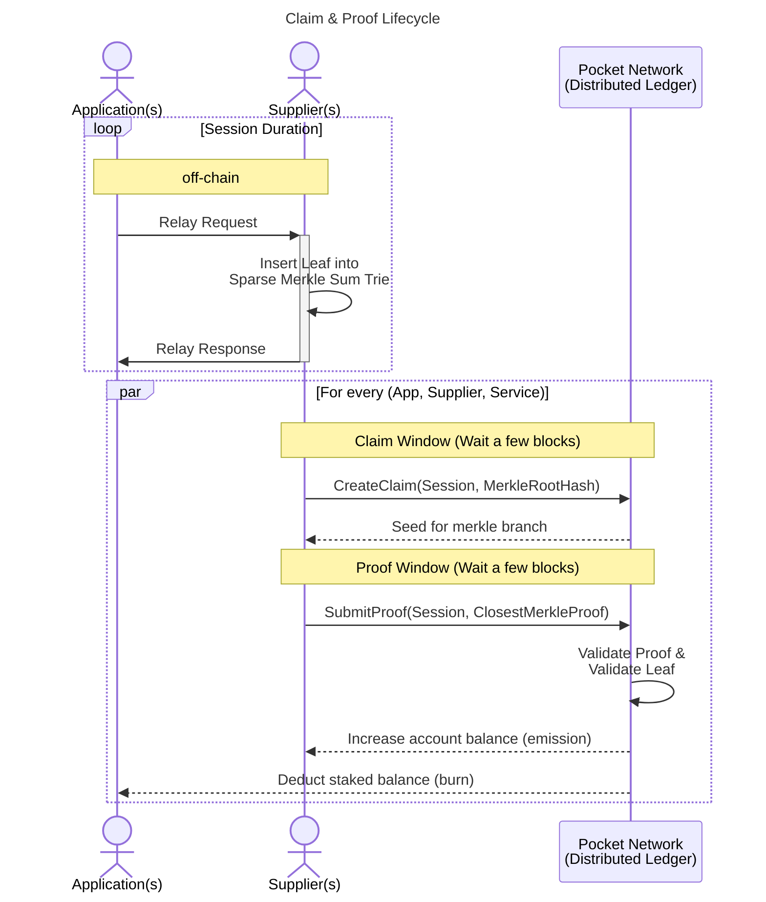
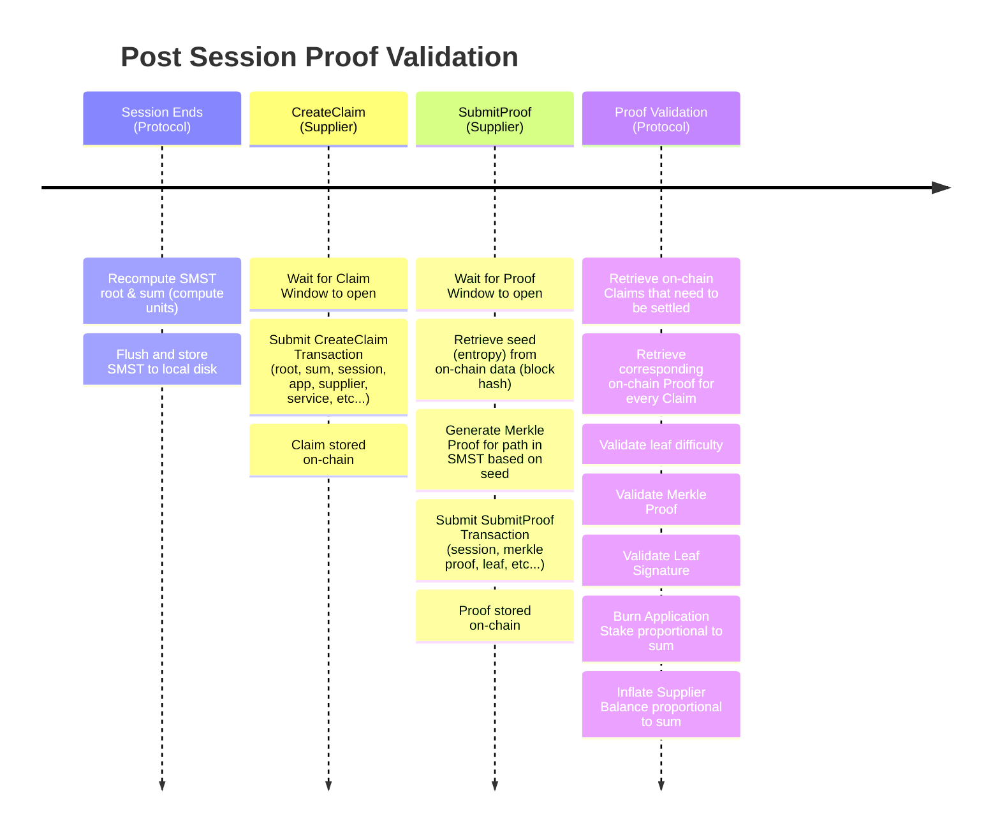
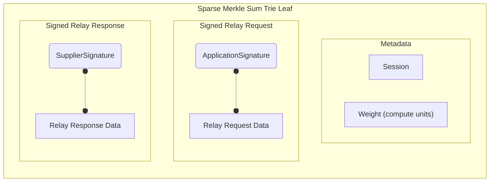
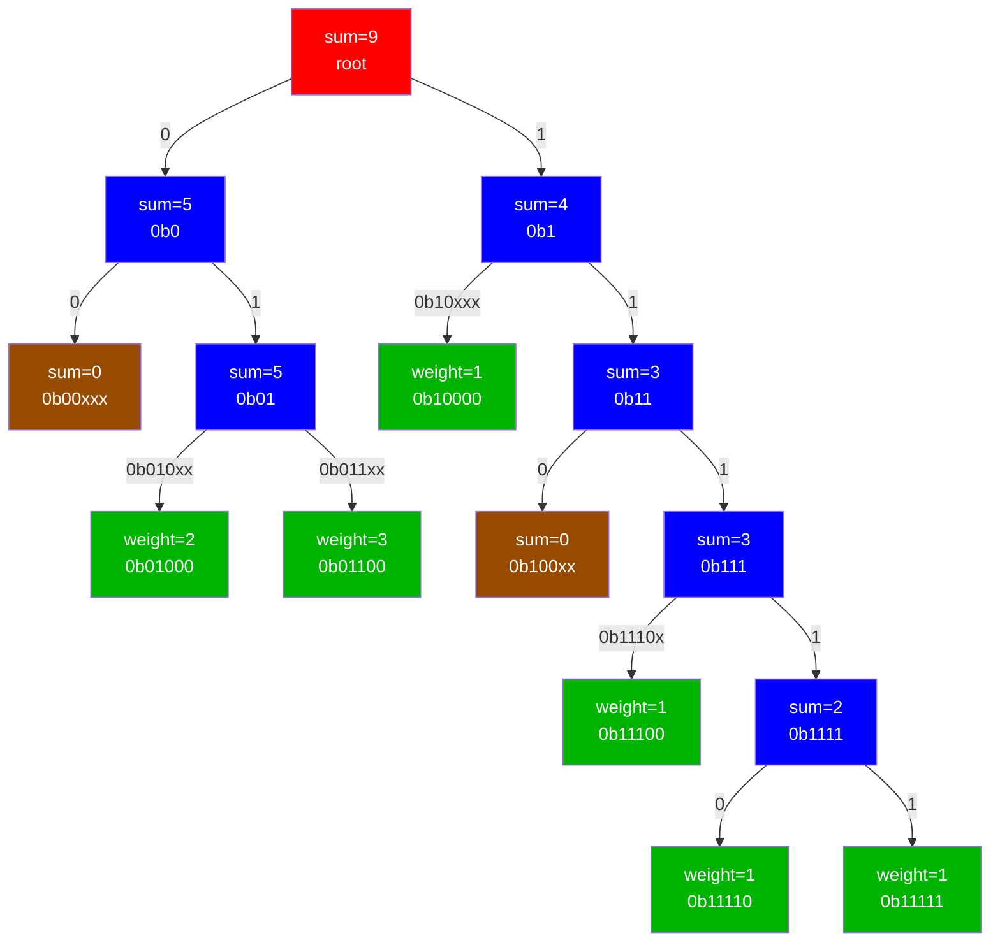
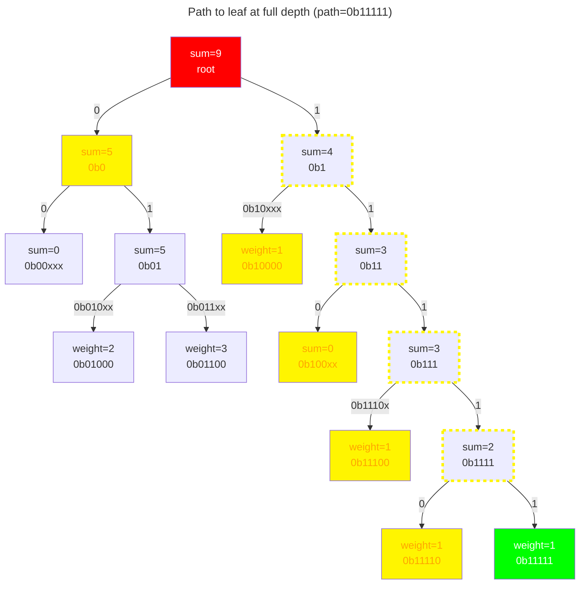
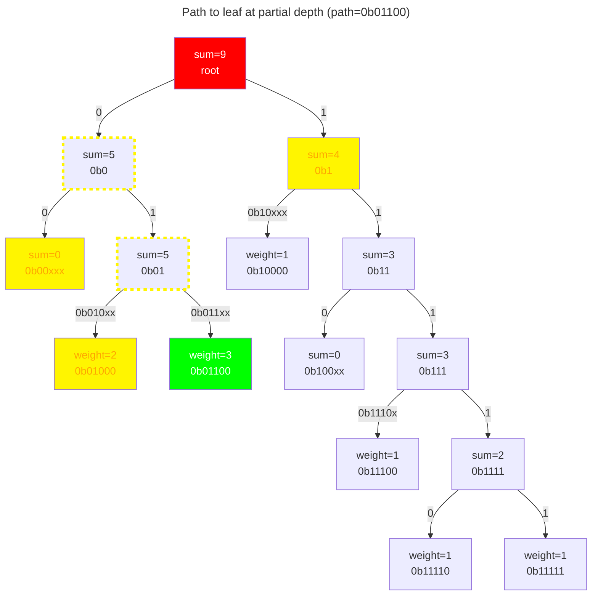
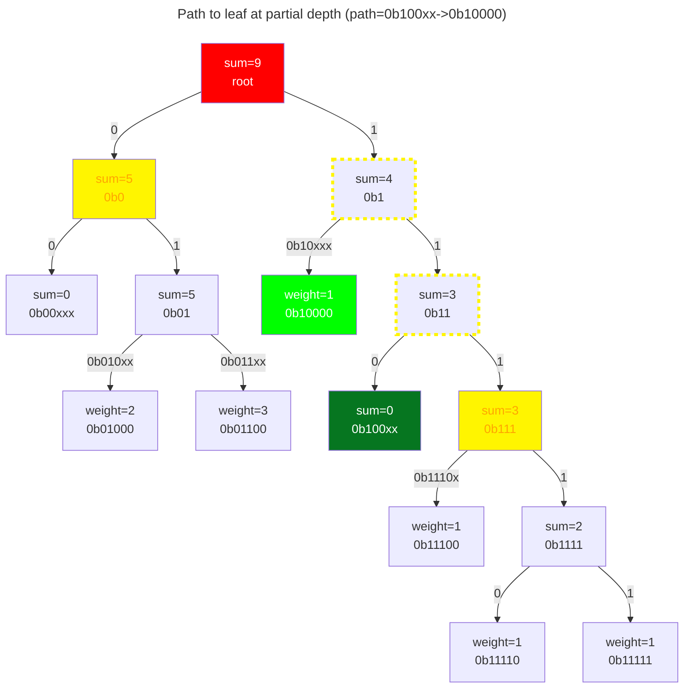
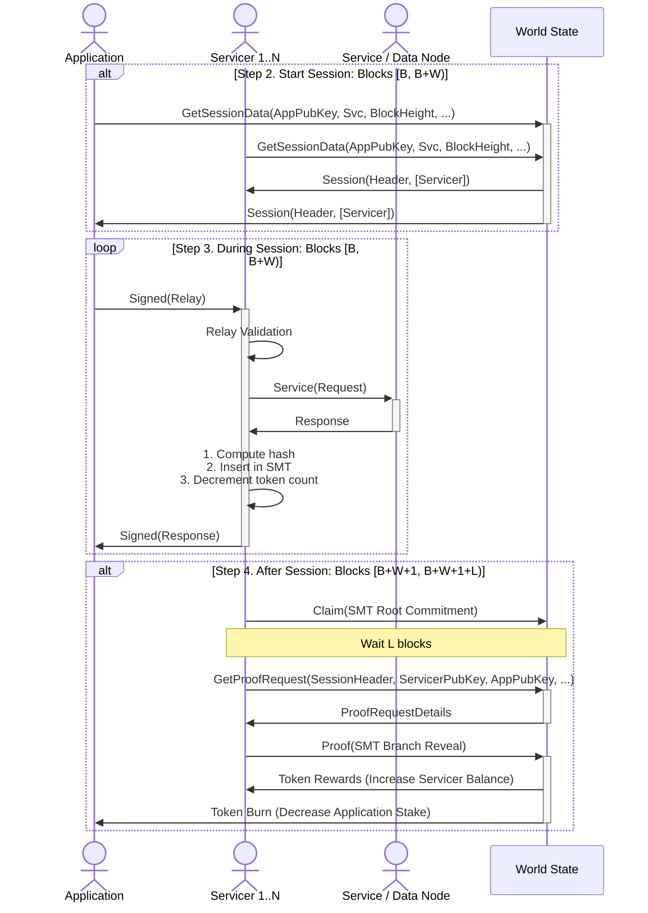

# Claim & Proof Lifecycle <!-- omit in toc -->

:::warning

This part of the documentation is just an INITIAL DRAFT and requires deep
understanding of the Pocket Network protocol. It is currently aiming to just
be a reference and not provide a coherent narrative that is easily accessible
to all readers.

TODO(@Olshansk): Iterate on this doc & link to governance params.

TODO(@red-0ne): Review this document and submit a PR with updates & edits.

:::

- [Introduction](#introduction)
- [Session](#session)
  - [Session Duration](#session-duration)
  - [Session End](#session-end)
- [Claim](#claim)
  - [Claim Protobuf](#claim-protobuf)
  - [CreateClaim Transaction](#createclaim-transaction)
  - [CreateClaim Validation](#createclaim-validation)
  - [Claim Window](#claim-window)
- [Proof](#proof)
  - [Proof Protobuf](#proof-protobuf)
  - [SubmitProof Transaction](#submitproof-transaction)
  - [SubmitProof Validation](#submitproof-validation)
  - [Proof Window](#proof-window)
- [Proof Security](#proof-security)
  - [Merkle Leaf Validation](#merkle-leaf-validation)
  - [Merkle Proof Selection](#merkle-proof-selection)
    - [Example: Example Sparse Merkle Sum Trie (SMST)](#example-example-sparse-merkle-sum-trie-smst)
    - [Example 1: Path to leaf at full depth](#example-1-path-to-leaf-at-full-depth)
    - [Example 2: Path to leaf at partial depth](#example-2-path-to-leaf-at-partial-depth)
    - [Example 3: Path to empty node](#example-3-path-to-empty-node)
- [Full Lifecycle](#full-lifecycle)

## Introduction

The `Claim & Proof` lifecycle is a fundamental part of the Pocket Network protocol.

At a high-level, it is an adaptation of a well-known `commit & reveal` paradigm used
in various blockchain application such as [ENS](https://docs.ens.domains/contract-api-reference/.eth-permanent-registrar/controller).

:::note

For the purpose of explaining the `Claim & Proof` lifecycle, we will remove
`Gateways` from the discussion and assume that `Applications` are directly
interacting with the `Suppliers`.

:::

## Session

A session is a necessary pre-requisite for the `Claim & Proof` lifecycle to work.
See [Session](./session.md) for more details.

### Session Duration

After a session is initiated, the majority of it is handled `off-chain`,
as `Applications` make RPC requests (`relays`) to the `Supplier`.

### Session End

After a session ends, the Claim & Proof Lifecycle can be decomposed, at a high-level,
into the following steps.

## Claim

A `Claim` is a structure submitted on-chain by a `Supplier` claiming to have done
some amount of work in servicing `relays` for `Application`.

Exactly one claim exists for every `(Application, Supplier, Session)`.

A `Claim` forces a `Supplier` to commit to have done `sum` work during a `Session` for
a certain `Application`. The `sum` in the root of the SMST is the amount of work
done. Each leaf has a different `weight` depending on the number of _"compute units"_
that were necessary to service that request.

_TODO_DOCUMENT(@Olshansk): Link to a document on compute units once it it written._

### Claim Protobuf

A serialized version of the `Claim` is stored on-chain.

You can find the definition for the [Claim structure here](../../../proto/poktroll/proof/claim.proto).

### CreateClaim Transaction

A `CreateClaim` transaction can be submitted by a `Supplier` to store a claim `on-chain`.

You can find the definition for the [CreateClaim Transaction here](../../../proto/poktroll/proof/tx.proto).

### CreateClaim Validation

_TODO(@bryanchriswhite, @Olshansk): Update this section once [msg_server_create_claim.go](./../../../x/proof/keeper/msg_server_create_claim.go) is fully implemented._

### Claim Window

After a `Session` ends, a `Supplier` has several blocks, a `Claim Window`, to submit
a `CreateClaim` transaction containing a `Claim`. If it is submitted too early
or too late, it will be rejected by the protocol.

If a `Supplier` fails to submit a `Claim` during the Claim Window, it will forfeit
any potential rewards it could earn in exchange for the work done.

_TODO(@Olshansk): Link to the governance params governing this once implemented._

## Proof

A `Proof` is a structure submitted on-chain by a `Supplier` containing a Merkle
Proof to a single pseudo-randomly selected leaf from the corresponding `Claim`.

At most one `Proof` exists for every `Claim`.

A `Proof` is necessary for the `Claim` to be validated so the `Supplier` can be
rewarded for the work done.

_TODO_DOCUMENT(@Olshansk): Link to a document on compute units once it it written._

### Proof Protobuf

A serialized version of the `Proof` is stored on-chain.

You can find the definition for the [Proof structure here](../../../proto/poktroll/proof/proof.proto)

### SubmitProof Transaction

A `SubmitProof` transaction can be submitted by a `Supplier` to store a proof `on-chain`.

If the `Proof` is invalid, or if there is no corresponding `Claim` for the `Proof`, the
transaction will be rejected.

You can find the definition for the [SubmitProof Transaction here](../../../proto/poktroll/supplier/tx.proto).

### SubmitProof Validation

_TODO(@bryanchriswhite, @Olshansk): Update this section once [msg_server_submit_proof.go](./../../../x/proof/keeper/msg_server_submit_proof.go) is fully implemented._

### Proof Window

After the `Proof Window` opens, a `Supplier` has several blocks, a `Proof Window`,
to submit a `SubmitProof` transaction containing a `Proof`. If it is submitted too
early or too late, it will be rejected by the protocol.

If a `Supplier` fails to submit a `Proof` during the Proof Window, the Claim will
expire and it it will forfeit any previously claimed work done.

_TODO(@Olshansk): Link to the governance params governing this once implemented._

## Proof Security

In addition to basic validation as part of processing `SubmitProof` to determine
whether or not the `Proof` should be stored on-chain, there are several additional
deep cryptographic validations needed:

1. `Merkle Leaf Validation`: Proof of the off-chain `Supplier`/`Application` interaction during the Relay request & response.
2. `Merkle Proof Selection`: Proof of the amount of work done by the `Supplier` during the `Session`.

:::note

TODO: Link to tokenomics and data integrity checks for discussion once they are written.

:::

### Merkle Leaf Validation

The key components of every leaf in the `Sparse Merkle Sum Trie` are shown below.

After the leaf is validated, two things happen:

1. The stake of `Application` signing the `Relay Request` is decreased through burn
2. The account balance of the `Supplier` signing the `Relay Response` is increased through mint

The validation on these signatures is done on-chain as part of `Proof Validation`.

### Merkle Proof Selection

Before the leaf itself is validated, we need to make sure if there is a valid
Merkle Proof for the associated pseudo-random path computed on-chain.

Since the path that needs to be proven uses an on-chain seed after the `Claim`
has been submitted, it is impossible to know the path in advance.

Assume a collision resistant hash function `H` that takes a the `block header hash`
as the `seed` and maps it to a `path` in the `Merkle Trie` key space.

#### Example: Example Sparse Merkle Sum Trie (SMST)

Below is an example of a `Sparse Merkle Sum Trie` where the paths can be at
most `5` bits (for example purposes).

:::note

Extension nodes are ommitted and shown via `0bxxxxx` as part of the tree edges

:::

Legend:

- 🟥 - Root node
- 🟦 - Inner node
- 🟩 - Leaf node
- 🟫 - Empty Node
- 🟨 - Included in Merkle Proof
- ⬚🟨 - Computed as Part of Merkle Proof
- ⬛ - Not used in the diagram node

#### Example 1: Path to leaf at full depth

#### Example 2: Path to leaf at partial depth

#### Example 3: Path to empty node

## Full Lifecycle

The following diagram was taken from the [Relay Mining whitepaper](https://arxiv.org/pdf/2305.10672.pdf),
and is an alternative view of the full lifecycle described above.
It is here for reference purposes.

