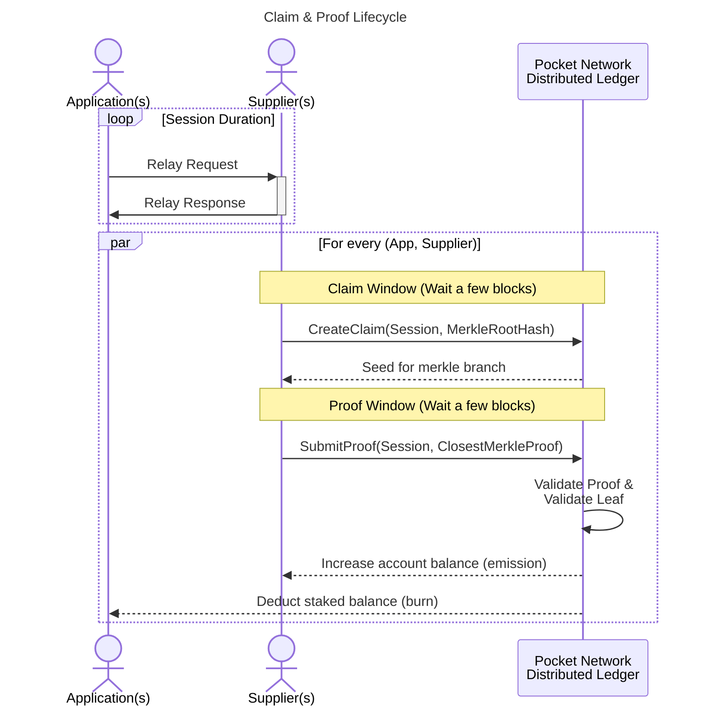
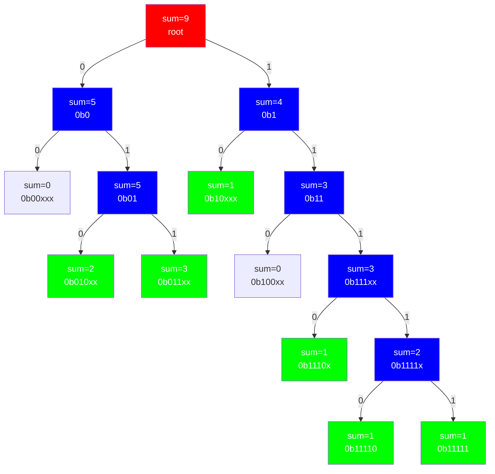
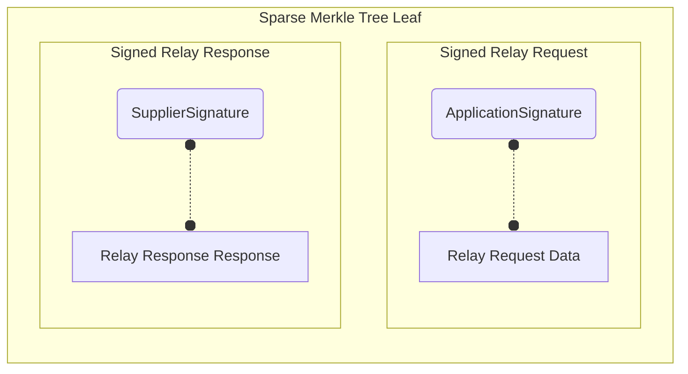
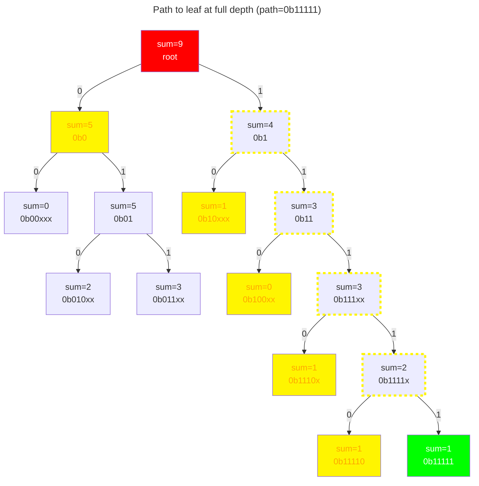
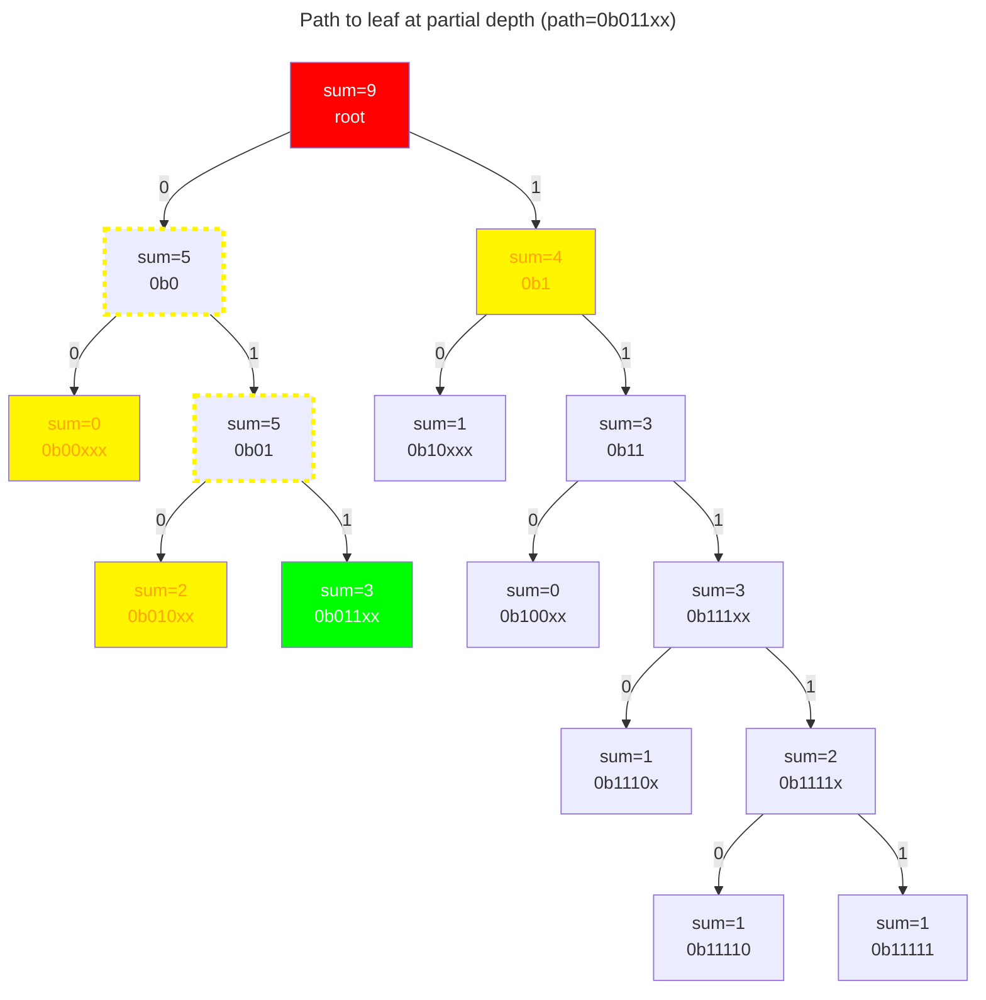
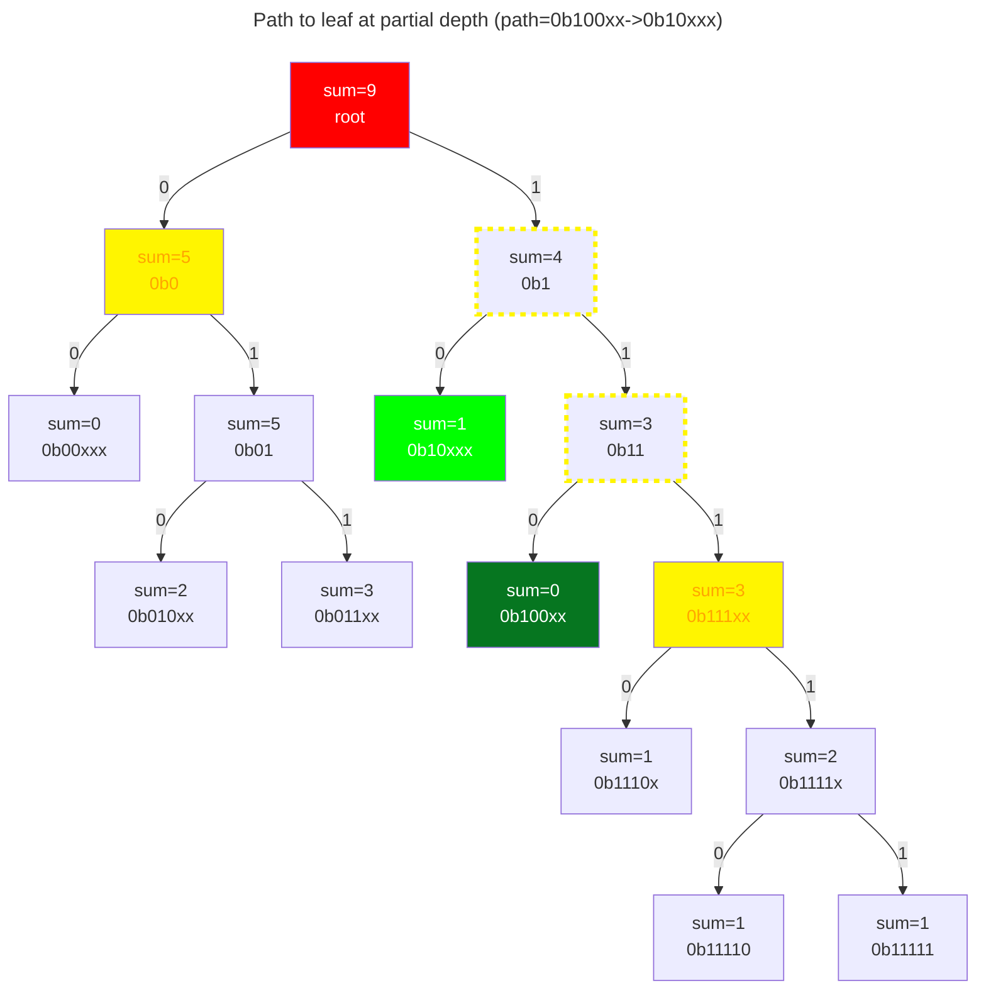
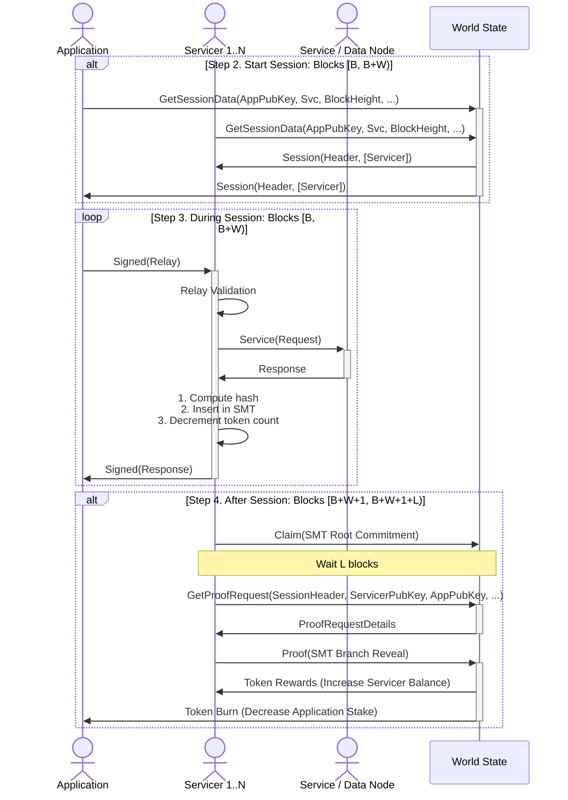

# Claim & Proof Lifecycle <!-- omit in toc -->

:::warning

This part of the documentation is just an initial draft and requires deep
understanding of the Pocket Network protocol. It is currently not intended to be
exhaustive or easily approachable to all readers.

TODO(@Olshansk): Iterate on these docs. Link & mention the necessary governance
params.

:::

- [Introduction](#introduction)
- [Session](#session)
  - [Session Duration](#session-duration)
  - [Session End](#session-end)
- [Claim](#claim)
  - [Claim Protobuf](#claim-protobuf)
  - [CreateClaim Transaction](#createclaim-transaction)
  - [CreateClaim Validation](#createclaim-validation)
  - [Claim Window](#claim-window)
- [Proof](#proof)
  - [Proof Protobuf](#proof-protobuf)
  - [SubmitProof Transaction](#submitproof-transaction)
  - [SubmitProof Validation](#submitproof-validation)
  - [Proof Window](#proof-window)
- [Security](#security)
  - [Merkle Proof Selection](#merkle-proof-selection)
  - [Merkle Leaf Validation](#merkle-leaf-validation)
  - [Examples](#examples)
    - [Example 1: Path to leaf at full depth](#example-1-path-to-leaf-at-full-depth)
    - [Example 2: Path to leaf at partial depth](#example-2-path-to-leaf-at-partial-depth)
    - [Example 3: Path to empty node](#example-3-path-to-empty-node)
- [Full Lifecycle](#full-lifecycle)

## Introduction

The `Claim & Proof` lifecycle is a fundamental part of the Pocket Network protocol.

At a high-level, it is an adaptation of a well-known `commit & reveal` paradigm used
in various blockchain application such as [ENS](https://docs.ens.domains/contract-api-reference/.eth-permanent-registrar/controller).

:::note

For the purpose of explaining the `Claim & Proof` lifecycle, we will remove
`Gateways` from the discussion and assume that `Applications` are directly
interacting with the `Suppliers`.

:::



## Session

A session is a necessary pre-requisite for the `Claim & Proof` lifecycle to work.
See [Session](./session.md) for more details.

### Session Duration

After a session is initiated, the majority of it is handled `off-chain`,
as `Applications`/`Gateways` make RPC requests (`relays`) to the `Supplier`.

### Session End

The following is a non-technical high-level idea of what happens when a session
intended to provide an idea of the steps involved.

```Mermaid
---
title: Session Ends
---
graph LR
    A(Session Ends) --> |"Sparse Merkle Sum Tree (SMST)"| B
    B[Commit Tree to Disk] --> |SMST Root Hash| C
    C[Send Claim Transaction] -.-> |Get Seed From Chain| D
    D[Send Proof Transaction] --> |Validate Proof| E(Settle Rewards)
```

```Mermaid
---
title: After Session Ends
---
timeline
    title Claim & Proof Timeline
    Session Ends
        : Wait a few blocks
    SubmitClaim
        : Facebook : Google
    Generate Proof
        : Wait a few blocks
        : Protocol generate on-chain entropy
        : Supplier retrives branch to prove
    SubmitProof
        : Validate Proof
        : Store Proof On-Chain
    ValidateProof
        : Burn Application Stake
        : Inflate Supplier Stake
```

## Claim

A `Claim` is a structure submitted on-chain by a `Supplier` claiming to have done
some amount of work in servicing `relays` for `Application`.

Exactly one claim exists for every `(Application, Supplier, Session)`.

A `Claim` forces a `Supplier` to commit to have done `X` work during a `Session` for
a certain `Application`. The `sum` in the root of the SMST is the amount of work
done. Each leaf has a different weight depending on the number of compute units
that were necessary to service that request.

_TODO_DOCUMENT(@Olshansk): Link to a document on compute units once it it written._

### Claim Protobuf

A serialized version of the `Claim` is stored on-chain.

You can find the definition for the [Claim structure here](../../../proto/pocket/supplier/claim.proto).

### CreateClaim Transaction

A `CreateClaim` transaction can be submitted by a `Supplier` to store a claim `on-chain`.

You can find the definition for the [CreateClaim Transaction here](../../../proto/pocket/supplier/tx.proto).

### CreateClaim Validation

TODO(@bryanchriswhite, @Olshansk): Update this section once [msg_server_create_claim.go](./../../../x/supplier/keeper/msg_server_create_claim.go) is fully implemented.

### Claim Window

After a `Session` ends, a `Supplier` has several blocks, a `Claim Window`, to submit
a `CreateClaim` transaction containing a `Claim`. If it is submitted too early
or too late, it will be rejected by the protocol.

If a `Supplier` fails to submit a `Claim` during the Claim Window, it will forfeit
any potential rewards it could earn in exchange for the work done.

TODO(@Olshansk): Link to the governance params determining this.

## Proof

A `Proof` is a structure submitted on-chain by a `Supplier` containing a Merkle
Proof to a single pseudo-randomly selected leaf. claiming to have done
some amount of work in servicing `relays` for `Application`.

Exactly one claim exists for every `(Application, Supplier, Session)`.

A `Claim` forces a `Supplier` to commit to have done `X` work during a `Session` for
a certain `Application`. The `sum` in the root of the SMST is the amount of work
done. Each leaf has a different weight depending on the number of compute units
that were necessary to service that request.

_TODO_DOCUMENT(@Olshansk): Link to a document on compute units once it it written._

### Proof Protobuf

You can find the definition for the [Proof structure here](../../../proto/pocket/supplier/proof.proto)

### SubmitProof Transaction

A `SubmitProof` transaction can be submitted by a `Supplier` to store a proof `on-chain`.

If the `Proof` is invalid, or if there is corresponding `Claim` for the `Proof`, the
transaction will be rejected.

You can find the definition for the [SubmitProof Transaction here](../../../proto/pocket/supplier/tx.proto).

### SubmitProof Validation

TODO(@bryanchriswhite, @Olshansk): Update this section once [msg_server_submit_proof.go](./../../../x/supplier/keeper/msg_server_submit_proof.go) is fully implemented.

### Proof Window

After the `Claim Window` closes, a `Supplier` has several blocks, a `Proof Window`,
to submit a `SubmitProof` transaction containing a `Proof`. If it is submitted too
early or too late, it will be rejected by the protocol.

If a `Supplier` fails to submit a `Proof` during the Proof Window, the Claim will
expire and it it will forfeit any previously claimed work done.

TODO(@Olshansk): Link to the governance params determining this.

## Security

### Merkle Proof Selection

- 🟥 - Root node
- 🟦 - Extension/Inner node
- 🟩 - Leaf node
- ⬛ - Empty node
- 🟨 - Part of Merkle Proof

A few simplifications are being made in this diagram:

- Extension nodes & inner nodes are represented by the same node type
- Leafs, which may or may not be single node subtrees, capture the whole path bound via `x` in the diagram
- The key in the binary trie below can have at most 5 bits



### Merkle Leaf Validation

The key components of every leaf in the `Sparse Merkle Sum Trie` are shown below.

When the leaf is validated, the `Application` signing the `Relay Request` is
the one whose staked balance is burnt, and the `Supplier` signing the `Relay Response`
is the one whose account balance is increased.



### Examples

Assume a collision resistant hash function `H` that takes a the `block header hash`
as the `seed` and maps it to a `path` in the `5-bit` space for the `Merkle Trie` in
this example.

#### Example 1: Path to leaf at full depth



#### Example 2: Path to leaf at partial depth



#### Example 3: Path to empty node



## Full Lifecycle

The following diagram shows the full lifecycle of a Relay Request, Claim, and Proof
taken from the [Relay Mining whitepaper](https://arxiv.org/pdf/2305.10672.pdf).


