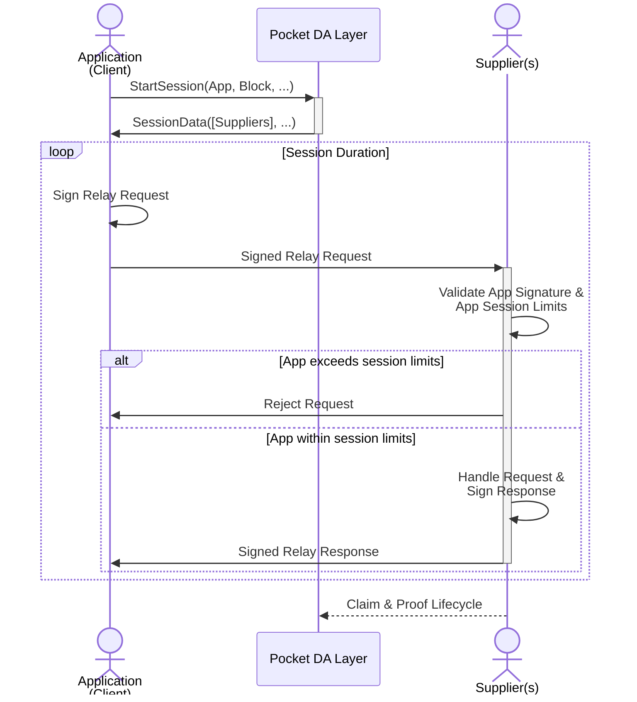
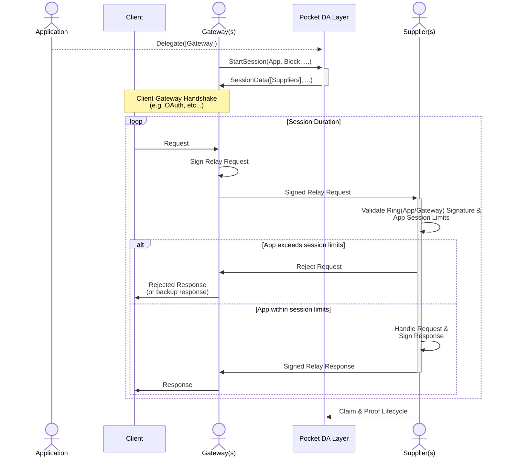
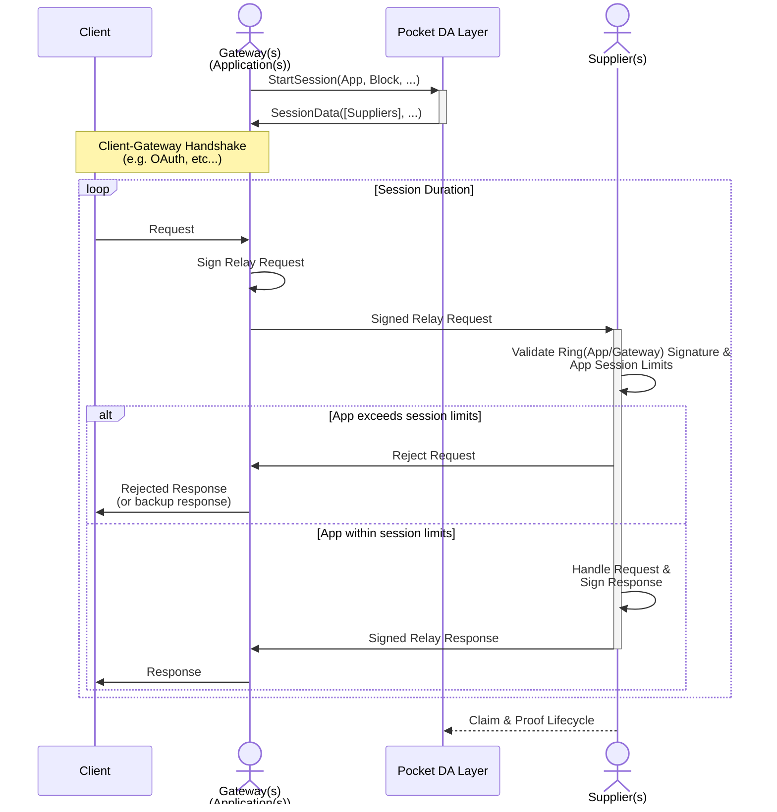
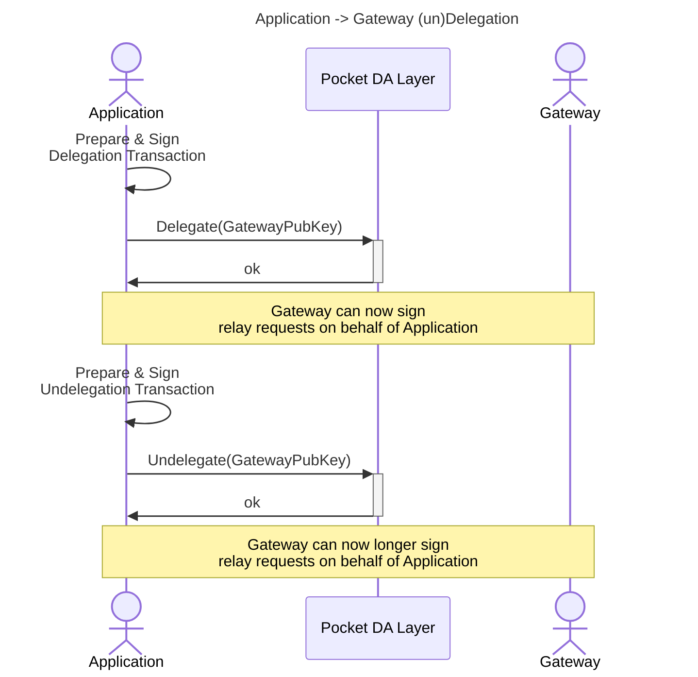
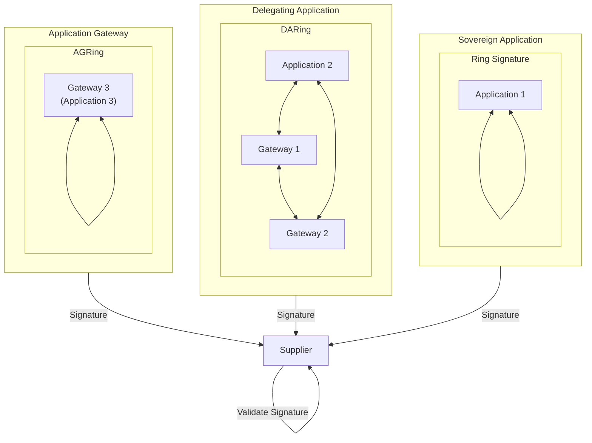
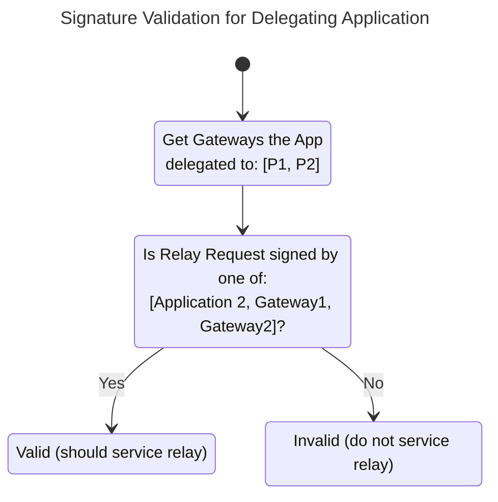

# Gateways <!-- omit in toc -->

:::warning

This part of the documentation is just an initial draft and requires deep
understanding of the Pocket Network protocol. It is currently aiming to just
be a reference and not provide a coherent narrative that is easily accessible
to all readers.

TODO(@Olshansk): Iterate on this doc & link to governance params.

:::

The [Gateway Actor](./../actors/gateway.md) section covers what a Gateway is.
Recall that it is a permissionless protocol actor to whom the Application can
**optionally** delegate on-chain trust in order to perform off-chain operations.

This section aims to cover the cryptographic aspects of Gateway interactions,
trust delegation, and how they fit into the Pocket Network protocol.

## Modes of Operation

There are three modes of operation to interact with the Suppliers on the network:

1. **Sovereign Application**
2. **Delegating Application**
3. **Gateway Application**

For the purposes of this discussion, it is important to note that an `Application`
and `Gateway` are on-chain actors/records that stake POKT to participate in the
network. The term `Client` is used to represent an application running on a user's
device, such as a smartphone or a web browser.

The goal of Gateways is to enable free-market off-chain economics tie into
on-chain interactions.

### Sovereign Application

A Sovereign Application is one where the `Client` manages its own on-chain `Application`
and interacts with the Pocket Supplier Network directly.

The Application is responsible for:

- Protecting it's own `Application` private key on the `Client`
- Maintaining and updating it's own on-chain stake to pay for `Supplier` services
- Determining which `Supplier` to use from the available list in the session

### Delegating Application

A Delegated Application is one where an `Application` delegates to one or more
`Gateways`. Agreements (authentication, payments, etc) between the `Client` and
`Gateway` are then managed off-chain, but payment for the on-chain `Supplier`
services still comes from the `Application`s stake.

The Application is responsible for:

- Protecting it's own `Application` private key somewhere in hot/cold storage
- Maintaining and updating it's own on-chain stake to pay for `Supplier` services
- Managing, through (un)delegation, which Gateway(s) can sign requests on ts behalf

The Gateway is responsible for:

- Providing tooling and infrastructure to coordinate with the `Client`
- Determining which `Supplier` to use from the available list in the session

### Gateway Application

A Gateway Application is one where the `Gateway` takes full onus, on behalf of
`Client`s to manage all on-chain `Application` interactions to access the
Pocket `Supplier` Network. Agreements (authentication, payments, etc) between
the `Client` and `Gateway` are then managed off-chain, and payment for the
on-chain `Supplier` services will comes from the `Application`s stake, which
is now maintained by the `Gateway`.

It is responsible for:

The Gateway is responsible for:

- Protecting it's own `Application` private key somewhere in hot/cold storage
- Maintaining and updating it's own on-chain stake to pay for `Supplier` services
- Providing tooling and infrastructure to coordinate with the `Client`
- Determining which `Supplier` to use from the available list in the session

## Application -> Gateway Delegation

An Application that chooses to delegate trust to a gateway by submitting a
one-time `DelegateMsg` transaction. Once this is done, the `Gateway` will be
able to sign relay requests on behalf of the `Application` that'll use the
`Application`s on-chain stake to pay for service to access the Pocket `Supplier` Network.

This can be done any number of times, so an `Application` can delegate to multiple
`Gateways` simultaneously.

### Ring Signature Verification

[Ring Signatures](https://en.wikipedia.org/wiki/Ring_signature) will be used in order to allow both the Application and the Gateway to sign the Relay.

## Gateway Off-Chain Operations

- altruist
- Check
- Client Side Challenge & Response
- Proof w/ that
- Etc.
- Session dispatching
- Pocket Network buisness logic
- Supplier selection and QoS management
-
