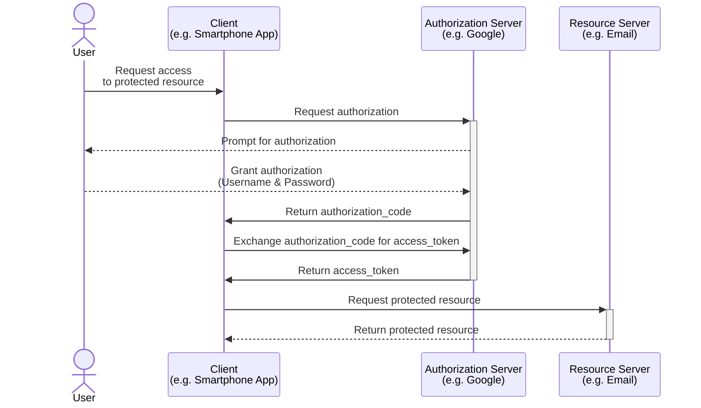
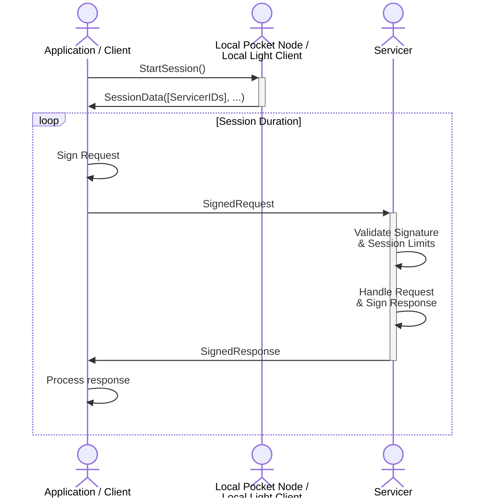
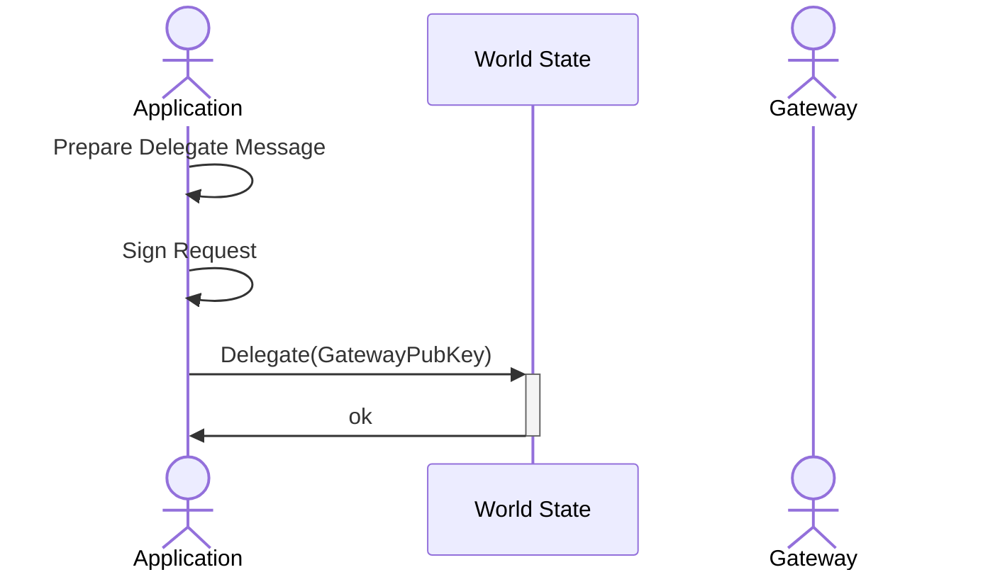
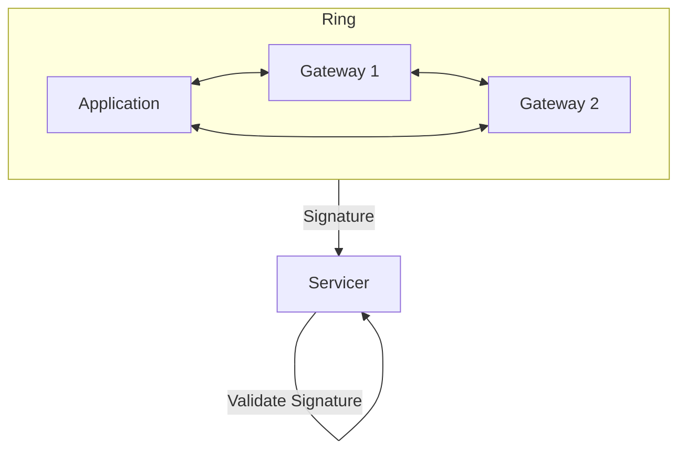
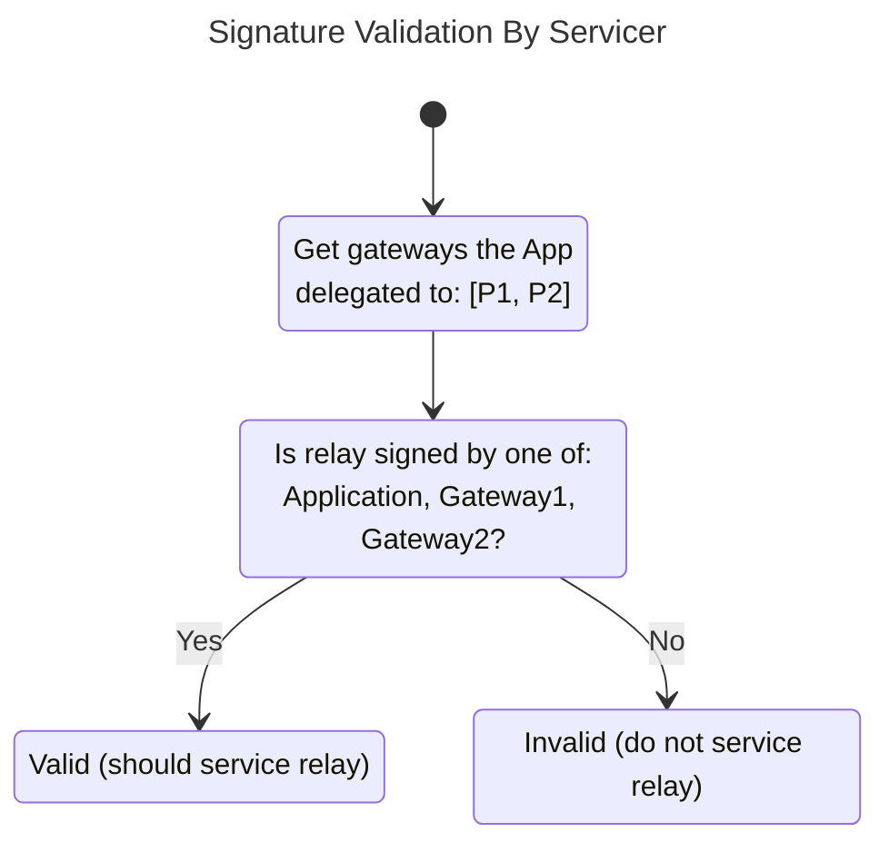
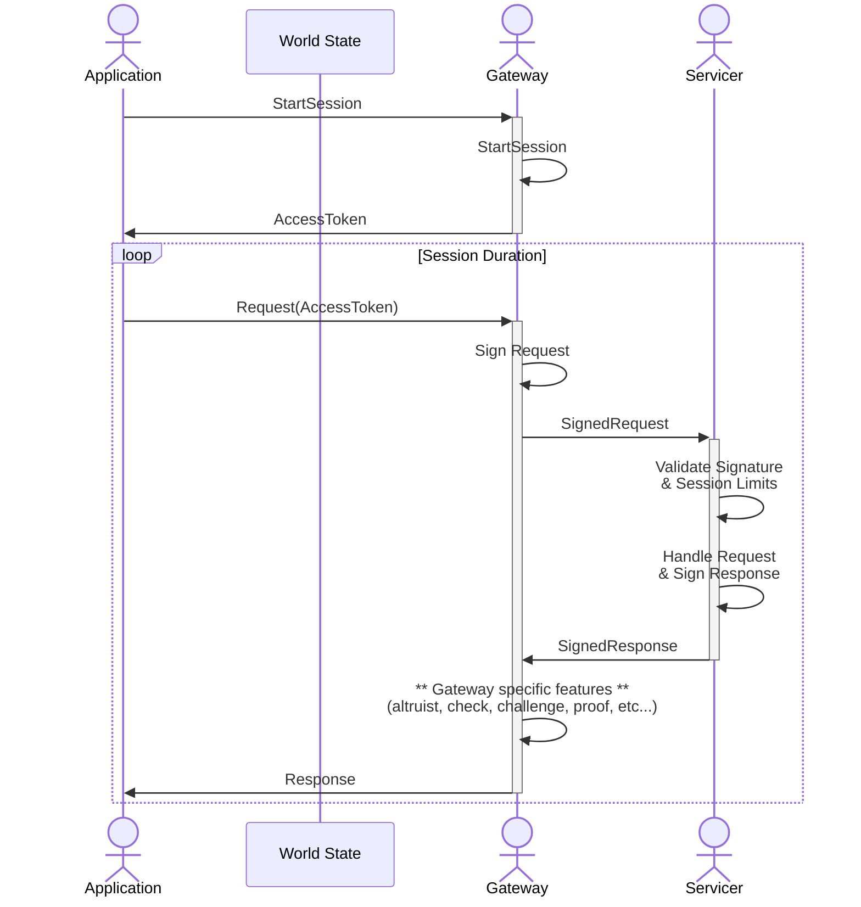

:::warning

TODO(@Olshansk): This is just a placeholder

:::

### 3.5 Gateway Protocol

A `Gateway` is a permissionless protocol actor to whom the Application can **optionally** delegate on-chain trust in order to perform off-chain operations.

#### 3.5.1 Gateway Responsibilities

Pocket Network's Utilitarian Economy incentivizes data redundancy in a multi-chain ecosystem, with cheap, accessible and highly available multi-chain access. Depending on the level of trust, or lack thereof, an Application can optionally use a Gateway for various Pocket-specific operations such as, but not limited to, session dispatching or request signing.

Delegation also enables free market off-chain economics where additional features, guarantees or payments can be made. This could, for example, include a contractual agreement between Applications and Gateways to execute [Client Side Validation](https://forum.pokt.network/t/client-side-validation/148) with every Nth request. It could also enable L2 services, such as data indexing, that are outside the scope of the Pocket ecosystem, but are closely related to the utility it provides.

Applications that requires just-in-time full data integrity guarantees may opt out of delegating to Gateways and operate in a completely permissionless manner. This may require them to maintain their own infrastructure (i.e. synching a full/light Pocket Node). Even with delegation, an Application would be able to continue operating permissionlessly (via a full or light node) as the two are not mutually exclusive.

#### 3.5.2 OAuth

[OAuth](https://oauth.net) is an open (Web2) protocol that authorizes clients or 3rd parties to gain access to restricted resources. It can be summarized via following flow:



For the sake of simplicity, we are omitting `refresh_token` related considerations.

Some parallels can be drawn between existing centralized, trusted and permissioned systems relative to Pocket's Utilitarian Economy:

- The `Client` remains as the `Client`
- The `Application` is the `User`
- The `Application` is a one-time `Authorization Server`
- The `Gateways` is an ongoing `Authorization Server`
- The `Servicer` is the `Resource Servicer`
- The `Fisherman` is a separate monitoring party overlooking the `Resource Servicer` most often owned by the `Authorization Server`

#### 3.5.3 Application w/o Gateway

An Application that chooses to operate without a Gateway is responsible for dispatching sessions and signing RPC requests on its own. To do so, it will need to maintain a Pocket Full Node or a Pocket Light Client.



#### 3.5.4 Application Delegation

An Application that chooses to delegate trust to a Gateway will need to submit a one-time `DelegateMsg` transaction to delegate trust from the Application to the Gateway. It must include the PublicKey of the Gateway and be signed by the Application.



The following message will need to be signed by the Application's PrivateKey in order for it to be valid and committed to the world state.

```go
type DelegateMsg interface {
  GetApplicationPublicKey() # The cryptographic ID of the Application
  GetGatewayPublicKey()     # The cryptographic ID of the Gateway
}
```

Once committed, the Application can be serviced on behalf of the Gateway. Though an Application can delegate to multiple Gateways simultaneously, the rate limiting for each session still remains at the Servicer level.

#### 3.5.5 Application Servicing

When an Application chooses to start a new session, the Gateway is responsible for dispatching the `StartSession` request using on-chain and use an off-chain mechanism (e.g. AccessTokens) to service the Application. Throughout the duration of the session, validation and communication between the Application and Gateway are done using off-chain mechanisms, which are outside the scope of this document.

[Ring Signatures](https://en.wikipedia.org/wiki/Ring_signature) will be used in order to allow both the Application and the Gateway to sign the Relay.



Similar to to the [incognito sampling section of the Fisherman Protocol](#334-incognito-sampling) section, Ring Signatures enable the Servicer to validate the signed request. This enables permissioned (w/ a Gateway) and permissionless (w/o a Gateway) operations to co-exist, without being mutually exclusive, and without the Servicer needing knowledge of the Application's current mode of operation.



Servicer's are incentivized to respond to any valid relay since it is applicable for reward distribution. The session tokens used for rate limiting by the Servicer will come out of the same bucket as described in the [rate limiting algorithm](#315-rate-limiting) regardless of who in the ring signed the request.



#### 3.5.6 Gateway Registration

Registration differs from staking in the sense that the pubKey is known but there are no economic benefits/penalties in this stage of the protocol's progression.

The Gateway must register on-chain in order for the Servicer to accept its signature as part of the ring. Future versions of the protocol may include on-chain rewards or penalties for the Gateway, but the current iteration will incentivize Gateways to provide a high quality, highly trusted service through free market economics.

When staking, the Gateway must bond a certain amount of POKT to be able to participate in the network. The governance parameter, `StakePerAppDelegation` limits the number of Applications that can delegate to it, and it is the Gateway's responsibility to increase its stake as the number of Applications that trust it grow.

For example, if `StakePerAppDelegation` is 100 POKT and the Gateway has staked 1000 POKT, a transaction by the 11th Application to delegate to it will be rejected until the stake is increased appropriately. However, if `StakePerAppDelegation` is 0 POKT, all Gateways, which are permissionless actors can have an unbounded number of Applications delegate to them.

If `StakePerAppDelegation` changes such that a Gateway cannot support the existing numbers of delegating apps, they are all legacied in to continue operating as normal. However, new applications cannot delegate to the Gateway until the stake is sufficiently increased.

```go
type GatewayStakeMsg interface {
  GetPublicKey() PublicKey   # The public cryptographic id of the Gateway account
  GetStakeAmount() BigInt     # The amount of uPOKT in escrow (i.e. a security deposit)
  GetServiceURL() ServiceURL  # The API endpoint where the Gateway service is provided
}
```

#### 3.5.7 Gateway Unregistration

A Gateway is able to submit an `UnstakeMsg` to exit and remove itself from the network. After a successful UnstakeMsg, the Gateway is no eligible sign relays on behalf of an Application. On-chain delegation from existing Applications will be removed from the world state. After the `GatewayUnstakingTime` unbonding time elapses, the remaining stake is returned to the Gateway's address.

#### 3.5.8 Application Undelegation

If a staked Application wants to stop using a Gateway, and prevent the Gateway from further signing relays on its behalf, it would simply submit an on-chain `UndelegateMsg`. Further relays signed by the Gateway on behalf of the Application would be rejected by the Servicers.

```go
type UndelegateMsg interface {
  GetApplicationPublicKey() # The cryptographic ID of the Application
  GetGatewayPublicKey()     # The cryptographic ID of the Gateway
}
```
