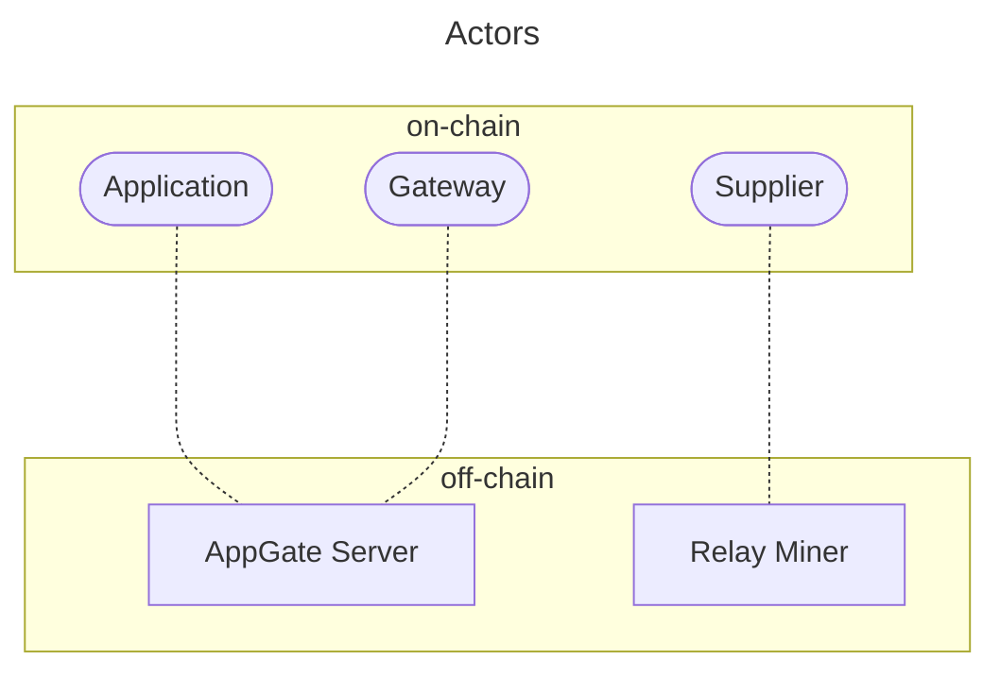

# Governance Params <!-- omit in toc -->

- [Updating This Page](#updating-this-page)
- [Parameters](#parameters)

## Updating This Page

This page can be updated to reflect the latest information in the source
code's `params.proto` files by running:

```bash
make docs_update_params_page
```

## Parameters

Pocket Network protocol is composed of both on-chain and off-chain actors.

There are 3 on-chain actors:

- [Applications](./application.md)
- [Suppliers](./supplier.md)
- [Gateways](./gateway.md)

There are 2 off-chain actors:

- [RelayMiners](./relay_miner.md)
- [AppGateServers](./appgate_server.md)


