# Claim & Proof Lifecycle <!-- omit in toc -->

:::warning

This part of the documentation is just an INITIAL DRAFT and requires deep
understanding of the Pocket Network protocol. It is currently aiming to just
be a reference and not provide a coherent narrative that is easily accessible
to all readers.

:::

- [Introduction](#introduction)
- [Session Windows \& Onchain Parameters](#session-windows--onchain-parameters)
    - [References:](#references)
  - [Claim Expiration](#claim-expiration)
- [Session](#session)
  - [Session Duration](#session-duration)
  - [Session End](#session-end)
- [Claim](#claim)
  - [Protobuf Types](#protobuf-types)
  - [CreateClaim Validation](#createclaim-validation)
    - [References:](#references-1)
  - [Claim Window](#claim-window)
- [Proof](#proof)
  - [Protobuf Types](#protobuf-types-1)
  - [SubmitProof Validation](#submitproof-validation)
    - [References:](#references-2)
  - [Proof Window](#proof-window)
- [Proof Security](#proof-security)
  - [Merkle Leaf Validation](#merkle-leaf-validation)
  - [Merkle Proof Selection](#merkle-proof-selection)
    - [Example: Example Sparse Merkle Sum Trie (SMST)](#example-example-sparse-merkle-sum-trie-smst)
    - [Example 1: Path to leaf at full depth](#example-1-path-to-leaf-at-full-depth)
    - [Example 2: Path to leaf at partial depth](#example-2-path-to-leaf-at-partial-depth)
    - [Example 3: Path to empty node](#example-3-path-to-empty-node)
- [Full Lifecycle](#full-lifecycle)
- [Reference Diagrams](#reference-diagrams)
  - [Session Header Validation](#session-header-validation)
  - [Proof Basic Validation](#proof-basic-validation)
  - [Proof Submission Relay Request Validation](#proof-submission-relay-request-validation)
  - [Proof Submission Relay Response Validation](#proof-submission-relay-response-validation)
  - [Proof Session Header Comparison](#proof-session-header-comparison)
  - [Proof Submission Claim Validation](#proof-submission-claim-validation)

## Introduction

The `Claim & Proof` lifecycle is a fundamental part of the Pocket Network protocol.

At a high-level, it is an adaptation of a well-known `commit & reveal` paradigm used
in various blockchain application such as [ENS](https://docs.ens.domains/contract-api-reference/.eth-permanent-registrar/controller).

:::note

For the purpose of explaining the `Claim & Proof` lifecycle, we will remove
`Gateways` from the discussion and assume that `Applications` are directly
interacting with the `Suppliers`.

:::

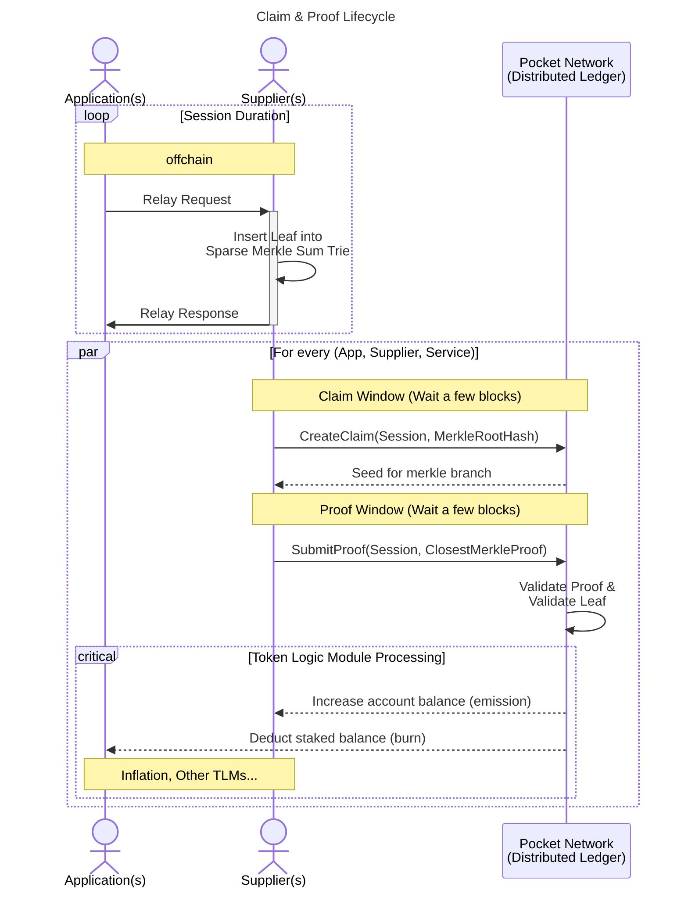
```mermaid
---
title: Claim & Proof Lifecycle
---
sequenceDiagram
    actor A as Application(s)
    actor S as Supplier(s)
    participant PN as Pocket Network<br>(Distributed Ledger)

    loop Session Duration
        note over A,S: offchain
        A ->> +S: Relay Request
        S ->> S: Insert Leaf into <br> Sparse Merkle Sum Trie
        S ->> -A: Relay Response
    end

    par For every (App, Supplier, Service)
        note over S, PN: Claim Window (Wait a few blocks)
        S ->> PN: CreateClaim(Session, MerkleRootHash)
        PN -->> S: Seed for merkle branch
        note over S, PN: Proof Window (Wait a few blocks)
        S ->> PN: SubmitProof(Session, ClosestMerkleProof)
        PN ->> PN: Validate Proof & <br> Validate Leaf
        critical Token Logic Module Processing
          PN -->> S: Increase account balance (emission)
          PN -->> A: Deduct staked balance (burn)
          note over A,S: Inflation, Other TLMs...
        end
    end
```

## Session Windows & Onchain Parameters

_TODO(@bryanchriswhite): Add message distribution offsets/windows to this picture._

```mermaid
gantt
    title Session Relay / Claim / Proof Windows
    dateFormat ss
    axisFormat %S
    tickInterval 1second

    section Relay Window
        Session N Start: milestone, sns, 00, 0s
        num_blocks_per_session: nbps, 00, 4s
        Session N End: milestone, sne, after nbps, 0s
        grace_period_end_offset_blocks: gpof, after sne, 1s
        Grace Period End: milestone, gpe, after gpof, 0s
        Session N + 1 Start: milestone, sns1, after sne, 0s
        num_blocks_per_session: nbps2, after sns1, 4s
    section Claim Window
        claim_window_open_offset_blocks: cwob, after sne, 1s
        Session N Claim Window Open: milestone, cwo, after cwob, 0s
        claim_window_close_offset_blocks: cwcb, after cwo, 4s
        Session N Claim Window Close: milestone, cwc, after cwcb, 0s
    section Proof Window
        proof_window_open_offset_blocks: pwob, after cwc, 10ms
        Session N Proof Window Open: milestone, pwo, after pwob, 0s
        proof_window_close_offset_blocks: pwcb, after pwo, 4s
        Session N PRoof Window Close: milestone, pwc, after pwcb, 0s

```

> NB: Depicted with the default values (see below); x-axis is units are blocks.

| Parameter                          | Description                                                                                                                                                                                                                                                                                                                                                                                                                                                      | Default |
| ---------------------------------- | ---------------------------------------------------------------------------------------------------------------------------------------------------------------------------------------------------------------------------------------------------------------------------------------------------------------------------------------------------------------------------------------------------------------------------------------------------------------- | ------- |
| `num_blocks_per_session`           | The number of blocks between the session start & end heights. Relays handled in these blocks are included in session N. It is positively correlated with the number of relays in (i.e. size of) each session tree for each session number (less other scaling factors; e.g. relaymining).                                                                                                                                                                        | 4       |
| `grace_period_end_offset_blocks`   | The number of blocks after the session end height, at which the grace period ends. Valid relays from both sessions N and N +1 are accepted in these blocks. It is positively correlated to the amount of time gateways have to transition sending relays to suppliers in the next session.                                                                                                                                                                       | 1       |
| `claim_window_open_offset_blocks`  | The number of blocks after the session end height, at which the claim window opens. Valid relays from both sessions N and N +1 are accepted in these blocks. Valid claims for session N will be rejected in these blocks. This parameter MUST NOT be less than grace_period_end_offset_blocks. It is positively correlated with the number of relays in (i.e. size of) each session tree for each session number (less other scaling factors; e.g. relaymining). | 1       |
| `claim_window_close_offset_blocks` | The number of blocks after the claim window open height, at which the claim window closes. Valid claims for session N will be accepted in these blocks. It is negatively correlated with density of claim creation (and update) messages over blocks in a given session number.                                                                                                                                                                                  | 4       |
| `proof_window_open_offset_blocks`  | The number of blocks after the claim window close height, at which the proof window opens. Valid proofs for session N will be rejected in these block. It is positively correlated with the amount of time suppliers MUST persist the complete merkle trees for unproven sessions (proof path is revealed at earliest_supplier_proof_commit_height - 1).                                                                                                         | 0       |
| `proof_window_close_offset_blocks` | The number of blocks after the proof window open height, at which the proof window closes. Valid proofs for session N will be accepted in these blocks. It is negatively correlated with the density of proof submission messages over blocks in a given session number.                                                                                                                                                                                         | 4       |

#### References:

- [`poktroll.shared.Params` / `sharedtypes.Params`](https://github.com/pokt-network/poktroll/blob/main/proto/poktroll/shared/params.proto)

### Claim Expiration

If a claim requires a proof (as determined by [Probabilistic Proofs](probabilistic_proofs.md)) and a `Supplier` fails
to submit a `Proof` before the `Proof Window` closes, the claim will expire and the `Supplier` will forfeit any
rewards for the work done.

Claims MUST expire (and therefore the proof window MUST close) for the following reasons:

1. The mint & burn associated with a given claim's settlement MUST occur while the application stake is still locked and applications must be allowed to complete unstaking in finite time.
1. Claim settlement SHOULD be limited to considering claims created within a rolling window of blocks to decouple settlement from a long-tail accumulation of unsettled claims.
1. Proofs MUST be pruned to prevent network state bloat over time. Pruning proofs makes the number of proofs in network state at any given time a function of recent relay demand.

## Session

A session is a necessary pre-requisite for the `Claim & Proof` lifecycle to work.
See [Session](./session.md) for more details.

### Session Duration

After a session is initiated, the majority of it is handled `offchain`,
as `Applications` make RPC requests (`relays`) to the `Supplier`.

### Session End

After a session ends, the Claim & Proof Lifecycle can be decomposed, at a high-level,
into the following steps.

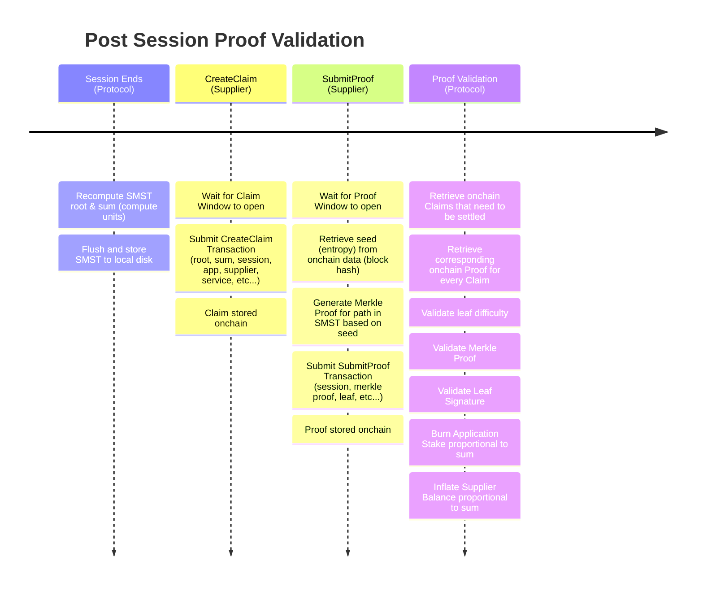
```mermaid
timeline
    title Post Session Proof Validation
    Session Ends <br> (Protocol)
        : Recompute SMST root & sum (compute units)
        : Flush and store SMST to local disk
    CreateClaim <br> (Supplier)
        : Wait for Claim Window to open
        : Submit CreateClaim Transaction <br>(root, sum, session, app, supplier, service, etc...)
        : Claim stored onchain
    SubmitProof <br> (Supplier)
        : Wait for Proof Window to open
        : Retrieve seed (entropy) from onchain data (block hash)
        : Generate Merkle Proof for path in SMST based on seed
        : Submit SubmitProof Transaction <br>(session, merkle proof, leaf, etc...)
        : Proof stored onchain
    Proof Validation <br> (Protocol)
        : Retrieve onchain Claims that need to be settled
        : Retrieve corresponding onchain Proof for every Claim
        : Validate leaf difficulty
        : Validate Merkle Proof
        : Validate Leaf Signature
        : Burn Application Stake proportional to sum
        : Inflate Supplier Balance  proportional to sum
```

## Claim

A `Claim` is a structure submitted onchain by a `Supplier` claiming to have done
some amount of work in servicing `relays` for `Application`.

Exactly one claim exists for every `(Application, Supplier, Session)`.

A `Claim` forces a `Supplier` to commit to have done `sum` work during a `Session` for
a certain `Application`. The `sum` in the root of the SMST is the amount of work
done. Each leaf has a different `weight` depending on the number of _"compute units"_
that were necessary to service that request.

### Protobuf Types

| Type                                                                                                 | Description                                             |
| ---------------------------------------------------------------------------------------------------- | ------------------------------------------------------- |
| [`Claim`](https://github.com/pokt-network/poktroll/blob/main/proto/poktroll/proof/claim.proto)       | A serialized version of the `Claim` is stored onchain. |
| [`MsgCreateClaim`](https://github.com/pokt-network/poktroll/blob/main/proto/poktroll/proof/tx.proto) | Submitted by a `Supplier` to store a claim `onchain`.  |

### CreateClaim Validation

When the network receives a [`MsgCreateClaim`](#TODO_link_to_MsgCreateClaim) message, before the claim is persisted
onchain, it MUST be validated:

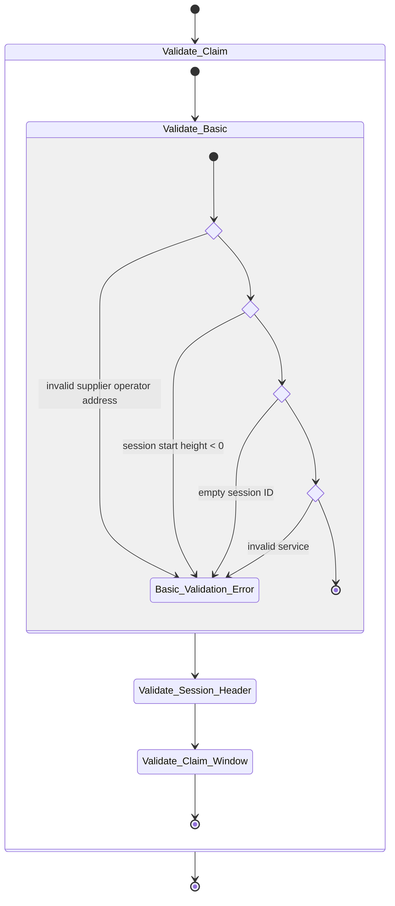
```mermaid
stateDiagram-v2

[*] --> Validate_Claim
state Validate_Claim {
    [*] --> Validate_Basic

    state Validate_Basic {
        state if_session_start_gt_0 <<choice>>
        state if_session_id_empty <<choice>>
        state if_service_invalid <<choice>>
        state if_supplier_operator_addr_valid <<choice>>

        [*] --> if_supplier_operator_addr_valid
        if_supplier_operator_addr_valid --> Basic_Validation_Error: invalid supplier operator address
        if_supplier_operator_addr_valid --> if_session_start_gt_0
        if_session_start_gt_0 --> Basic_Validation_Error: session start height < 0
        if_session_start_gt_0 --> if_session_id_empty
        if_session_id_empty --> Basic_Validation_Error: empty session ID
        if_session_id_empty --> if_service_invalid
        if_service_invalid --> Basic_Validation_Error: invalid service
        if_service_invalid --> [*]
    }

    Validate_Basic --> Validate_Session_Header
    Validate_Session_Header
    Validate_Session_Header --> Validate_Claim_Window
    Validate_Claim_Window -->[*]
}
Validate_Claim --> [*]
```

#### References:

- Create claim message basic
  validation ([`MsgCreateClaim#ValidateBasic()`](https://github.com/pokt-network/poktroll/blob/main/x/proof/types/message_create_claim.go))
- Session header
  validation ([diagram](#session-header-validation) / [`msgServer#queryAndValidateSessionHeader()`](https://github.com/pokt-network/poktroll/blob/main/x/proof/keeper/session.go))
- Onchain claim window
  validation ([diagram](#TODO) / [`msgServer#validateClaimWindow()`](https://github.com/pokt-network/poktroll/blob/main/x/proof/keeper/session.go))

### Claim Window

After a `Session` ends, a `Supplier` has several blocks, a `Claim Window`, to submit
a `CreateClaim` transaction containing a `Claim`. If it is submitted too early
or too late, it will be rejected by the protocol.

If a `Supplier` fails to submit a `Claim` during the Claim Window, it will forfeit
any potential rewards it could earn in exchange for the work done.

See [Session Windows & OnChain Parameters](#session-windows--onchain-parameters) for more details.

## Proof

A `Proof` is a structure submitted onchain by a `Supplier` containing a Merkle
Proof to a single pseudo-randomly selected leaf from the corresponding `Claim`.

At most one `Proof` exists for every `Claim`.

A `Proof` is necessary for the `Claim` to be validated so the `Supplier` can be
rewarded for the work done.

### Protobuf Types

| Type                                                                                                 | Description                                                                                                                                                                  |
| ---------------------------------------------------------------------------------------------------- | ---------------------------------------------------------------------------------------------------------------------------------------------------------------------------- |
| [`Proof`](https://github.com/pokt-network/poktroll/blob/main/proto/poktroll/proof/proof.proto)       | A serialized version of the `Proof` is stored onchain.                                                                                                                      |
| [`MsgSubmitProof`](https://github.com/pokt-network/poktroll/blob/main/proto/poktroll/proof/tx.proto) | Submitted by a `Supplier` to store a proof `onchain`. If the `Proof` is invalid, or if there is no corresponding `Claim` for the `Proof`, the transaction will be rejected. |

### SubmitProof Validation

When the network receives a [`MsgSubmitProof`](#TODO_link_to_MsgSubmitProof) message, before the proof is accepted
onchain, it MUST be validated:

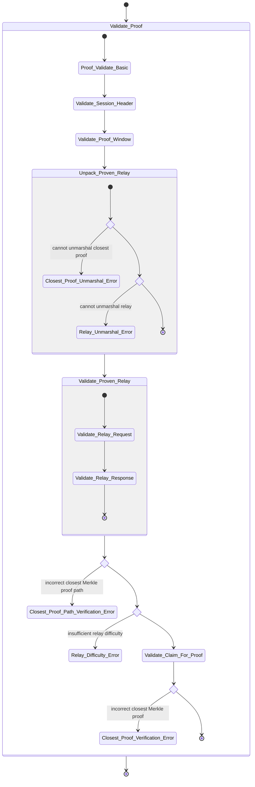
```mermaid
stateDiagram-v2
[*] --> Validate_Proof
state Validate_Proof {
  [*] --> Proof_Validate_Basic
  Proof_Validate_Basic --> Validate_Session_Header
  Validate_Session_Header --> Validate_Proof_Window
  Validate_Proof_Window --> Unpack_Proven_Relay

  state Unpack_Proven_Relay {
    state if_closest_proof_malformed <<choice>>
    state if_relay_valid <<choice>>

    [*] --> if_closest_proof_malformed
    if_closest_proof_malformed --> Closest_Proof_Unmarshal_Error: cannot unmarshal closest proof
    if_closest_proof_malformed --> if_relay_valid
    if_relay_valid --> Relay_Unmarshal_Error: cannot unmarshal relay
    if_relay_valid --> [*]
  }

Unpack_Proven_Relay --> Validate_Proven_Relay

state Validate_Proven_Relay {
  [*] --> Validate_Relay_Request
  Validate_Relay_Request --> Validate_Relay_Response
  Validate_Relay_Response --> [*]
}

state if_closest_proof_path_valid <<choice>>
state if_relay_difficulty_sufficient <<choice>>

Validate_Proven_Relay --> if_closest_proof_path_valid
if_closest_proof_path_valid --> Closest_Proof_Path_Verification_Error: incorrect closest Merkle proof path
if_closest_proof_path_valid --> if_relay_difficulty_sufficient
if_relay_difficulty_sufficient --> Relay_Difficulty_Error: insufficient relay difficulty
if_relay_difficulty_sufficient --> Validate_Claim_For_Proof

state if_closest_proof_valid <<choice>>
  Validate_Claim_For_Proof --> if_closest_proof_valid
  if_closest_proof_valid --> Closest_Proof_Verification_Error: incorrect closest Merkle proof
  if_closest_proof_valid --> [*]
}
Validate_Proof --> [*]
```

#### References:

- Proof basic
  validation ([diagram](#proof-basic-validation) / [`MsgSubmitProof#ValidateBasic()`](https://github.com/pokt-network/poktroll/blob/main/x/proof/types/message_submit_proof.go))
- Session header
  validation ([diagram](#session-header-validation) / [`msgServer#queryAndValidateSessionHeader()`](https://github.com/pokt-network/poktroll/blob/main/x/proof/keeper/session.go))
- Proof window
  validation ([diagram](#TODO) / [`msgServer#validateProofWindow()`](https://github.com/pokt-network/poktroll/blob/main/x/proof/keeper/session.go))
- Proven relay request
  validation ([diagram](#proof-submission-relay-request-validation) / [`RelayRequest#ValidateBasic()`](https://github.com/pokt-network/poktroll/blob/main/x/service/types/relay.go))
- Proven relay response
  validation ([diagram](#proof-submission-relay-response-validation) / [`RelayResponse#ValidateBasic()`](https://github.com/pokt-network/poktroll/blob/main/x/service/types/relay.go))
- Proof claim
  validation ([diagram](#proof-submission-claim-validation) / [`msgServer#queryandValidateClaimForProof()`](https://github.com/pokt-network/poktroll/blob/main/x/proof/keeper/msg_server_submit_proof.go))

### Proof Window

After the `Proof Window` opens, a `Supplier` has several blocks, a `Proof Window`,
to submit a `SubmitProof` transaction containing a `Proof`. If it is submitted too
early or too late, it will be rejected by the protocol.

If a proof is required (as determined by [Probabilistic Proofs](probabilistic_proofs.md)) and a `Supplier` fails to
submit a `Proof` during the Proof Window, the Claim will expire, and the supplier will forfeit rewards for the claimed
work done. See [Claim Expiration](#claim-expiration) for more.

See [Session Windows & Onchain Parameters](#session-windows--onchain-parameters) for more details.

## Proof Security

In addition to basic validation as part of processing `SubmitProof` to determine
whether or not the `Proof` should be stored onchain, there are several additional
deep cryptographic validations needed:

1. `Merkle Leaf Validation`: Proof of the offchain `Supplier`/`Application` interaction during the Relay request & response.
2. `Merkle Proof Selection`: Proof of the amount of work done by the `Supplier` during the `Session`.

:::note

TODO_DOCUMENT: Link to tokenomics and data integrity checks for discussion once they are written.

:::

### Merkle Leaf Validation

The key components of every leaf in the `Sparse Merkle Sum Trie` are shown below.

After the leaf is validated, two things happen:

1. The stake of `Application` signing the `Relay Request` is decreased through burn
2. The account balance of the `Supplier` owner is increased through mint

The validation on these signatures is done onchain as part of `Proof Validation`.

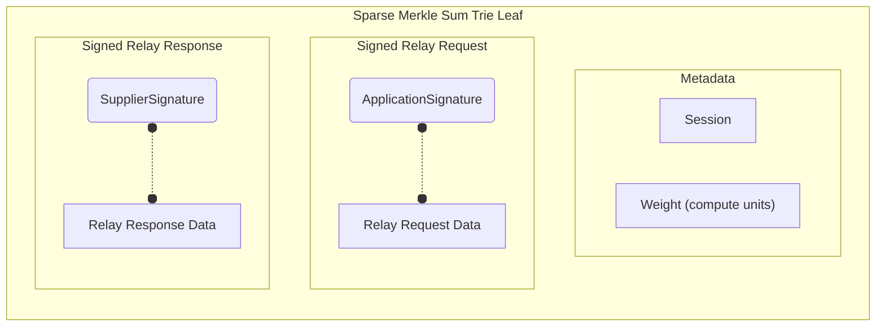
```mermaid
graph LR
    subgraph Sparse Merkle Sum Trie Leaf
        subgraph Metadata
            S["Session"]
            W["Weight (compute units)"]
        end
        subgraph Signed Relay Request
            direction TB
            Req[Relay Request Data]
            AppSig(ApplicationSignature)
            AppSig o-.-o Req
        end

        subgraph Signed Relay Response
            direction TB
            Res[Relay Response Data]
            SupSig(SupplierSignature)
            SupSig o-.-o Res
        end
    end
```

### Merkle Proof Selection

Before the leaf itself is validated, we need to make sure if there is a valid
Merkle Proof for the associated pseudo-random path computed onchain.

Since the path that needs to be proven uses an onchain seed after the `Claim`
has been submitted, it is impossible to know the path in advance.

Assume a collision resistant hash function `H` that takes a the `block header hash`
as the `seed` and maps it to a `path` in the `Merkle Trie` key space.

#### Example: Example Sparse Merkle Sum Trie (SMST)

Below is an example of a `Sparse Merkle Sum Trie` where the paths can be at
most `5` bits (for example purposes).

:::note

Extension nodes are ommitted and shown via `0bxxxxx` as part of the tree edges

:::

Legend:

- 🟥 - Root node
- 🟦 - Inner node
- 🟩 - Leaf node
- 🟫 - Empty Node
- 🟨 - Included in Merkle Proof
- ⬚🟨 - Computed as Part of Merkle Proof
- ⬛ - Not used in the diagram node

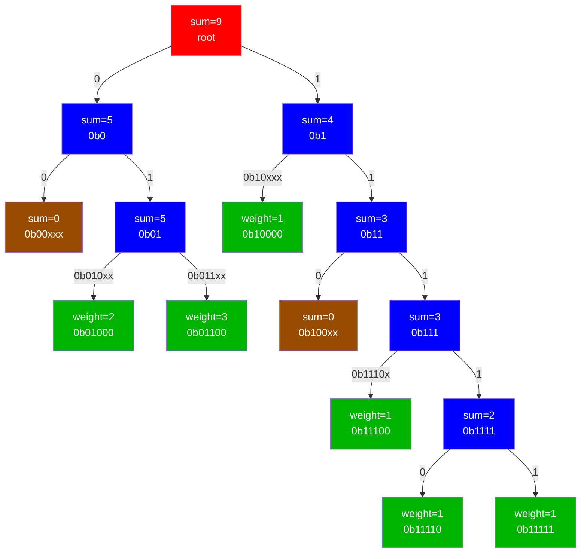
```mermaid
graph TB
    classDef redNode fill:#ff0000, color:#ffffff;
    classDef greenNode fill:#00b300, color:#ffffff;
    classDef blueNode fill:#0000ff, color:#ffffff;
    classDef yellowNode fill:#fff500, color:#ffa500
    classDef brownNode fill:#964B00, color:#ffffff;

    %% Define root node
    R[sum=9<br>root]

    %% Height = 1
    R -- 0 --> N1[sum=5<br>0b0]
    R -- 1 --> N2[sum=4<br>0b1]

    %% Height = 2
    N1 -- 0 --> E1[sum=0<br>0b00xxx]
    N1 -- 1 --> N3[sum=5<br>0b01]
    N2 -- 0b10xxx --> L1[weight=1<br>0b10000]
    N2 -- 1 --> N4[sum=3<br>0b11]

    %% Height = 3
    N3 -- 0b010xx --> L2[weight=2<br>0b01000]
    N3 -- 0b011xx --> L3[weight=3<br>0b01100]
    N4 -- 0 --> E2[sum=0<br>0b100xx]
    N4 -- 1 --> N5[sum=3<br>0b111]

    %% Height = 4
    N5 -- 0b1110x --> L4[weight=1<br>0b11100]
    N5 -- 1 --> N6[sum=2<br>0b1111]

    %% Height = 5
    N6 -- 0 --> L5[weight=1<br>0b11110]
    N6 -- 1 --> L6[weight=1<br>0b11111]

    class R redNode;
    class L1,L2,L3,L4,L5,L6 greenNode;
    class N1,N2,N3,N4,N5,N6 blueNode;
    class E1,E2 brownNode;
```

#### Example 1: Path to leaf at full depth

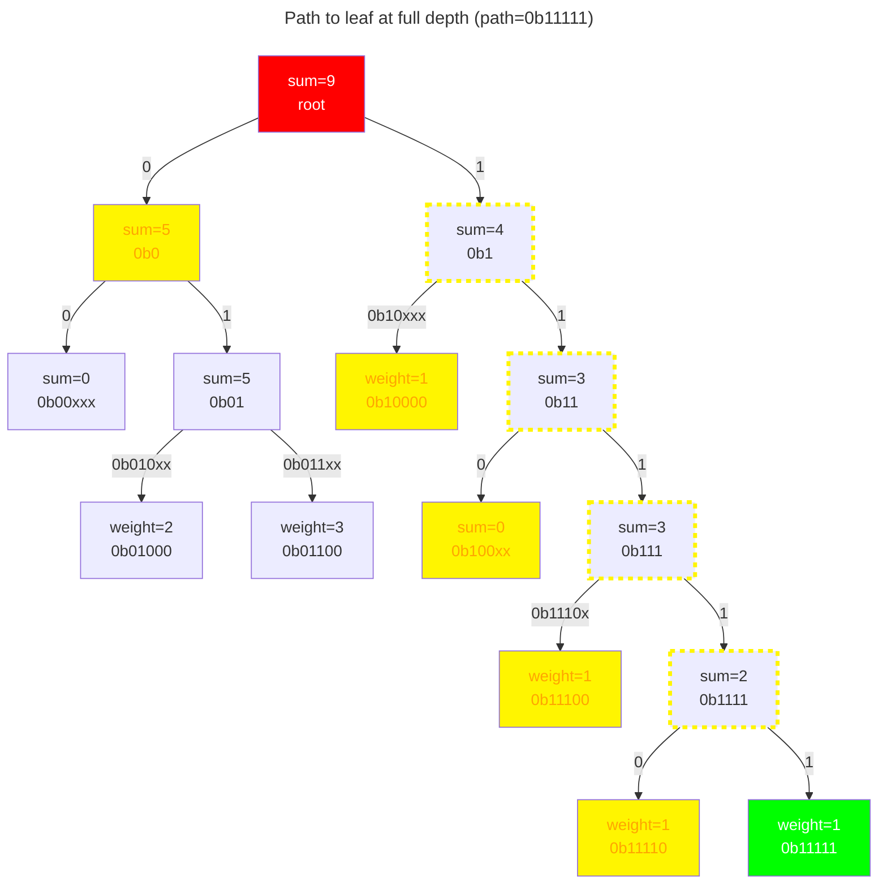
```mermaid
---
title: Path to leaf at full depth (path=0b11111)
---
graph TB
    %% Define a class for red nodes
    classDef redNode fill:#ff0000, color:#ffffff;
    classDef greenNode fill:#00ff00, color:#ffffff;
    classDef blueNode fill:#0000ff, color:#ffffff;
    classDef yellowNode fill:#fff500, color:#ffa500
    classDef yellowBorderNode stroke:#fff500, stroke-width:4px, stroke-dasharray: 5 5

    %% Define root node
    R[sum=9<br>root]

    %% Height = 1
    R -- 0 --> N1[sum=5<br>0b0]
    R -- 1 --> N2[sum=4<br>0b1]

    %% Height = 2
    N1 -- 0 --> E1[sum=0<br>0b00xxx]
    N1 -- 1 --> N3[sum=5<br>0b01]
    N2 -- 0b10xxx --> L1[weight=1<br>0b10000]
    N2 -- 1 --> N4[sum=3<br>0b11]

    %% Height = 3
    N3 -- 0b010xx --> L2[weight=2<br>0b01000]
    N3 -- 0b011xx --> L3[weight=3<br>0b01100]
    N4 -- 0 --> E2[sum=0<br>0b100xx]
    N4 -- 1 --> N5[sum=3<br>0b111]

    %% Height = 4
    N5 -- 0b1110x --> L4[weight=1<br>0b11100]
    N5 -- 1 --> N6[sum=2<br>0b1111]

    %% Height = 5
    N6 -- 0 --> L5[weight=1<br>0b11110]
    N6 -- 1 --> L6[weight=1<br>0b11111]

    class R redNode;
    class L1,L4,L5,E2,N1 yellowNode;
    class N6,N5,N4,N2 yellowBorderNode;
    class L6 greenNode;
```

#### Example 2: Path to leaf at partial depth

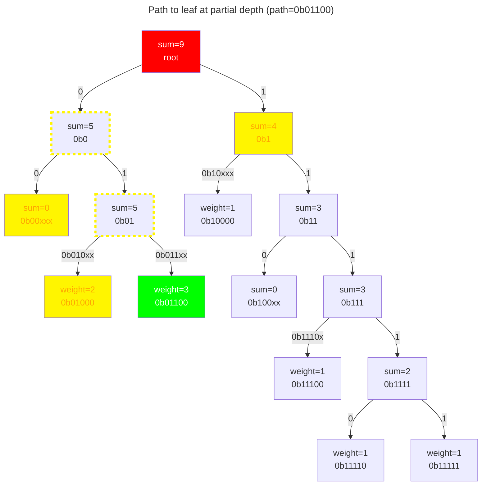
```mermaid
---
title: Path to leaf at partial depth (path=0b01100)
---
graph TB
    %% Define a class for red nodes
    classDef redNode fill:#ff0000, color:#ffffff;
    classDef greenNode fill:#00ff00, color:#ffffff;
    classDef blueNode fill:#0000ff, color:#ffffff;
    classDef yellowNode fill:#fff500, color:#ffa500
    classDef yellowBorderNode stroke:#fff500, stroke-width:4px, stroke-dasharray: 5 5

    %% Define root node
    R[sum=9<br>root]

    %% Height = 1
    R -- 0 --> N1[sum=5<br>0b0]
    R -- 1 --> N2[sum=4<br>0b1]

    %% Height = 2
    N1 -- 0 --> E1[sum=0<br>0b00xxx]
    N1 -- 1 --> N3[sum=5<br>0b01]
    N2 -- 0b10xxx --> L1[weight=1<br>0b10000]
    N2 -- 1 --> N4[sum=3<br>0b11]

    %% Height = 3
    N3 -- 0b010xx --> L2[weight=2<br>0b01000]
    N3 -- 0b011xx --> L3[weight=3<br>0b01100]
    N4 -- 0 --> E2[sum=0<br>0b100xx]
    N4 -- 1 --> N5[sum=3<br>0b111]

    %% Height = 4
    N5 -- 0b1110x --> L4[weight=1<br>0b11100]
    N5 -- 1 --> N6[sum=2<br>0b1111]

    %% Height = 5
    N6 -- 0 --> L5[weight=1<br>0b11110]
    N6 -- 1 --> L6[weight=1<br>0b11111]

    class R redNode;
    class E1,N2,L2 yellowNode;
    class N1,N3 yellowBorderNode;
    class L3 greenNode;
```

#### Example 3: Path to empty node

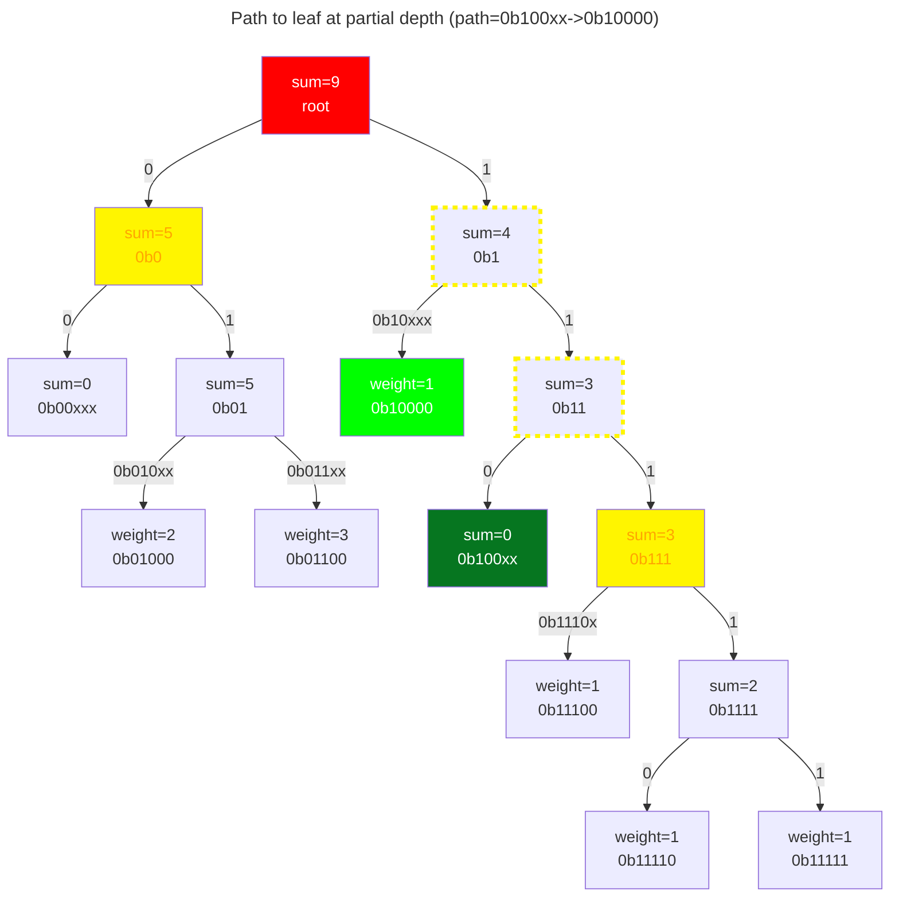
```mermaid
---
title: Path to leaf at partial depth (path=0b100xx->0b10000)
---
graph TB
    classDef redNode fill:#ff0000, color:#ffffff;
    classDef greenNode fill:#00ff00, color:#ffffff;
    classDef greenNodeDark fill:#067620, color:#ffffff;
    classDef blueNode fill:#0000ff, color:#ffffff;
    classDef yellowNode fill:#fff500, color:#ffa500
    classDef yellowBorderNode stroke:#fff500, stroke-width:4px, stroke-dasharray: 5 5

    %% Define root node
    R[sum=9<br>root]

    %% Height = 1
    R -- 0 --> N1[sum=5<br>0b0]
    R -- 1 --> N2[sum=4<br>0b1]

    %% Height = 2
    N1 -- 0 --> E1[sum=0<br>0b00xxx]
    N1 -- 1 --> N3[sum=5<br>0b01]
    N2 -- 0b10xxx --> L1[weight=1<br>0b10000]
    N2 -- 1 --> N4[sum=3<br>0b11]

    %% Height = 3
    N3 -- 0b010xx --> L2[weight=2<br>0b01000]
    N3 -- 0b011xx --> L3[weight=3<br>0b01100]
    N4 -- 0 --> E2[sum=0<br>0b100xx]
    N4 -- 1 --> N5[sum=3<br>0b111]

    %% Height = 4
    N5 -- 0b1110x --> L4[weight=1<br>0b11100]
    N5 -- 1 --> N6[sum=2<br>0b1111]

    %% Height = 5
    N6 -- 0 --> L5[weight=1<br>0b11110]
    N6 -- 1 --> L6[weight=1<br>0b11111]

    class R redNode;
    class N1,N5 yellowNode;
    class N4,N2 yellowBorderNode;
    class E2,L1 greenNode;
    class E2 greenNodeDark;
```

## Full Lifecycle

The following diagram was taken from the [Relay Mining whitepaper](https://arxiv.org/pdf/2305.10672.pdf),
and is an alternative view of the full lifecycle described above.
It is here for reference purposes.

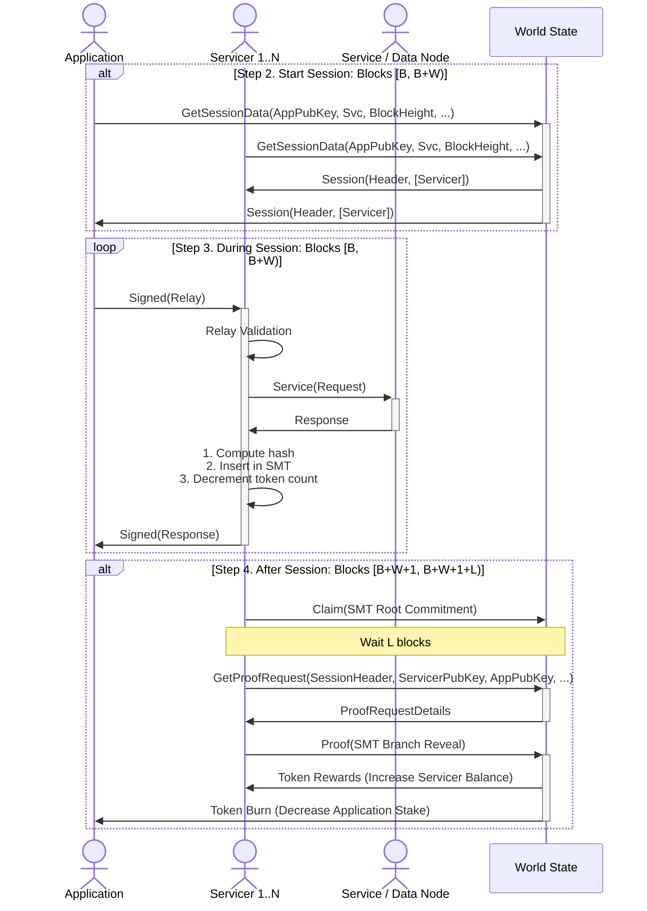
```mermaid
sequenceDiagram
    actor A as Application
    actor S as Servicer 1..N
    actor Svc as Service / Data Node
    participant W as World State
    alt Step 2. Start Session: Blocks [B, B+W)
        A ->> +W: GetSessionData(AppPubKey, Svc, BlockHeight, ...)
        S ->> W: GetSessionData(AppPubKey, Svc, BlockHeight, ...)
        W ->> S: Session(Header, [Servicer])
        W ->> -A: Session(Header, [Servicer])
    end

    loop Step 3. During Session: Blocks [B, B+W)
        A ->> +S: Signed(Relay)
        S ->> S: Relay Validation
        S ->> +Svc: Service(Request)
        Svc ->> -S: Response
        S ->> S: 1. Compute hash<br>2. Insert in SMT<br>3. Decrement token count
        S ->> -A: Signed(Response)
    end

    alt Step 4. After Session: Blocks [B+W+1, B+W+1+L)
        S ->> W: Claim(SMT Root Commitment)
        note over S,W: Wait L blocks
        S ->> +W: GetProofRequest(SessionHeader, ServicerPubKey, AppPubKey, ...)
        W ->> -S: ProofRequestDetails
        S ->> +W: Proof(SMT Branch Reveal)
        W ->> S: Token Rewards (Increase Servicer Balance)
        W ->> -A: Token Burn (Decrease Application Stake)
    end
```

## Reference Diagrams

### Session Header Validation

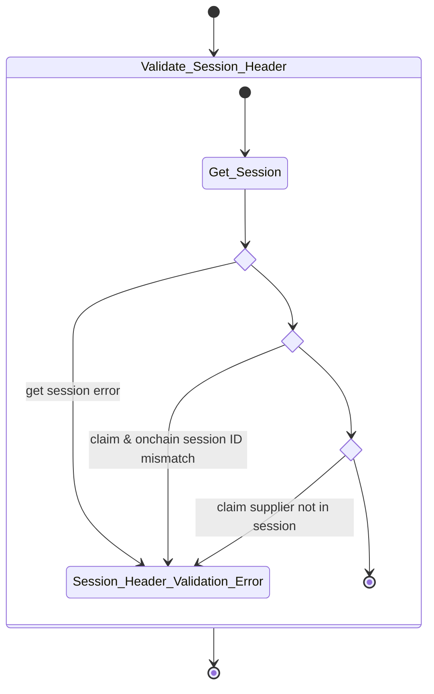
```mermaid
stateDiagram-v2

[*] --> Validate_Session_Header


state Validate_Session_Header {
    [*] --> Get_Session
    state if_get_session_error <<choice>>
    state if_session_id_mismatch <<choice>>
    state if_supplier_found <<choice>>
    Get_Session --> if_get_session_error
    if_get_session_error --> Session_Header_Validation_Error: get session error
    if_get_session_error --> if_session_id_mismatch
    if_session_id_mismatch --> Session_Header_Validation_Error: claim & onchain session ID mismatch
    if_session_id_mismatch --> if_supplier_found
    if_supplier_found --> Session_Header_Validation_Error: claim supplier not in session
    if_supplier_found --> [*]
}

Validate_Session_Header --> [*]
```

### Proof Basic Validation

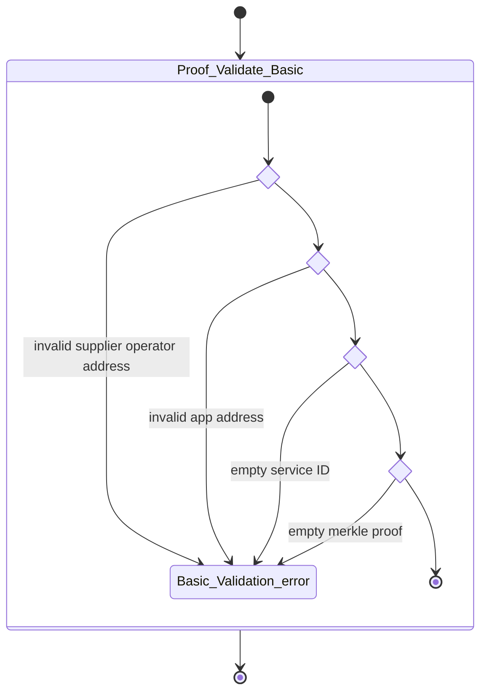
```mermaid
stateDiagram-v2

  [*] --> Proof_Validate_Basic

  state Proof_Validate_Basic {
    state if_supplier_operator_addr_valid <<choice>>
    state if_app_addr_valid <<choice>>
    state if_service_id_empty <<choice>>
    state if_proof_empty <<choice>>
    [*] --> if_supplier_operator_addr_valid
    if_supplier_operator_addr_valid --> Basic_Validation_error: invalid supplier operator address
    if_supplier_operator_addr_valid --> if_app_addr_valid
    if_app_addr_valid --> Basic_Validation_error: invalid app address
    if_app_addr_valid --> if_service_id_empty
    if_service_id_empty --> Basic_Validation_error: empty service ID
    if_service_id_empty --> if_proof_empty
    if_proof_empty --> Basic_Validation_error: empty merkle proof
    if_proof_empty --> [*]
  }

  Proof_Validate_Basic --> [*]
```

### Proof Submission Relay Request Validation

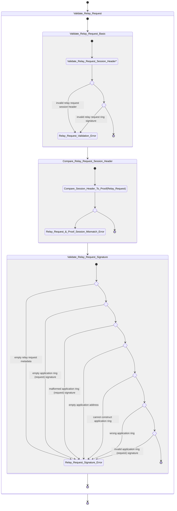
```mermaid
stateDiagram-v2

[*] --> Validate_Relay_Request
state Validate_Relay_Request {

        [*] --> Validate_Relay_Request_Basic

    state Validate_Relay_Request_Basic {
        state if_request_valid <<choice>>
        state if_request_signature_empty <<choice>>
        [*] --> Validate_Relay_Request_Session_Header*
        Validate_Relay_Request_Session_Header* --> if_request_valid
        if_request_valid --> Relay_Request_Validation_Error: invalid relay request session header
        if_request_valid --> if_request_signature_empty
        if_request_signature_empty --> Relay_Request_Validation_Error: invalid relay request ring signature
        if_request_signature_empty --> [*]
    }

    Validate_Relay_Request_Basic --> Compare_Relay_Request_Session_Header

    state Compare_Relay_Request_Session_Header {
        state if_req_session_header_mismatch <<choice>>
        [*] --> Compare_Session_Header_To_Proof(Relay_Request)
        Compare_Session_Header_To_Proof(Relay_Request) --> if_req_session_header_mismatch
        if_req_session_header_mismatch --> Relay_Request_&_Proof_Session_Mismatch_Error
        if_req_session_header_mismatch --> [*]
    }

    Compare_Relay_Request_Session_Header --> Validate_Relay_Request_Signature

    state Validate_Relay_Request_Signature {
        state if_request_meta_empty <<choice>>
        state if_ring_sig_empty <<choice>>
        state if_ring_sig_malformed <<choice>>
        state if_app_addr_empty <<choice>>
        state if_ring_valid <<choice>>
        state if_ring_mismatch <<choice>>
        state if_ring_sig_valid <<choice>>

        [*] --> if_request_meta_empty
        if_request_meta_empty --> Relay_Request_Signature_Error: empty relay request metadata
        if_request_meta_empty --> if_ring_sig_empty
        if_ring_sig_empty --> Relay_Request_Signature_Error: empty application ring (request) signature
        if_ring_sig_empty --> if_ring_sig_malformed
        if_ring_sig_malformed --> Relay_Request_Signature_Error: malformed application ring (request) signature
        if_ring_sig_malformed --> if_app_addr_empty
        if_app_addr_empty --> Relay_Request_Signature_Error: empty application address
        if_app_addr_empty --> if_ring_valid
        if_ring_valid --> Relay_Request_Signature_Error: cannot construct application ring
        if_ring_valid --> if_ring_mismatch
        if_ring_mismatch --> Relay_Request_Signature_Error: wrong application ring
        if_ring_mismatch --> if_ring_sig_valid
        if_ring_sig_valid --> Relay_Request_Signature_Error: invalid application ring (request) signature
        if_ring_sig_valid --> [*]
    }

    Validate_Relay_Request_Signature --> [*]

}
Validate_Relay_Request --> [*]
```

### Proof Submission Relay Response Validation

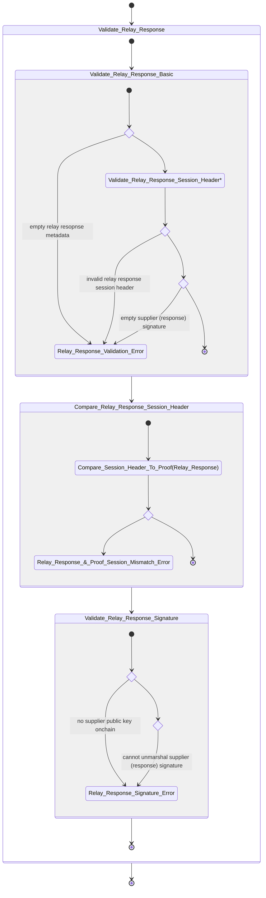
```mermaid
stateDiagram-v2

[*] --> Validate_Relay_Response
state Validate_Relay_Response {

        [*] --> Validate_Relay_Response_Basic

    state Validate_Relay_Response_Basic {
        state if_response_valid <<choice>>
        state if_supplier_signature_empty <<choice>>
        state if_response_meta_empty <<choice>>
        [*] --> if_response_meta_empty
        if_response_meta_empty --> Relay_Response_Validation_Error: empty relay resopnse metadata
        if_response_meta_empty --> Validate_Relay_Response_Session_Header*
        Validate_Relay_Response_Session_Header* --> if_response_valid
        if_response_valid --> Relay_Response_Validation_Error: invalid relay response session header
        if_response_valid --> if_supplier_signature_empty
        if_supplier_signature_empty --> Relay_Response_Validation_Error: empty supplier (response) signature
        if_supplier_signature_empty --> [*]
    }

    Validate_Relay_Response_Basic --> Compare_Relay_Response_Session_Header

     state Compare_Relay_Response_Session_Header {
        state if_res_session_header_mismatch <<choice>>
        [*] --> Compare_Session_Header_To_Proof(Relay_Response)
        Compare_Session_Header_To_Proof(Relay_Response) --> if_res_session_header_mismatch
        if_res_session_header_mismatch --> Relay_Response_&_Proof_Session_Mismatch_Error
        if_res_session_header_mismatch --> [*]
    }

    Compare_Relay_Response_Session_Header --> Validate_Relay_Response_Signature

    state Validate_Relay_Response_Signature {
        state if_supplier_pubkey_exists <<choice>>
        state if_supplier_sig_malformed <<choice>>

        [*] --> if_supplier_pubkey_exists
        if_supplier_pubkey_exists --> Relay_Response_Signature_Error: no supplier public key onchain
        if_supplier_pubkey_exists --> if_supplier_sig_malformed
        if_supplier_sig_malformed --> Relay_Response_Signature_Error: cannot unmarshal supplier (response) signature
    }

    Validate_Relay_Response_Signature --> [*]

}
Validate_Relay_Response --> [*]
```

### Proof Session Header Comparison

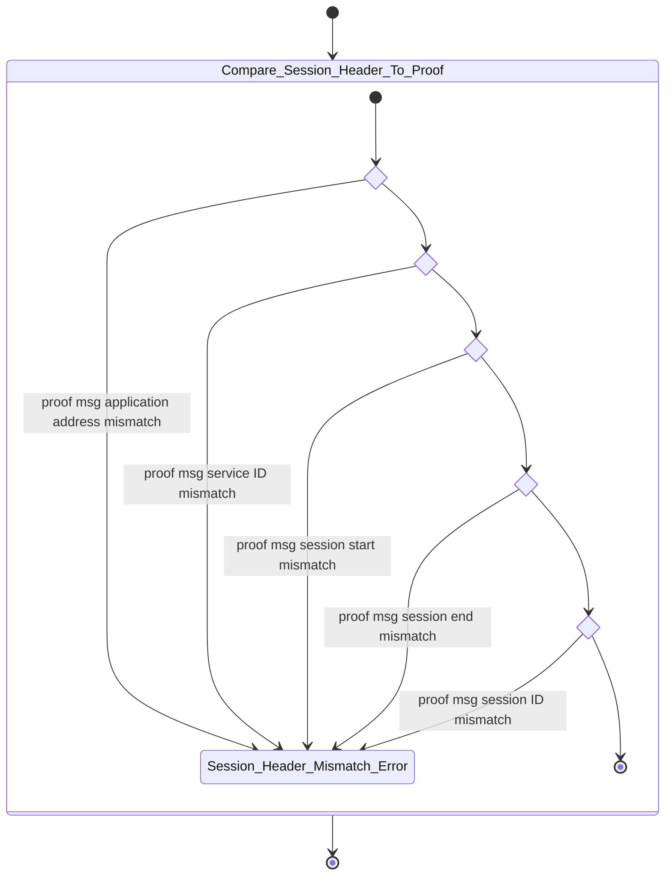
```mermaid
stateDiagram-v2

[*] --> Compare_Session_Header_To_Proof
state Compare_Session_Header_To_Proof {
        state if_app_addr_mismatch <<choice>>
        state if_service_id_mismatch <<choice>>
        state if_session_start_mismatch <<choice>>
        state if_session_end_mismatch <<choice>>
        state if_session_id_mismatch <<choice>>
        [*] --> if_app_addr_mismatch
        if_app_addr_mismatch --> Session_Header_Mismatch_Error: proof msg application address mismatch
        if_app_addr_mismatch -->  if_service_id_mismatch
        if_service_id_mismatch --> Session_Header_Mismatch_Error: proof msg service ID mismatch
        if_service_id_mismatch --> if_session_start_mismatch
        if_session_start_mismatch -->Session_Header_Mismatch_Error: proof msg session start mismatch
        if_session_start_mismatch --> if_session_end_mismatch
        if_session_end_mismatch --> Session_Header_Mismatch_Error: proof msg session end mismatch
        if_session_end_mismatch --> if_session_id_mismatch
        if_session_id_mismatch --> Session_Header_Mismatch_Error: proof msg session ID mismatch
        if_session_id_mismatch --> [*]
}
Compare_Session_Header_To_Proof --> [*]
```

### Proof Submission Claim Validation

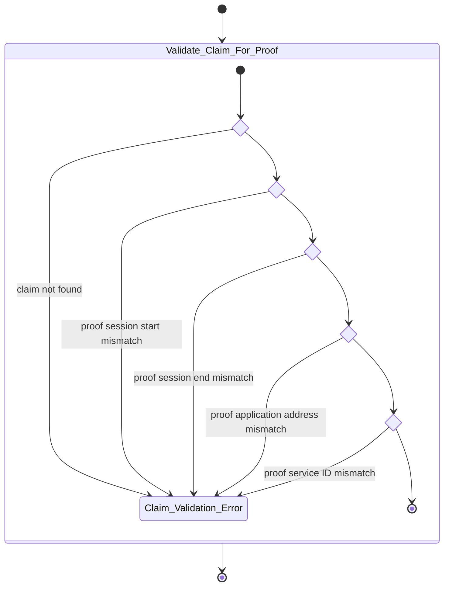
```mermaid
stateDiagram-v2

  [*] --> Validate_Claim_For_Proof
  state Validate_Claim_For_Proof {
    state if_claim_found <<choice>>
    state if_proof_session_start_mismatch <<choice>>
    state if_proof_session_end_mismatch <<choice>>
    state if_proof_app_addr_mismatch <<choice>>
    state if_proof_service_mismatch <<choice>>

    [*] --> if_claim_found
    if_claim_found --> Claim_Validation_Error: claim not found
    if_claim_found --> if_proof_session_start_mismatch
    if_proof_session_start_mismatch --> Claim_Validation_Error: proof session start mismatch
    if_proof_session_start_mismatch --> if_proof_session_end_mismatch
    if_proof_session_end_mismatch --> Claim_Validation_Error: proof session end mismatch
    if_proof_session_end_mismatch --> if_proof_app_addr_mismatch
    if_proof_app_addr_mismatch --> Claim_Validation_Error: proof application address mismatch
    if_proof_app_addr_mismatch --> if_proof_service_mismatch
    if_proof_service_mismatch --> Claim_Validation_Error: proof service ID mismatch
    if_proof_service_mismatch --> [*]
  }
  Validate_Claim_For_Proof --> [*]
```
