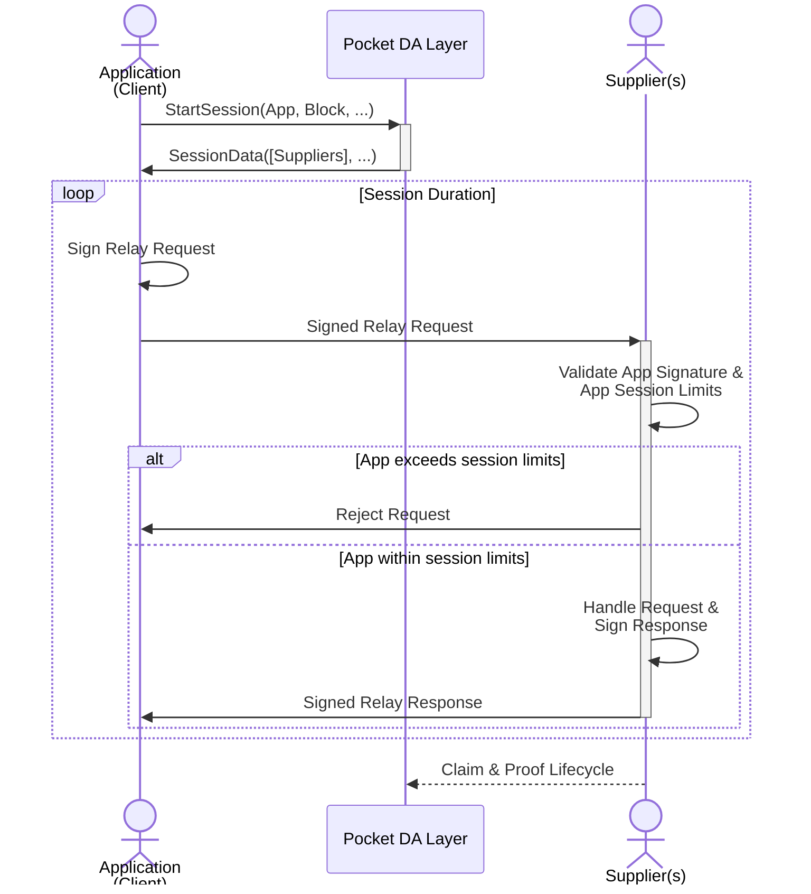
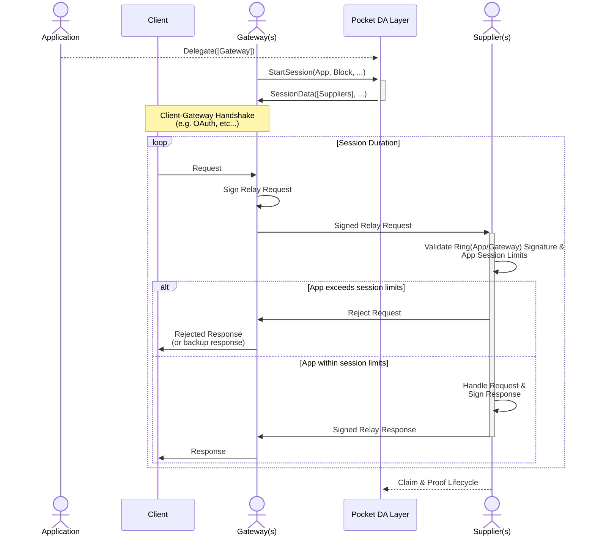
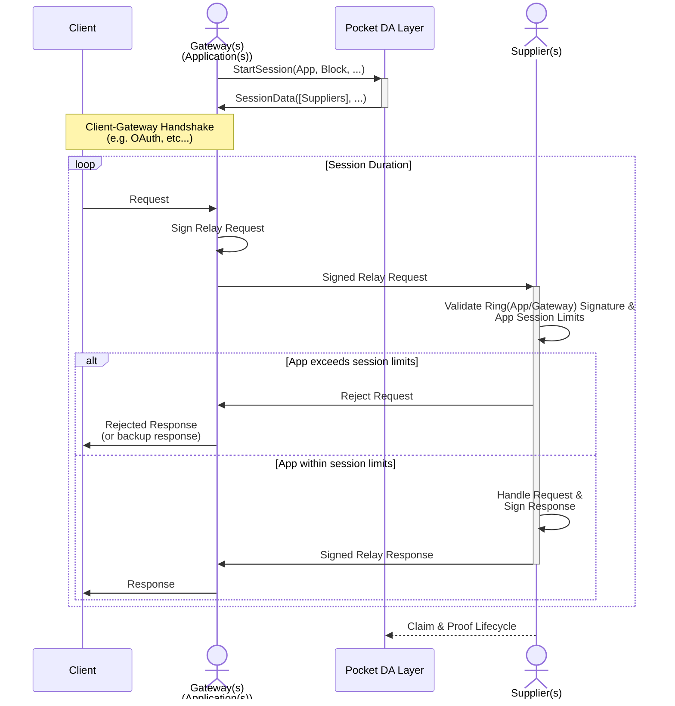
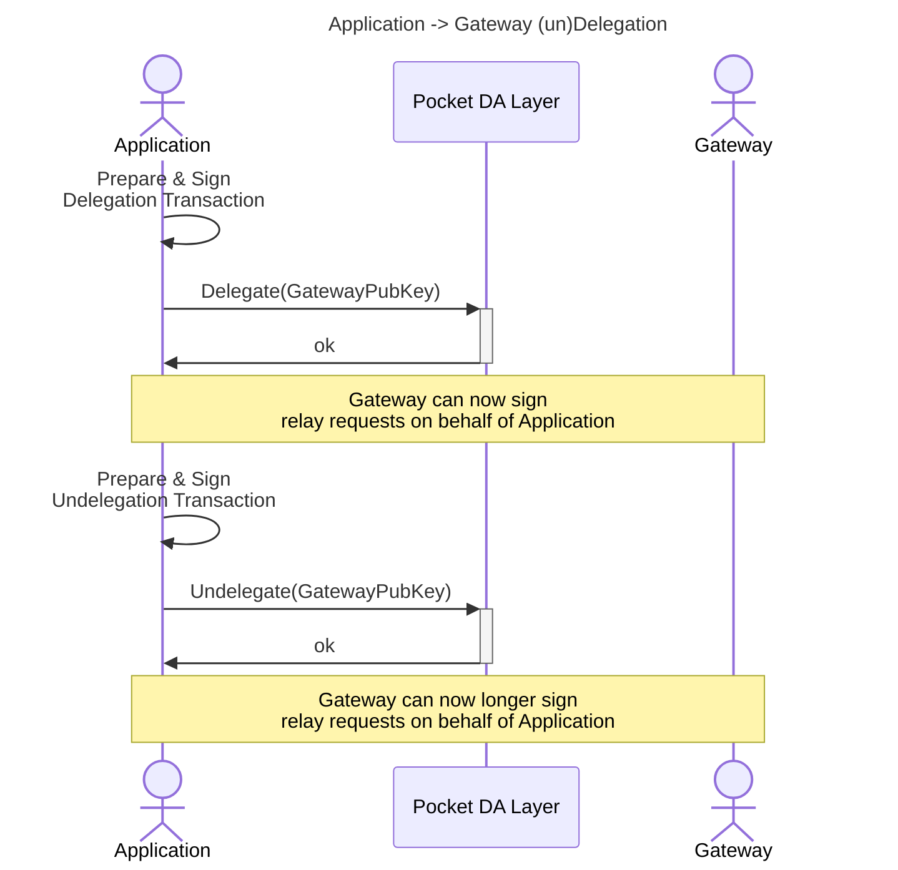
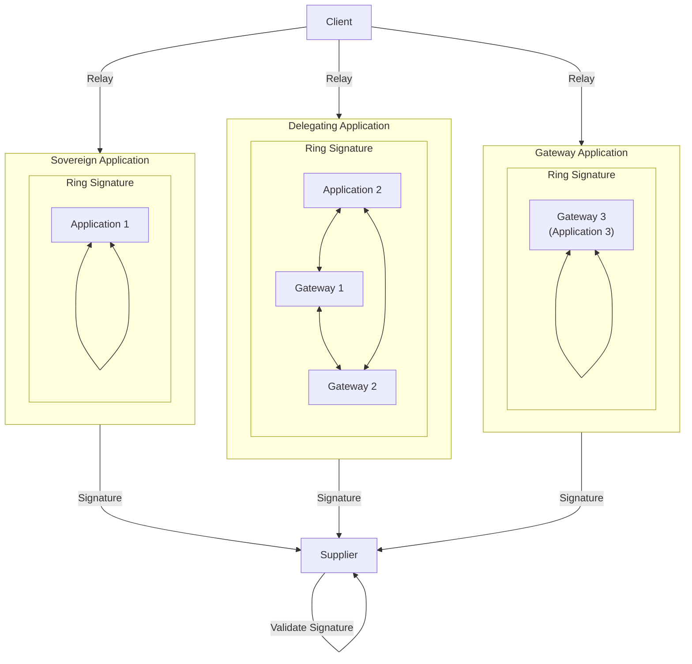
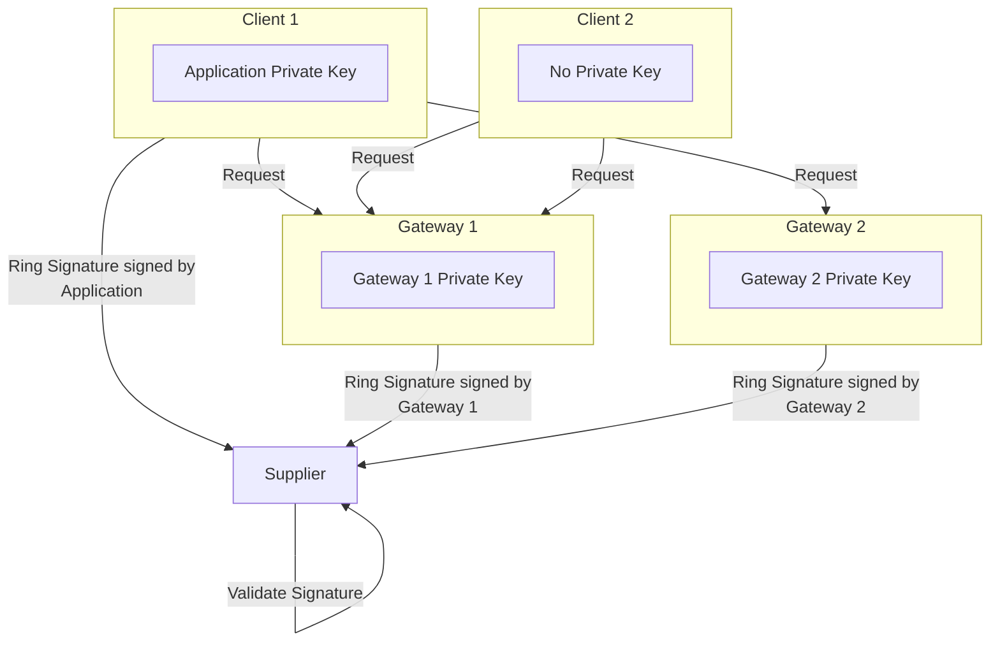
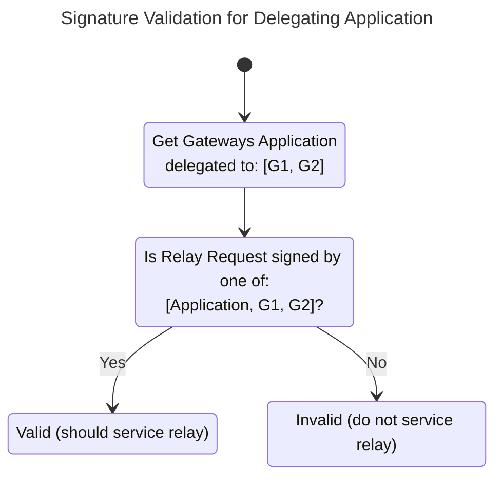

# Gateways <!-- omit in toc -->

:::warning

This part of the documentation is just an INITIAL DRAFT and requires deep
understanding of the Pocket Network protocol. It is currently aiming to just
be a reference and not provide a coherent narrative that is easily accessible
to all readers.

:::

- [Introduction](#introduction)
- [Modes of Operation](#modes-of-operation)
  - [Sovereign Application](#sovereign-application)
  - [Delegating Application](#delegating-application)
  - [Gateway Application](#gateway-application)
- [Application -\> Gateway Delegation](#application---gateway-delegation)
- [Relay Signatures](#relay-signatures)
  - [Delegating Application Example](#delegating-application-example)
- [\[WIP\] Gateway Offchain Operations](#wip-gateway-offchain-operations)

## Introduction

The [Gateway Actor](../../protocol/actors/gateway.md) section covers what a Gateway is.
Recall that it is a permissionless protocol actor to whom the Application can
**optionally** delegate onchain trust in order to perform offchain operations.

This section aims to cover the cryptographic aspects of Gateway interactions,
trust delegation, and how they fit into the Pocket Network protocol.

## Modes of Operation

There are three modes of operation to interact with the Suppliers on the network:

1. **Sovereign Application**: Client manages personal Application private key
2. **Delegating Application**: Gateway abstracts all aspects of Pocket Network to Client
3. **Gateway Application**: Client trusts Gateway to sign relays on behalf of its Application

For the purposes of this discussion, it is important to note that an `Application`
and `Gateway` are onchain actors/records that stake POKT to participate in the
network. The term `Client` is used to represent an application running on a user's
device, such as a smartphone or a web browser.

The goal of Gateways is to enable free-market offchain economics tie into
onchain interactions.

### Sovereign Application

A Sovereign Application is one where the `Client` manages its own onchain `Application`
and interacts with the Pocket Supplier Network directly.

The Application is responsible for:

- Protecting it's own `Application` private key on the `Client`
- Maintaining and updating it's own onchain stake to pay for `Supplier` services
- Determining which `Supplier` to use from the available list in the session

### Delegating Application

A Delegated Application is one where an `Application` delegates to one or more
`Gateways`. Agreements (authentication, payments, etc) between the `Client` and
`Gateway` are then managed offchain, but payment for the onchain `Supplier`
services still comes from the `Application`s stake.

The Application is responsible for:

- Protecting it's own `Application` private key somewhere in hot/cold storage
- Maintaining and updating it's own onchain stake to pay for `Supplier` services
- Managing, through (un)delegation, which Gateway(s) can sign requests on ts behalf

The Gateway is responsible for:

- Providing tooling and infrastructure to coordinate with the `Client`
- Determining which `Supplier` to use from the available list in the session

### Gateway Application

A Gateway Application is one where the `Gateway` takes full onus, on behalf of
`Client`s to manage all onchain `Application` interactions to access the
Pocket `Supplier` Network. Agreements (authentication, payments, etc) between
the `Client` and `Gateway` are then managed offchain, and payment for the
onchain `Supplier` services will comes from the `Application`s stake, which
is now maintained by the `Gateway`.

It is responsible for:

The Gateway is responsible for:

- Protecting it's own `Application` private key somewhere in hot/cold storage
- Maintaining and updating it's own onchain stake to pay for `Supplier` services
- Providing tooling and infrastructure to coordinate with the `Client`
- Determining which `Supplier` to use from the available list in the session

## Application -> Gateway Delegation

An Application that chooses to delegate trust to a gateway by submitting a
one-time `DelegateMsg` transaction. Once this is done, the `Gateway` will be
able to sign relay requests on behalf of the `Application` that'll use the
`Application`s onchain stake to pay for service to access the Pocket `Supplier` Network.

This can be done any number of times, so an `Application` can delegate to multiple
`Gateways` simultaneously.

## Relay Signatures

As explained in the [Claim & Proof Lifecycle](./claim_and_proof_lifecycle.md) document,
the `Application` that signs the relay request is the one whose stake is used to
for access to services provided by the Pocket `Supplier` Network.

The `Application` is the one paying for services, but a `Gateway` could potentially
be the one proxing and signing the relay. [Ring Signatures](https://en.wikipedia.org/wiki/Ring_signature)
are used to enable both since delegation happens at the public key level.

Below we see what the Ring would look like in each of the three modes of operation
described above:

### Delegating Application Example

As an example, consider an `Application` that has delegated to two independent
`Gateways`: Gateway 1 & Gateway 2. The diagrams below show a few things:

- A client with the `Application` private can sign the relay itself or delegate
  to a `Gateway` to sign the relay on its behalf.
- A client without the `Application` private key can only delegate to a `Gateway`
  to sign the relay on its behalf.
- The `Supplier` does not know who signed the relay, but only that it was signed by
  one of `Application`, `Gateway 1`, or `Gateway 2`.
- The `Application` is always the one paying for the service.

## [WIP] Gateway Offchain Operations

Gateways can design and manage offchain operations to coordinate with the `Client`
including by not limited to:

- Dashboards & user management
- API Keys
- Second layer of rate limiting
- Providing altruist backups
- QoS (SLA, SLO) guarantees
- Prove & validate data integrity
- Provide additional offchain services
- Guarantee certain SLAs and SLOs
- Manage onchain Pocket logic (account top-ups, etc...)
- Etc...
