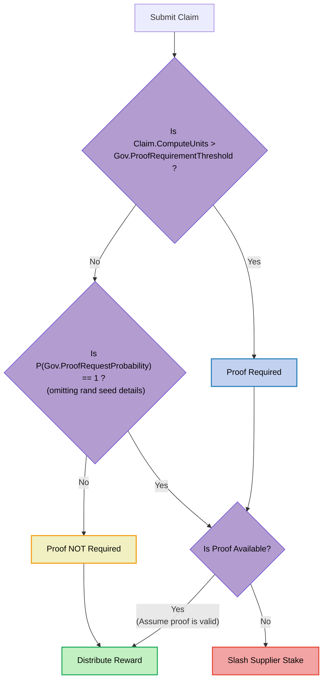

## Probabilistic Proofs <!-- omit in toc -->

:::warning

TODO_DOCUMENT(@Olshansk): This is just a placeholder. Use the [probabilistic proofs](https://github.com/pokt-network/pocket-core/blob/staging/docs/proposals/probabilistic_proofs.md) design
document as a reference for writing this.

:::

- [Introduction](#introduction)
  - [Problem Statement](#problem-statement)
  - [Example Scenario](#example-scenario)
- [Solution](#solution)

### Introduction

Probabilistic Proofs is a method to scale Pocket Network indefinitely.

#### Problem Statement

_tl;dr Too many on-chain proofs do not scale due to state bloat and excessive CPU usage._

The core limiting factor to Pocket Network's scalability is the number of necessary onchain proofs. For details on how proofs are generated and validated, see the [Claim & Proof lifecycle](./claim_and_proof_lifecycle.md) section.

In every session, for every `(Application, Supplier, Service)` tuple, there is a
single onchain Merkle proof to prove the claimed work done.

These proofs are large and costly to both store and verify. Too many proofs result in:

- **State Bloat**: Full Node disk space grows too quickly because blocks are large (i.e. full of transactions containing large proofs) increasing disk usage.
- **Verification cost**: Block producers (i.e. Validators) must verify all these proofs on every block increasing CPU usage.

:::note

There is a lot of research around this type of problem, but our team is not looking into zero-knowledge as a solution at the time of writing (2024).

:::

#### Example Scenario

Consider the hypothetical scenario below as an extremely rough approximation

Network state and parameters:

- Median Proof Size: `1,000` bytes
- Num services: `10,000`
- Num applications: `100,000`
- Num suppliers: `1,00,000`
- Num suppliers per session: `10`
- Session duration: `1` hour
- Num proofs per session: `1`

Conservative (simple) Scenario:

- Num active applications: `10,000`
- Num services used per application per session: `5`
- Num suppliers used per application per session: `10`
- 1 proof per (service, supplier) pair for each app
- Total time: `1` day (`24` sessions)

Total disk growth per day:

```bash
10,000 app * 1 proof/(service,supplier) 10 supplier/app * 5 services/session * 24 sessions * 1,000 bytes/proof = 12 GB
```

A very simple (conservative) scenario would result in `12GB` of disk growth per day, amount to more than `4TB` of disk growth in a year.

This discounts CPU usage needed to verify the proofs.

### Solution

_tl;dr Require a claim for every (App, Supplier, Service) tuple, but only require a proof for a subset of these claims and slash Suppliers that fail to provide a proof when needed._

The diagram below makes reference to some of the onchain [Governance Params](./../governance/params.md).



## Crypto-economic Analysis & Incentives

## Motivation from Morse
