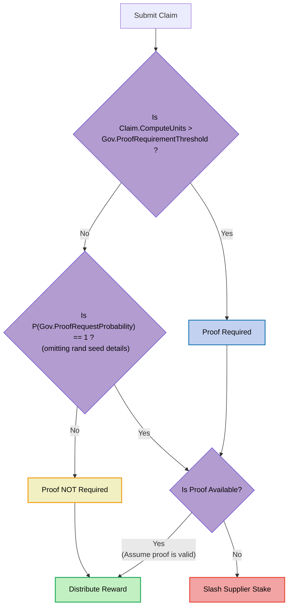

## Probabilistic Proofs <!-- omit in toc -->

:::warning

TODO_DOCUMENT(@Olshansk): This is just a placeholder. Use the [probabilistic proofs](https://github.com/pokt-network/pocket-core/blob/staging/docs/proposals/probabilistic_proofs.md) design
document as a reference for writing this.

:::

- [Introduction](#introduction)
  - [Problem Statement](#problem-statement)
  - [Example Scenario](#example-scenario)
- [Solution](#solution)

### Introduction

Probabilistic Proofs is a method to scale Pocket Network indefinitely.

#### Problem Statement

_tl;dr Too many on-chain proofs do not scale due to state bloat and excessive CPU usage._

The core limiting factor to Pocket Network's scalability is the number of necessary onchain proofs. For details on how proofs are generated and validated, see the [Claim & Proof lifecycle](./claim_and_proof_lifecycle.md) section.

In every session, for every `(Application, Supplier, Service)` tuple, there is a
single onchain Merkle proof to prove the claimed work done.

These proofs are large and costly to both store and verify. Too many proofs result in:

- **State Bloat**: Full Node disk space grows too quickly because blocks are large (i.e. full of transactions containing large proofs) increasing disk usage.
- **Verification cost**: Block producers (i.e. Validators) must verify all these proofs on every block increasing CPU usage.

:::note

There is a lot of research around this type of problem, but our team is not looking into zero-knowledge as a solution at the time of writing (2024).

:::

#### Example Scenario

Consider the hypothetical scenario below as an extremely rough approximation

Network state and parameters:

- Median Proof Size: `1,000` bytes
- Num services: `10,000`
- Num applications: `100,000`
- Num suppliers: `1,00,000`
- Num suppliers per session: `10`
- Session duration: `1` hour
- Num proofs per session: `1`

Conservative (simple) Scenario:

- Num active applications: `10,000`
- Num services used per application per session: `5`
- Num suppliers used per application per session: `10`
- 1 proof per (service, supplier) pair for each app
- Total time: `1` day (`24` sessions)

Total disk growth per day:

```bash
10,000 app * 1 proof/(service,supplier) 10 supplier/app * 5 services/session * 24 sessions * 1,000 bytes/proof = 12 GB
```

A very simple (conservative) scenario would result in `12GB` of disk growth per day, amount to more than `4TB` of disk growth in a year.

This discounts CPU usage needed to verify the proofs.

### Approach

_tl;dr Require a claim for every (App, Supplier, Service) tuple, but only require a proof for a subset of these claims and slash Suppliers that fail to provide a proof when needed._

The diagram below makes reference to some of the onchain [Governance Params](./../governance/params.md).



## Key Question

What values need to be selected to deter a Supplier from submitting a false claim? How can this be modelled?

## Guarantees & Expected Values

Pocket Network's tokenomics DO NOT provide a 100% guarantee against gaming the system.
This is similar to how Data Availability (DA) layers DO NOT provide a 100% guarantee
that the data is available.

Rather, there is a tradeoff of what the network's security guarantees are in exchange
for scalability, cost, user experience, and acceptable gamability.

Our goal is to model the expected value of an honest and dishonest supplier and
have levers in place to adjust an acceptable gaming risk.

A Supplier's balance can changed in the following ways:

1. Earn rewards for valid Claims w/ Proofs; proof required
2. Earn rewards for valid Claims w/o Proofs; proof not required
3. **Earn rewards for invalid Claims w/o Proofs; proof not required**
4. Slash stake for Claims w/ invalid Proofs; proof required
5. Slash stake for Claims w/ missing Proofs; proof required

The goal of Probabilistic Proofs is to define an acceptable risk for (3)
such that the expected value (i.e. balance) of the Supplier is lower even
if (1) and (2)

TODO: IMPROVE THIS.

## Modelling an Attack

### Defining a Trial - Bernoulli Trial - A False Claim that gets caught

A [Bernoulli probability distribution](https://en.wikipedia.org/wiki/Bernoulli_distribution)
is used as the foundation of modelling an attack.

Each (Claim, Proof) pair can be treated as an independent Bernoulli Trial.

If `Claim.ComputeUnits > Gov.ProofRequirementThreshold`, the model is _short-circuited_ and is therefore outside the sample space for this definition.

Defining Bernoulli Trial success & failure:

- **Success**: False/invalid/missing Claim that penalizes the Supplier. For example:
  - A false Claim that does not have an associated Proof
  - A false Claim that has an associated invalid Proof
  - A valid Claim that fails to submit a Proof on time
- **Failure**: All other outcomes. For example:
  - Supplier submits a false Claim and gets away with it
  - Supplier submits a true Claim and is required prove it
  - Supplier submits a true Claim and is not required prove it
  - Supplier submits a true Claim and fails to prove it

### Modelling k Claims that do not require a proof

Successive Proof - Geometric Probability Distribution Function

The foundation/DAO is responsible for selection a value `p` (ProofRequestProbability)
that represents

$$ p = ProofRequestProbability $$

$$ q = 1 - p $$

$$ Pr(X=k) = (1-p)^{k-1}p $$

$$ k = \frac{ln(\frac{Pr(X=k)}{p})}{ln(1-p)} + 1 $$

TODO: ADD GRAPH

TODO_FUTURE:

### Geometric CDF

$$ x ∈ ℝ ∣ 0 ≤ x < 1 $$

$$ p = ProofRequestProbability $$

$$ P(X<=k) = 1 - (1 - p)^{k} $$

$$ k = \frac{log(1 - P(X<=k))}{log(1 - p)} $$

TODO: ADD GRAPH

## Crypto-economic Analysis & Incentives

## Motivation from Morse
