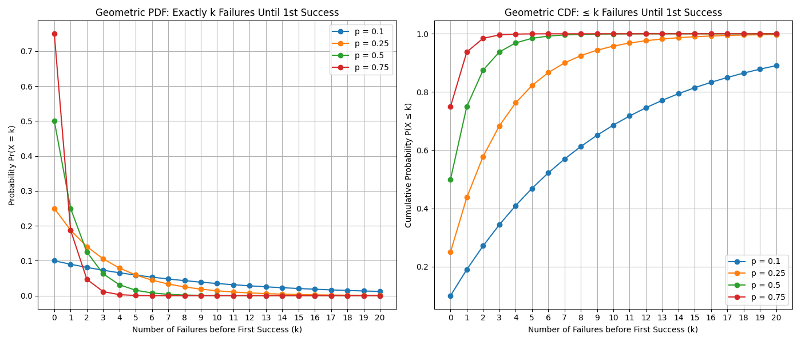

_tl;dr Probabilistic Proofs is a method to scale Pocket Network indefinitely._

## Abstract

This document explains and walks through the mechanism of Probabilistic Proofs needed
to scale Pocket Network indefinitely. Precisely, it'll allow an unlimited number of
sessions that pair (Applications, Suppliers, Services) by requiring a single Claim
for each such session, but only require a proof probabilistically if it is below a
specific threshold.

External stakeholders (i.e. DAO/Foundation) need to be involved in adjusting the
`ProofRequirementThreshold` by statistically analyzing onchain data, along with selecting
an appropriate `ProofRequestProbability` that balances scalability and security. In turn, these values
are used to derive on-chain reward and penalty amounts for honest and dishonest Suppliers, respectively.
The penalty amount is then used to derive `SupplierMinStake`.
Reasonably selected values can be chosen to easily scale the network by `100x` without compromising
security.

The results show that choosing a value of `20 POKT` for `ProofRequirementThreshold`,
the `95th percentile` of all Claims, along with a `ProofRequestProbability` of `0.01`,
can enable `100x` scalability of the network if the `Slashing penalty` for invalid/missing
proofs is set to `2,000 POKT`. As long as the minimum required stake for Suppliers exceeds
this value, staked collateral will be available for slashing, if needed.

In future work, we will look at a potential attack vector that still needs to be considered,
along with further research on the topic.

## Problem Statement

_tl;dr Too many on-chain Proofs do not scale due to state bloat and excessive CPU usage._

The core limiting factor to Pocket Network's scalability is the number of required on-chain Proofs.
For details on how Proofs are generated and validated, see the [Claim & Proof lifecycle](./Claim_and_Proof_lifecycle.md) section.

For every session (i.e. `(Application, Supplier, Service)` tuple), it is possible to construct a
Merkle Proof which proves the Claimed work done, which can be stored on-chain.

These Proofs are large and costly to both store and verify. Too many Proofs result in:

- **State Bloat**: Full Node disk space grows too quickly because blocks are large (i.e.,full of transactions containing large Proofs), increasing disk usage.
- **Verification Cost**: Block producers (i.e. Validators) MUST verify ALL Proofs (once), correlating average CPU usage with the average throughput of on-chain Proofs.

:::note

There is a lot of research around this type of problem, but our team is not actively
looking into `0`-knowledge as a solution at the time of writing (2024).

TODO_IN_THIS_PR: Reference the papers from justin taylor, Alin Tomescu, and axelar (avalanche?).

:::

## Example Scenario

Consider the hypothetical scenario below as an extremely rough approximation.

TODO_IN_THIS_PR: Turn this into a table.

Network parameters:

- **Session duration**: `1` hour
- **Number of suppliers per session (per app)**: `20`
- **Number of services per session (per app)**: `1`

Network state (conservative scenario):

- **Number of (active) services**: `10,000`
- **Number of (active) applications**: `100,000`
- **Number of (active) suppliers**: `100,000`

Assumptions for the purpose of an example:

- **Median Proof Size**: `1,000` bytes
- **Total time**: `1` day (`24` sessions)

Total disk growth per day:

```bash
10,000 apps * 1 Proof/(service,supplier) * 20 suppliers/app * 1 services/session * 24 sessions * 1,000 bytes/Proof = 4.8 GB ≈ 5 GB
```

**CRITICAL**: A very simple (conservative) scenario would result in `5 GB` of disk growth per day, amounting to almost `2 TB` of disk growth in a year.

This discounts CPU usage needed to verify the Proofs.

## High Level Approach

_tl;dr Require a Claim for every (App, Supplier, Service) tuple, but only require a Proof for a subset of these Claims and slash Suppliers that fail to provide a Proof when needed._

The diagram below makes reference to some of the on-chain [Governance Params](./../governance/params.md).


## Key Question

**What onchain protocol governance parameters need to be selected or created to**
**deter a Supplier from submitting a false Claim? How can this be modeled?**

## Guarantees & Expected Values

Pocket Network's tokenomics do not provide a 100% guarantee against gaming the system.
Instead, there's a tradeoff between the network's security guarantees and factors
like scalability, cost, user experience, and acceptable gamability.

Our goal is to:

- Model the expected value (EV) of both honest and dishonest Suppliers.
- Adjust protocol parameters to ensure that the expected profit for dishonest behavior is less than that of honest behavior.

A Supplier's balance can change in the following ways:

1. ✅ **Earn rewards for valid Claims with Proofs** (Proof required).
2. ✅ **Earn rewards for valid Claims without Proofs** (Proof not required).
3. 🚨 **Earn rewards for invalid Claims without Proofs** (Proof not required).
4. ❌ **Get slashed for invalid Proofs** (Proof required but invalid).
5. ❌ **Get slashed for missing Proofs** (Proof required but not provided).

The goal of Probabilistic Proofs is to minimize the profitability of scenario (3🚨)
by adjusting protocol parameters such that dishonest Suppliers have a negative expected
value compared to honest Suppliers.

## Modeling an Attack

### Defining a Single (Bernoulli) Trial

We use a [Bernoulli distribution](https://en.wikipedia.org/wiki/Bernoulli_distribution)
to model the probability of a dishonest Supplier getting caught when submitting false Claims.

- **Trial Definition**: Each attempt by a Supplier to submit a Claim without being required to provide a Proof.
- **Success**:
  - A dishonest Supplier gets caught (i.e. is required to provide a Proof and fails, resulting in a penalty)
  - Taken from the network's perspective
- **Failure**:
  - A dishonest Supplier does not get caught (i.e. is not required to provide a Proof and receives rewards without providing actual service)
  - An honest Supplier is rewarded
  - All other outcomes
  - Does not include _short-circuited_ (i.e. Claim.ComputeUnits > ProofRequirementThreshold)

### Conceptual Parameters: Onchain, Modeling, Governance, Etc

- **ProofRequestProbability (p)**: The probability that a Claim will require a Proof.
- **Penalty (S)**: The amount of stake slashed when a Supplier fails to provide a required Proof.
- **Reward per Claim (R)**: The reward received for a successful Claim without Proof.
- **Maximum Claims Before Penalty (k)**: The expected number of false Claims a Supplier can make before getting caught.

We note that `R` is variable and that `SupplierMinStake` is not taken into account in the definition of the problem.
As will be demonstrated by the end of this document:

- Reward per Claim (`R`) will be equal to the `ProofRequirementThreshold` (POKT)
- Penalty (`S`) will be less than or equal to the `SupplierMinStake` (in POKT)

### Dishonest Supplier: Calculating the Expected Value

The dishonest Supplier's strategy:

- Submit false Claims repeatedly, hoping not to be selected for Proof submission.
- Accept that eventually, they will be caught and penalized.

#### Modeling a Dishonest Supplier's Strategy using a Geometric PDF (Probability Distribution Function)

The number of successful false Claims before getting caught follows a [Geometric distribution](https://en.wikipedia.org/wiki/Geometric_distribution):

**Probability of Not Getting Caught (q)**:
$$ q = 1 - p $$

**Probability of Getting Caught on the `(k+1)`th Claim**:
$$ P(X = k+1) = q^k \cdot p $$

#### Expected Number of False Claims (Failures) Before Getting Caught (Success)

$$ E[K] = \frac{q}{p} $$

:::note
Recall:

- **Success**: The network **does** catch a dishonest Supplier
- **Failure**: The network **does not** catch a dishonest Supplier
:::

#### Modeling a Dishonest Supplier's Strategy using a Geometric CDF (Cumulative Distribution Function)

So far, we've considered the probability given by `Pr(X=k+1)`: the probability
of `k` "failures" (👆) until a single "success" (👆). This can be modeled using a Geometric PDF (Probability Distribution Function).

In practice, we need to track the likelihood of `k or less` "failures" `Pr(X<=k)`,
until a single "success". This can be modeled using a Geometric CDF.

TODO_IN_THIS_PR: Remove the paragraph below. From Bryan: `This paragraph confuses me a bit. The previous paragraph says that we need to use a CDF but then this paragraph seems to turn around and say that this actually don't? I feel like this and the above paragraph should be combined and rephrased a bit.`

To simplify the math, we'll be using the Expected Value of a Geometric PDF
due to its [simpler proof formulation](https://en.wikipedia.org/wiki/Geometric_distribution#Proof_of_expected_value), guaranteeing the results be **AT LEAST**
as secure when compared to the Geometric CDF.

Visual intuition of the two can be seen below:



:::tip

You can generate the graph above with `make geometric_pdf_vs_cdf.py`

:::

#### Total Rewards: Expected Value Calculation for Dishonest Supplier Before Penalty

$$ E[\text{Total Rewards}] = R \cdot E[K] = R \cdot \frac{q}{p} $$

This represents the Supplier's earnings before the penalty is applied.

If the Supplier chooses to leave the network at this point in time, it will
have successfully gamed the system.

#### Expected Penalty: Slashing amount for Dishonest Supplier

The penalty is a fixed amount `S` when caught.

#### Total Profit: Expected Value Calculation for Dishonest Supplier AFTER Penalty

$$ E[\text{Total Profit}] = E[\text{Total Rewards}] - S = R \cdot \frac{q}{p} - S $$

### Honest Supplier: Calculating the Expected Value

- **Expected Rewards per Claim**: $$ E[\text{Reward per Claim}] = R $$
- **No Penalties**: Since the honest Supplier always provides valid Proofs when required, they avoid penalties.
- **Expected Profit for Honest Supplier (1 Claim)**:

  $$ E[\text{Total Profit}] = R $$

### Setting Parameters to Deter Dishonest Behavior

To deter dishonest Suppliers, we need:

$$ E[\text{Total Profit}_{\text{Dishonest}}] \leq E[\text{Total Profit}_{\text{Honest}}] $$

Substituting the expected values:

$$ R \cdot \frac{q}{p} - S \leq R $$

Since `q = 1 -p`, we can simplify the inequality to:

$$ R \left( \frac{1 - 2p}{p} \right) \leq S $$

#### Solving for Penalty `S`

However, since `p` is between 0 and 1, `1 - 2p` can be negative if `p > 0.5`.
To ensure `S` is positive, we consider `p ≤ 0.5`.

Alternatively, to make the penalty effective, we can set:

$$ S = R \cdot \left( \frac{1 - p}{p} \right) $$

This ensures that the expected profit for dishonest Suppliers is `0` or negative:

$$ E[\text{Total Profit}_{\text{Dishonest}}] = R \cdot \frac{q}{p} - S = R \cdot \frac{q}{p} - R \cdot \frac{q}{p} = 0 $$

### Example Calculation

Assume:

- Reward Per Claim: `R = 10`
- ProofRequestProbability: `p = 0.2`
- Probability No Proof Requested: `q = 0.8`

Calculate the expected profit for a dishonest Supplier:

1. **Expected Number of False Claims Before Getting Caught**:

   $$ E[K] = \frac{q}{p} = \frac{0.8}{0.2} = 4 $$

2. **Expected Total Rewards**:

   $$ E[\text{Total Rewards}] = R \cdot E[K] = 10 \cdot 4 = 40 $$

3. **Penalty**:

   $$ S = R \cdot \left( \frac{1 - p}{p} \right) = 10 \cdot \left( \frac{0.8}{0.2} \right) = 40 $$

4. **Expected Profit**:

   $$ E[\text{Total Profit}] = E[\text{Total Rewards}] - S = 40 - 40 = 0 $$

The dishonest Supplier has an expected profit of `0`, making dishonest behavior unattractive compared to honest behavior, which yields a profit of `R = 10` units per Claim without risk of penalty.

### Generalizing the Penalty Formula

To ensure that dishonest Suppliers have no incentive to cheat, set the penalty `S` such that:

$$ S = R \cdot \frac{q}{p} = R \cdot \left( \frac{1 - p}{p} \right) $$

This makes the expected profit for dishonest behavior `0`:

$$ E[\text{Total Profit}_{\text{Dishonest}}] = R \cdot \frac{q}{p} - S = 0 $$

### Considering false Claim Variance

While the expected profit is `0`, the variance in the number of successful false
Claims can make dishonest behavior risky. The Supplier might get caught earlier than expected,
leading to a net loss.

TODO_IN_THIS_PR: Incorporate this from Ramiro: `Variance works both ways, hence my previous comment. This can be a justification for changing the calculation of S as I suggest. This is because the attacker might not be caught until much later and result in a net profit.`

## Crypto-economic Analysis & Incentives

### Impact on Honest Suppliers

Honest Suppliers are not affected by penalties since they always provide valid Proofs when required.
Their expected profit remains:

$$ E[\text{Total Profit}_{\text{Honest}}] = R $$

### Impact on Dishonest Suppliers

Dishonest Suppliers face:

- A high penalty (`S`) that wipes out their expected gains.
- The risk of getting caught earlier than expected, resulting in a net loss.
- Increased uncertainty due to the probabilistic nature of Proof requests.

### Analogs between Model Parameters and onchain Governance Values

### Parameter Analog for Penalty (`S`)

_tl;dr `S` = `Supplier.MinStake`_

The penalty `S` is some amount that the protocol should be able to retrieve from the Supplier.

In practice, this is the `Supplier.MinStake` parameter, which is the amount a Supplier
always has in escrow. This amount can be slashed and/or taken from the Supplier for misbehavior.

### Parameter Analog for Reward (`R`)

_tl;dr `R` = `ProofRequirementThreshold`_

In practice, the reward for each onchain Claim is variable and a function of the amount
of work done.

For the purposes of Probabilistic Proofs, we assume a constant reward of `R` per Claim
because any reward greater than `ProofRequirementThreshold` requires a proof and
short-circuits this entire document.

Therefore, `R` can be assumed constant when determining the optimal `p` and `S`.

### Considerations during Parameter Adjustment

By tweaking `p` and `S`, the network can:

- Increase the deterrent against dishonest behavior.
- Balance the overhead of Proof verification with security needs.

**Considerations:**

- **Lower `p`** reduces the number of Proofs required --> improves scalability --> requires higher penalties.
- **Higher `S`** increases the risk for dishonest Suppliers --> lead to social adversity from network participants.

TODO_IN_THIS_PR: Explain how `How does a high slashing penalty increase the risk of dishonest suppliers?`

#### Selecting Optimal `p` and `S`

To select appropriate values:

1. **Determine Acceptable Proof Overhead (`p`)**:

   - Choose `p` based on the desired scalability.
   - Example: `p = 0.1` for 10% Proof submissions

2. **Calculate Required Penalty (`S`)**:

   - Ensure `S` is practical and enforceable.
   - Use the formula:
     $$ S = R \cdot \left( \frac{1 - p}{p} \right) $$

3. **Assess Economic Impact**:

   - Simulate scenarios to verify that dishonest Suppliers have a negative expected profit.
   - Ensure honest Suppliers remain profitable.

To illustrate the relationship between `p`, `S`, see the following chart:


:::tip

You can generate the graph above with `penalty_vs_proof_request_prob.py`

:::

#### Considerations for `ProofRequirementThreshold`

- **Threshold Value**: Set the `ProofRequirementThreshold` low enough that most Claims are subject to probabilistic Proof requests, but high enough to prevent excessive Proof submissions.
- **Short-Circuiting**: Claims above the threshold always require Proofs, eliminating the risk of large false Claims slipping through.

##### Modeling `ProofRequirementThreshold`

`ProofRequirementThreshold` should be as small as possible so that most such that
most Claims for into the probabilistic bucket, while also balancing out penalties
that may be too large for faulty honest Suppliers.

##### Normal Distribution

Assume Claim rewards are normally distributed with a mean `μ` and standard deviation `σ`.

Ideally, we would choose `2σ` above the Claim `μ` such that `97.3%` fall of all Claims require a Proof.

##### Non-Normal Distribution

In practice, rewards are not normally distributed, so we can choose an arbitrary value (e.g. `p95`)
such that 95% of Claims fall into the category of requiring a proof.

#### Considerations for `ProofRequestProbability` (`p`)

:::note

See [Pocket_Network_Morse_Probabilistic_Proofs.ipynb](./Pocket_Network_Morse_Probabilistic_Proofs.ipynb) for more details from Morse backing the fact that the majority of the block space is taken up by Proofs.

:::

Accept the fact that the majority of the block space is taken up by Proofs.

The number of on-chain relays (proofs) required by the network scales inversely to `ProofRequestProbability`. For example:

- `ProofRequestProbability` = 0.5 -> 2x scale
- `ProofRequestProbability` = 0.25 -> 4x scale
- `ProofRequestProbability` = 0.1 -> 10x scale
- `ProofRequestProbability` = 0.01 -> 100x scale
- `ProofRequestProbability` = 0.001 -> 1000x scale

##### Maximizing `Pr(X<=k)` to ensure `k or less` failures (Supplier escapes without penalty)

When selecting a value for `p`, our goal is not to maximize `Pr(X=k)`, but rather
maximize `Pr(X<=k)` to ensure `k or less` failures (Supplier escapes without penalty).

This does not affect the expected reward calculations above, but gives a different
perspective of what the probabilities of success and failure are.

## Conclusions for Modeling

By modeling the attack using a geometric distributions and calculating expected values, we can:

- Determine `R = ProofRequirementThreshold` using statical onchain data.
- Manually adjust `p = ProofRequestProbability` to adjust scalability.
- Compute `S ≤ SupplierMinStake` to deter dishonest behavior.
- Determine the necessary penalty `S` to deter dishonest behavior.
- Ensure that honest Suppliers remain profitable while dishonest Suppliers face negative expected profits.

This approach allows the network to scale by reducing the number of on-chain Proofs while maintaining economic (dis)incentives that deter dishonest behavior.

## Morse Based Value Selection

As of writing (October 2024), Shannon MainNet is not live; therefore, data from Morse must be used to approximate realistic values.

### Selecting `ProofRequirementThreshold`

Choose `R = 20` since it is greater than `p95` of all Claims collected in Morse. 

:::info
Units are in `POKT`.
:::

See the original proposal from Morse available in [probabilistic_proofs_morse.md](./probabilistic_proofs_morse.md)
and [Pocket_Network_Morse_Probabilistic_Proofs.ipynb](./Pocket_Network_Morse_Probabilistic_Proofs.ipynb) for supporting data.

$$ R = 20 $$

### Calculating `p`: `ProofRequestProbability`

Choose `p = 0.01` to ensure high scalability.

$$ E[K] = \frac{q}{p} = \frac{0.99}{0.01} = 99 $$

### Calculating `S`: `ProofMissingPenalty`

$$ S = R \cdot E[K] = 20 \cdot 99 = 1980 ≈ 2,000 $$

## Future Work

1. **Attack Vector**: Account for the fact that a Supplier could be in multiple sessions at the same, so either:

   - The number of sessions a supplier is in will need to be limited
   - The minimum stake amount will need to be significantly higher than the penalty to enable slashing across multiple sessions at once
   - It could be a multiple of its provided services count.

2. **Optimal Reward Value**: Evaluating onchain Shannon data to determine the optimal value for `R`
3. **Closed Feedback Loop**: Having `p` dynamically adjust onchain as a function of onchain data without intervention from the DAO / PNF.
4. Reviewing, comparing & contributing to **external literature** such as:

   - https://research.facebook.com/publications/distributed-auditing-proofs-of-liabilities/
   - https://eprint.iacr.org/2020/1568.pdf
