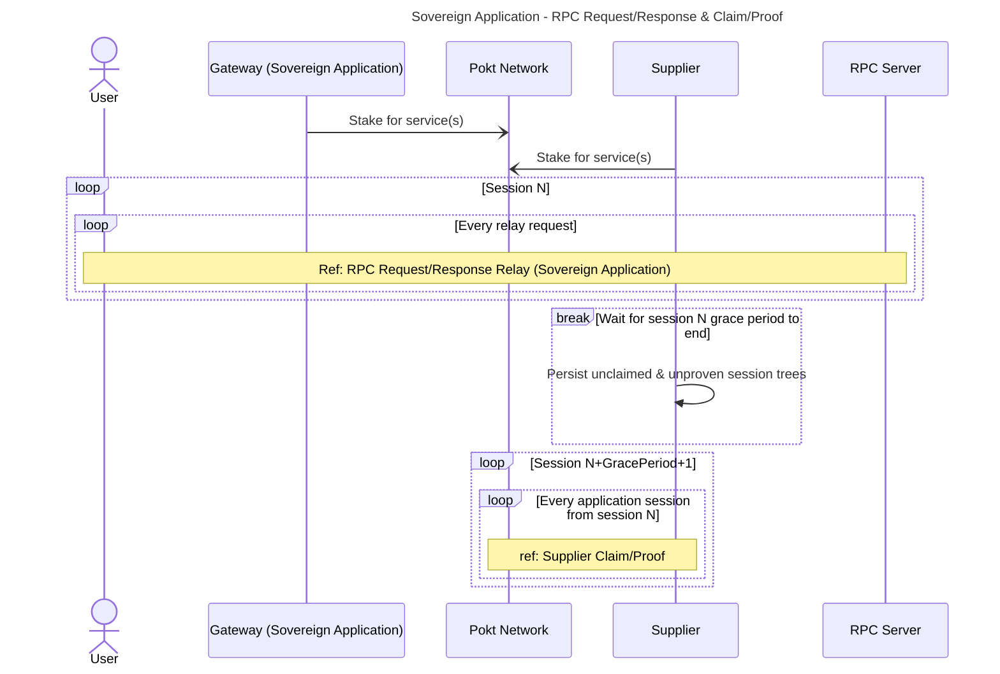
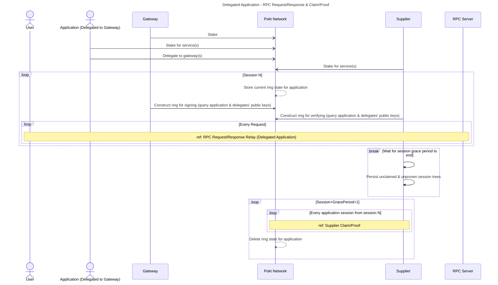
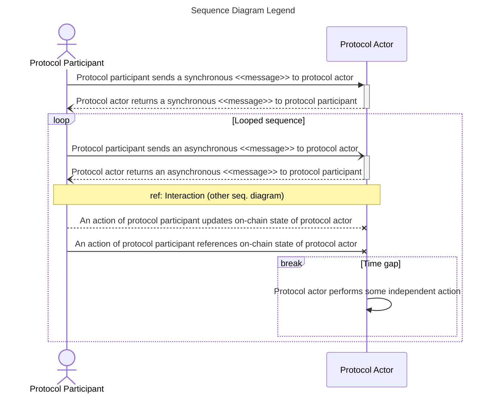

# Relay Mining <!-- omit in toc -->

:::warning

TODO_DOCUMENT(@Olshansk): This is just a placeholder. Use the [relay mining presentation](https://docs.google.com/presentation/d/1xlCGzS_oHXJOzvcu-jHZUfmhD3qeVCzc6SUSJijTuJ4/edit#slide=id.p) and
the [relay mining paper](https://arxiv.org/abs/2305.10672) as a reference for writing this.

:::

- [Introduction](#introduction)

## Introduction

tl;dr Modulate on-chain difficulty up (similar to Bitcoin) so we can accommodate
surges in relays and have no upper limit on the number of relays per session.

Relay Mining is the only solution in Web3 to incentivize read-only requests
and solve for the problem of high volume: `how can we scale to billions or trillions
of relays per session`.

This complements the design of [Probabilistic Proofs](./probabilistic_proofs.md)
to solve for all scenarios.

## Relay Sessions

[Sessions](./session) effectively group relays into time-wise batches. During each session,
`Application`s and/or `Gateway`s can submit relays to one or more of the `Supplier`s
in the current session for servicing.

### Sovereign Application

An `Application` can act as a "soverign application" (i.e. its own `Gateway`).
In this case, the ring used to sign relay requests is constructed only from
the `Application`'s public key.

> **See**: [Legend > Sequence Diagram](#sequence-diagram)

### Delegated Application

An `Application` can also be delegated to one or more `Gateway`s. In this case
the ring used to sign relay requests is constructed from the `Application`'s
public key and the public keys of the all `Gateway`s it is delegated to at the
start of the session in question.

> **See**: [Legend > Sequence Diagram](#sequence-diagram)

## Legend

### Sequence Diagram

## Reference Diagrams

### RPC Request/Response Relay (Sovereign Application)

### RPC Request/Response Relay (Delegated Application)

### 
