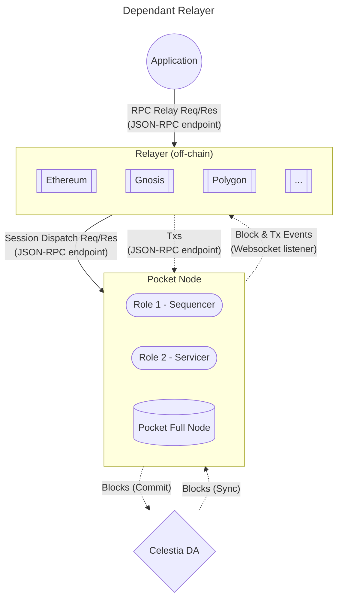
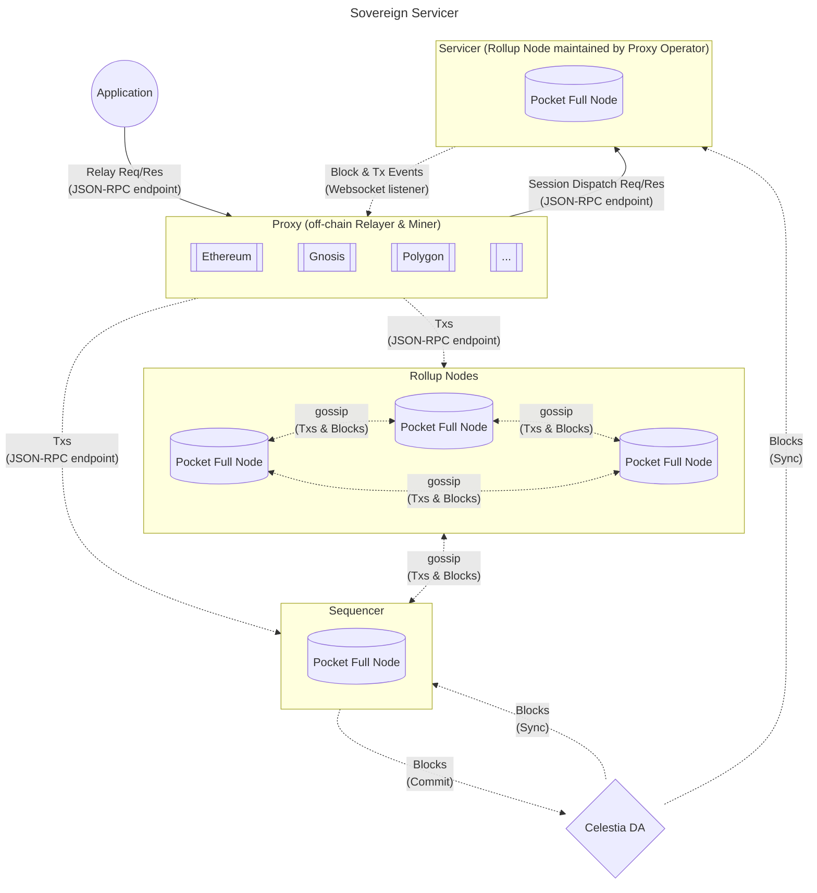

# Pocket Nodes in the Celestia Network <!-- omit in toc -->

:::danger
TODO(@Olshansk): This file was copied over from the `poktroll-alpha` repo and has
not been updated to reflect recent changse & learnings.
:::

- [Dependant Node](#dependant-node)
- [Sovereign Node](#sovereign-node)

This document aims to show a high level diagram of the nodes participating in the Pocket Rollkit Celestia network.

It includes the flow of Requests, Data, Transactions, and Blocks.

## Dependant Node

The diagram below shows the absolute base case where there is:

1. 1 Pocket Rollup Node
2. The Rollup Node is also the Centralized Sequencer
3. The Centralized Sequencer is also the Proxy's (i.e. Relayer/Miner) source of data and events

A Dependant Relayer is one that:

- Sends Txs to the sequencer (or another rollup that gossips with the sequencer)
  - specified via `--sequencer-node`
- Trusts another node (i.e. spefieid via `--pocket-node`) to:
  - read on-chain data
  - listen for on-chain events

## Sovereign Node

The diagram below shows the Celestia DA, Rollup Nodes in the network, the sequencer as well as a Sovereign Relayer that maintains its own Pocket Rollup Node.

A Sovereign Relayer is one that:

- Sends Txs to the sequencer (or its own rollup node that gossips with the sequencer)
  - specified via `--sequencer-node`
- Runs it's own Pocket Full Node (specified via `--pocket-node`) to:
  - read on-chain data
  - listen for on-chain events

