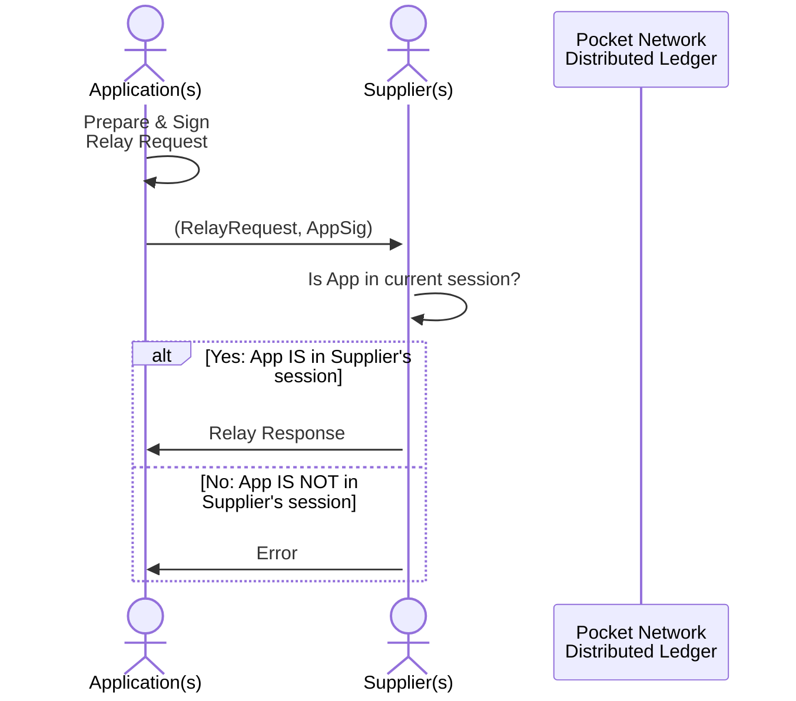

:::warning

TODO(@Olshansk): This is just a placeholder

:::

- [Pre-Requisites](#pre-requisites)
- [Session Duration](#session-duration)
- [Free Work](#free-work)

## Pre-Requisites

There are a number of pre-requisites for the session to be created and for the flow
to function.

1. `Application` must be staked for a specific `Service`
2. `Supplier` must be staked for a specific `Service`
3. `Session` must match `Application` to `Supplier` for the duration of this
   session using on-chain entropy as a pseudorandom seed.

## Session Duration

## Free Work

It is i