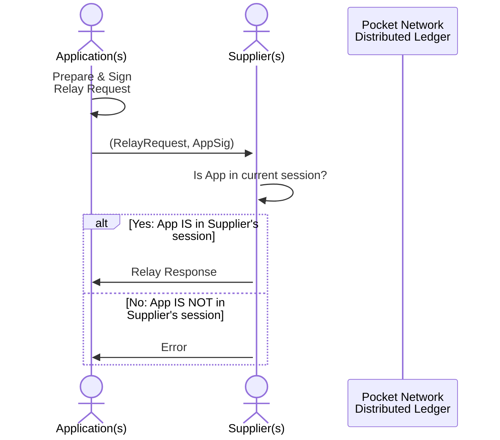
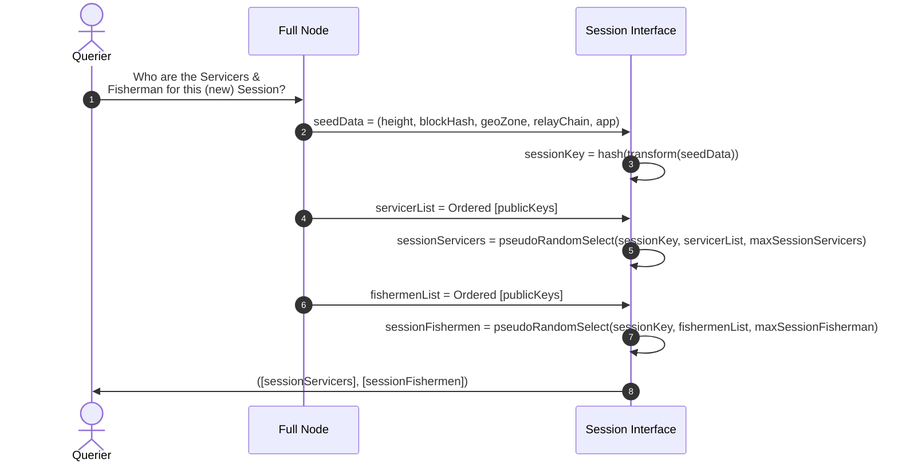
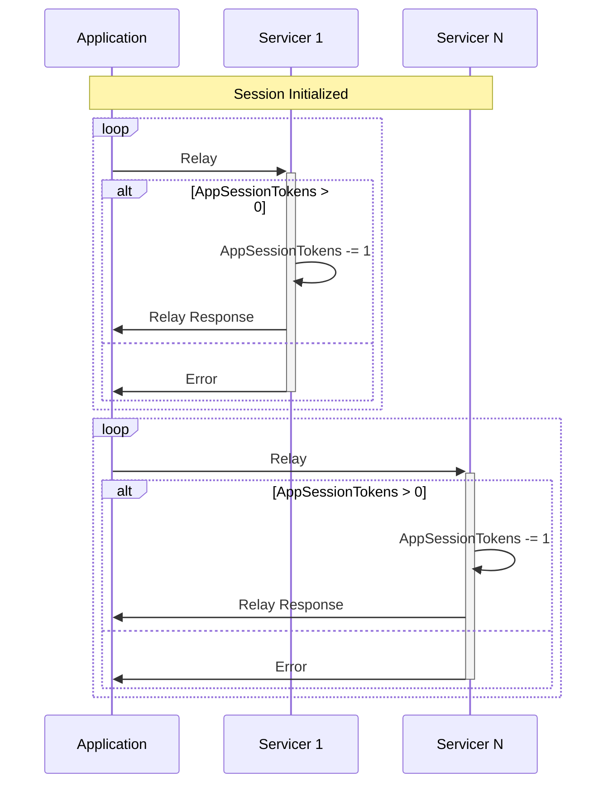

:::warning

TODO(@Olshansk): This is just a placeholder

:::

- [Pre-Requisites](#pre-requisites)
- [Session Duration](#session-duration)
- [Free Work](#free-work)
  - [3.1 Session Protocol](#31-session-protocol)
    - [3.1.1 Actor Selection (Dispatch)](#311-actor-selection-dispatch)
    - [3.1.2 RelayChain](#312-relaychain)
    - [3.1.3 GeoZone](#313-geozone)
    - [3.1.4 Actor Substitution](#314-actor-substitution)
    - [3.1.5 Rate Limiting](#315-rate-limiting)
    - [3.1.6 Interface](#316-interface)

## Pre-Requisites

There are a number of pre-requisites for the session to be created and for the flow
to function.

1. `Application` must be staked for a specific `Service`
2. `Supplier` must be staked for a specific `Service`
3. `Session` must match `Application` to `Supplier` for the duration of this
   session using on-chain entropy as a pseudorandom seed.

## Session Duration



## Free Work

### 3.1 Session Protocol

A `Session` is a time-based mechanism used to regulate the various interactions (Web3 access, monitoring, etc) between protocol actors to enable the Utilitarian economy in a fair and secure manner. A single session may extend multiple Blocks as determined by `SessionBlockFrequency`.

#### 3.1.1 Actor Selection (Dispatch)

Under the Random Oracle Model, a Session can be seeded to deterministically select which group of actors will interact for some duration of time. This enables a random, deterministic and uniform distribution of Web3 access, provisioning and monitoring. It limits what work, and by whom, can be rewarded or penalized at the protocol layer.

The seed data for a session is an implementation detail that could be composed of multiple variables. It includes, but is not limited to, attributes such as `LatestBlockHash`, `Timestamp`, etc...

To start a new session, or retrieve the metadata for an existing / prior session, the Querier (e.g. Application, Client) can execute a request to any synched Full Node (protocol actor or not).



For illustrative purposes, an example implementation of `NewSession` could be:

```go
func NewSession(sessionHeight, lastBlockHash, geoZone, relayChain, appPubKey) Session {
  key = hash(concat(sessionHeight, lastBlockHash, geoZone, relayChain, appPubKey))
  servicers = getClosestServicers(key, geoZone, numServicers)
  fishermen = getClosestFishermen(key, geoZone, numFishermen)
  return Session{sessionHeight, geoZone, relayChain, appPubKey, servicers, fishermen}
}
```

Note that a `timestamp` is explicitly not used to generate a new session because the process of generating a session (i.e. matching an application to servicers in some geozone at some height), must be a deterministic process executable by full nodes, light nodes and actors alike.

#### 3.1.2 RelayChain

A `RelayChain` is an identifier of the specified Web3 data source (i.e. a blockchain) being interacted with for that session.

For example, `0021` represents `Ethereum Mainnet` in Pocket Network V0.

#### 3.1.3 GeoZone

A `GeoZone` is a representation of a physical geo-location the actors advertise they are in.

For example, `GeoZone 0001` could represent `US East`, but alternative coordinate systems such as [Uber's H3](https://h3geo.org) or [PostGIS](https://postgis.net/) could be used as well.

There is no formal requirement or validation (e.g. IP verification) for an actor to be physically located in the GeoZone it registers in. However, crypto-economic incentives drive actors to be registered close to where they are physically located to receive and provide the best service possible.

The number of GeoZones an actor can stake for is limited to one to incentivize real geographic distribution. To quote @deblasis: "If an actor is everywhere, they're nowhere."

#### 3.1.4 Actor Substitution

Since a single Session extends multiple blocks, an actor could potentially send an on-chain transaction to exit (e.g. Unstake, Pause) prematurely. Any rewards for that Session for that actor are invalidated, and penalties may be applied. A replacement actor (e.g. a Servicer) will be found and dynamically added to the session in the closest following block.

#### 3.1.5 Rate Limiting

Rate limiting limits the amount of work (i.e. Web3 access) a Servicer can provide to an Application throughout the duration of a Session.

During each Session, the amount of POKT an Application has staked (see [Application Protocol](#34-application-protocol) for more details) is mapped to "Service Tokens" that represent the amount of work a Servicer can provide using the `SessionTokenBucketCoefficient` governance parameter. The [Token Bucket](https://en.wikipedia.org/wiki/Token_bucket) rate limiting algorithm is used to determine the maximum number of requests a Servicer can relay, and be rewarded for, thereby disincentivizing it to process relays for the Application once the cap is reached.

At the beginning of the session, each Servicer initializes: `AppSessionTokens = (AppStakeAmount * SessionTokenBucketCoefficient) / NumServicersPerSession`. When one of the Servicers in the session is out of session tokens, the Application can continue to use other Servicers until every they are all exhausted.



The mechanism described above enables future iterations of the protocol where different types of request may vary the required number of `AppSessionTokens` per request.

#### 3.1.6 Interface

An illustrative example of the Session interface can be summarized as follows:

```go
type Session interface {
  NewSession(seeds ...interface{}) Session

  GetApplication() Application # The Application consuming Web3 access
  GetRelayChain() RelayChain   # The Web3 chain identifier being accessed this session
  GetGeoZone() GeoZone         # The physical geo-location where all the actors are registered
  GetSessionHeight() uint64    # The block height when the session started
  GetServicers() []Servicer    # The Servicers providing Web3 access
  GetFishermen() []Fisherman   # The Fisherman monitoring Web3 service
}
```
