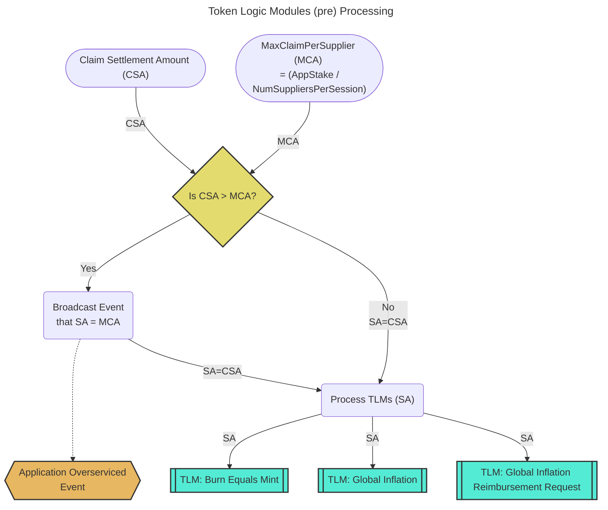
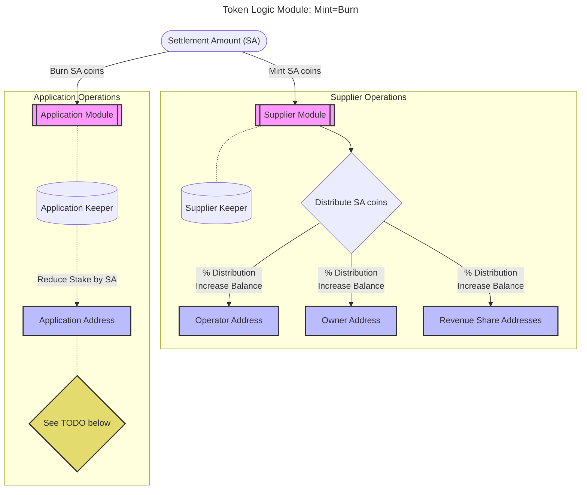
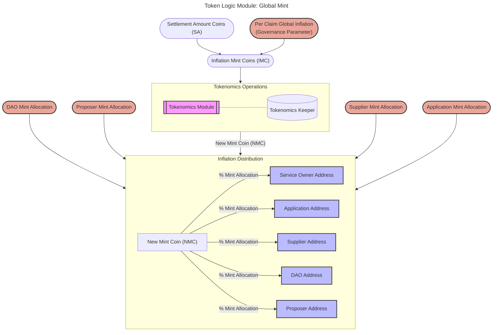
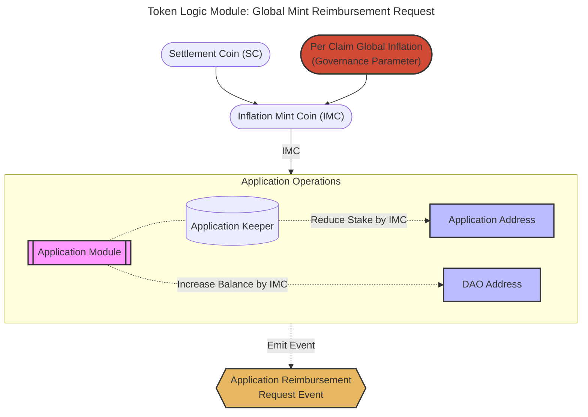

# Token Logic Modules <!-- omit in toc -->

- [Introduction](#introduction)
- [Background: Max Claimable Amount](#background-max-claimable-amount)
- [TLM (pre) Processing](#tlm-pre-processing)
- [TLM: Mint=Burn (MEB)](#tlm-mintburn-meb)
- [TLM: Global Mint (GM)](#tlm-global-mint-gm)
- [TLM: Global Mint Reimbursement Request (GMRR)](#tlm-global-mint-reimbursement-request-gmrr)

## Introduction

:::warning

Note that this is an active WIP and the [resources here](./resources.md) are the best starting references to learn more.

In particular:

- This is better than what exists in production today
- This should be seen as an interim solution to avoid further delays
- Implicit QoS is the best solution, but adds a lot of complexity alongside the existing upgrade

:::

Token Logic Module (TLM) processing consists of the following sequential steps:

1. `TLM pre-processing` - General pre-processing to determine the number of tokens to settle per claim.
2. `TLM processing` - Iterating through each TLM, sequentially.

## Background: Max Claimable Amount

_tl;dr Max Claimable Amount ∝ (Application Stake / Number of Suppliers per Session)_

Per **Algorithm 1** of the [Relay Mining paper](https://arxiv.org/pdf/2305.10672),
the maximum amount a supplier can claim from an application in a single session is
proportional to the Application's stake divided by the number of suppliers in the session.

This is referred to as "Relay Mining Payable Relay Accumulation" in the paper and
is described by the following pseudo-code:

## TLM (pre) Processing

_tl;dr Determine if the claim settlement amount is greater than the maximum claimable amount prior to running each individual TLM._

**Prior to** processing each individual TLM, we need to understand if the amount claimed
by the supplier adheres to the optimistic maxima set per the limits of the Relay Mining algorithm.

Suppliers always have the option to over-service an application (**i.e. do free work**),
in order to ensure high quality service in the network. This may lead to offchain
reputation benefits (e.g. Gateways favoring them), but suppliers' on-chain rewards
are always limited by the cumulative amounts applications' stakes (at session start; per service)
and the number of suppliers in the session.

:::note

TODO_POST_MAINNET: After the Shannon upgrade, the team at Grove has a lot of ideas
related to on-chain reputation, [supplier overlay networks](https://www.notion.so/buildwithgrove/Off-chain-Application-Stake-Tracking-6a8bebb107db4f7f9dc62cbe7ba555f7?pvs=4), and
much more, all of which is out of scope for the initial implementation.

:::

## TLM: Mint=Burn (MEB)

_tl;dr The transfer of tokens from the applications to the suppliers based on the amount of work received and provided respectively._

The `Mint=Burn` TLM is, _theoretically_, the only TLM necessary once the network
reaches maturity in the far future.

The same number of tokens minted to the **supplier module** is burned from
the **application module**. The stake (in escrow) owned by the application which is
paying for work is reduced and the rewards are distributed to the supplier and its
revenue shareholder addresses.

:::note

TODO_MAINNET: If the application stake has dropped to (near?) zero, should
we unstake it? Should we use it's balance? Should their be a payee of last resort?
Make sure to document whatever decision we come to.

:::

## TLM: Global Mint (GM)

_tl;dr Distributed newly minted coins on a per claim basis to all involved stakeholders._

The `Global Mint` TLM is, _theoretically_, going to reach `zero`the only when the network
reaches maturity in the far future.

On a per claim basis, the network mints new tokens based on the the amount of work
claimed. The newly minted tokens are distributed to the supplier, DAO, service owner
and application based on the values of various governance params.

## TLM: Global Mint Reimbursement Request (GMRR)

_tl;dr Prevent self-dealing by over-charging applications, sending the excess to the DAO/PNF, and emitting an event as a reimbursement request._

This TLM is a dependency of the Global Mint TLM; i.e., it **MUST** be active if Global Mint is active.

This TLM can, **theoretically**, be removed if self-dealing attacks are not a concern,
or if the global mint per claim governance parameter is set to zero.

The goal of the TLM is to overcharge applications equal to the global inflation amount
and send those funds to the DAO/PNF. This forces potentially self-dealing gateways to
"show face" in front of the DAO/PNF and request reimbursement.

The event emitted creates an easy, onchain mechanism, to track reimbursement handled offchain.

A side effect of this TLM is creating additional buy pressure of the token as Applications
and Gateways will be responsible for frequently "topping up" their balances and app stakes.

