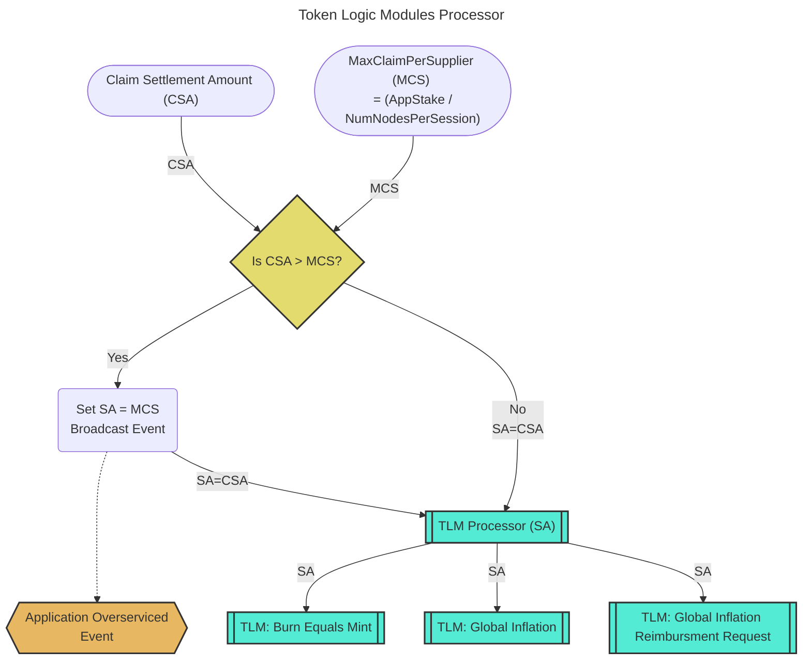
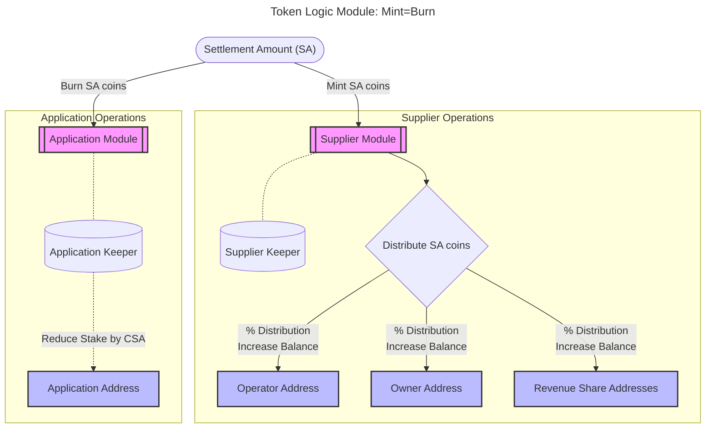

# Token Logic Modules <!-- omit in toc -->

- [Introduction](#introduction)
- [Background: Relay Mining Payable Relay Accumulation](#background-relay-mining-payable-relay-accumulation)
- [TLM Pre-processor: Claim Settlement Limit](#tlm-pre-processor-claim-settlement-limit)
- [TLM: Mint=Burn (MEB)](#tlm-mintburn-meb)
- [TLM: Global Mint (GM)](#tlm-global-mint-gm)
- [TLM: Global Mint Reimbursement Request (GMRR)](#tlm-global-mint-reimbursement-request-gmrr)

## Introduction

:::warning

Note that this is an active WIP and the [resources here](./resources.md) are the best starting references to learn more.

:::

Token Logic Modules (TLMs) processing involves:

1. `TLM pre-processing` - A general pre-processor determining the amount of coins to settle per claim
2. `TLM processing` - Individual processing each TLM independent of the other

## Background: Relay Mining Payable Relay Accumulation

Per **Algorithm 1** of the [Relay Mining paper](https://arxiv.org/pdf/2305.10672),
the maximum amount a supplier can claim from an application in a single session is
proportional to the Application's stake divided by the number of nodes in the session
as see in the following image:

## TLM Pre-processor: Claim Settlement Limit

**Prior to** processing each individual TLM, we need to understand if the amount claimed
by the supplier adheres to the maximum allowed per the limits set by Relay Mining.

Suppliers always have the option to over-service an application (**i.e. do free work**),
in exchange for providing a good service to the network, but their on-chain rewards
are still limited as a function of the application's stake before the session started
and the number of nodes in the session.

:::note

TODO_POST_MAINNET: After the Shannon upgrade, the team at Grove has a lot of ideas
related to [supplier gossipin](https://www.notion.so/buildwithgrove/Off-chain-Application-Stake-Tracking-6a8bebb107db4f7f9dc62cbe7ba555f7?pvs=4) but that
is out of scope for the initial implementation.

:::

## TLM: Mint=Burn (MEB)

The `Mint=Burn` TLM is, _theoretically_, the only TLM necessary when the network
reaches equilibrium in the far future.

Put simply, it is a transfer of tokens from the application to the supplier based on the
amount of work done by the supplier.

The same amount of tokens that is minted in the supplier module is burned from the application module.
The stake of the application paying for work is reduced and the rewards are distributed to the supplier
and its revenue shareholder addresses.

## TLM: Global Mint (GM)

TLMGlobalMint is the token logic module that mints new tokens based on the
on global governance parameters in order to reward the participants providing
services while keeping inflation in check.

## TLM: Global Mint Reimbursement Request (GMRR)

TLMGlobalMintReimbursementRequest is the token logic module that complements
TLMGlobalMint to enable permissionless demand. In order to prevent self-dealing
attacks, applications will be overcharged by the amount equal to global inflation,
those funds will be sent to the DAO/PNF, and event will be emitted to be used
for reimbursements.
