# Token Logic Modules <!-- omit in toc -->

- [Introduction](#introduction)
- [Background: Max Claimable Amount](#background-max-claimable-amount)
- [TLM (pre) Processing](#tlm-pre-processing)
- [TLM: Mint=Burn (MEB)](#tlm-mintburn-meb)
- [TLM: Global Mint (GM)](#tlm-global-mint-gm)
- [TLM: Global Mint Reimbursement Request (GMRR)](#tlm-global-mint-reimbursement-request-gmrr)
  - [Self Dealing Attack](#self-dealing-attack)
  - [Reimbursement Request Philosophy](#reimbursement-request-philosophy)
  - [Reimbursement Request Design](#reimbursement-request-design)
  - [FAQ](#faq)

## Introduction

:::warning

This is an active WIP and the [resources here](./resources.md) are the best starting references to learn more.

In particular:

- This is better than what exists in production (Morse) today in enabling permissionless demand
- This should be seen as an interim solution to avoid delaying the Shannon upgrade
- The goal is to iterate and experiment with tokenomics post upgrade

:::

Token Logic Module (TLM) processing consists of the following sequential steps:

1. `TLM pre-processing` - General pre-processing to determine the number of tokens to settle per claim.
2. `TLM processing` - Iterating through each TLM, sequentially, independently of each other.

## Background: Max Claimable Amount

_tl;dr Max Claimable Amount ∝ (Application Stake / Number of Suppliers per Session)_

Per **Algorithm 1** of the [Relay Mining paper](https://arxiv.org/pdf/2305.10672),
the maximum amount a supplier can claim from an application in a single session
MUST NOT exceed the Application's stake divided by the number of suppliers in the session.

This is referred to as "Relay Mining Payable Relay Accumulation" in the paper and
is described by the following pseudo-code:

:::tip

See the [relay mining docs](../primitives/relay_mining.md) or the [annotated presentation](https://olshansky.substack.com/p/annotated-presentation-relay-mining) for more information.

:::

## TLM (pre) Processing

_tl;dr Determine if the claim amount is greater than the maximum claimable amount prior to running each individual TLM._

**Prior to** processing each individual TLM, we need to understand if the amount claimed
by the supplier adheres to the optimistic maxIA set per the limits of the Relay Mining algorithm.

:::info

Pocket Network can be seen as a probabilistic, optimistic permissionless multi-tenant rate limiter.

This works by putting funds in escrow, burning it after work is done, and putting optimistic limits
in place whose work volume is proven onchain.

:::

Suppliers always have the option to over-service an Application (**i.e. do free work**),
in order to ensure high quality service in the network. This may lead to offchain
reputation benefits (e.g. Gateways favoring them), but suppliers' onchain rewards
are always limited by the cumulative amounts Applications' stakes (at session start; per service)
and the number of Suppliers in the session.

:::warning

In order for the `MaxClaimableAmount` to prevent Applications from over-servicing,
the `Application.Stake` must be claimable only by `Supplier`s from the same session
(i.e. the same service).

For a given application `MaxClaimableAmount` is `Application.Stake / NumSuppliersPerSession`
and defined per session/service.

If an `Application` is able send traffic to `n` services then it could be over-servicing
up to `n` times its stake for a given session number by performing
`MaxClaimableAmount * NumSuppliersPerSession * n > Application.Stake` worth of work.

To avoid thy type of over-servicing, The Pocket protocol requires `Application`s
to only be able to stake for EXACTLY ONE service.

:::

:::note

TODO_POST_MAINNET: After the Shannon upgrade, the team at Grove has a lot of ideas
related to onchain reputation, [supplier overlay networks](https://www.notion.so/buildwithgrove/Off-chain-Application-Stake-Tracking-6a8bebb107db4f7f9dc62cbe7ba555f7?pvs=4), and
much more, all of which is out of scope for the initial implementation.

:::

## TLM: Mint=Burn (MEB)

_tl;dr The transfer of tokens from the applications to the suppliers based on the amount of work received and provided respectively._

The `Mint=Burn` TLM is, _theoretically_, the only TLM necessary once the network
reaches maturity in the far future.

The same number of tokens minted to the **Supplier module** is burned from
the **Application module**. The stake (in escrow) owned by the application which is
paying for work is reduced and the rewards are distributed to the suppliers and their
revenue shareholder addresses.

```mermaid
---
title: "Token Logic Module: Mint=Burn"
---
flowchart TD
    SA(["Settlement Amount (SA)"])

    SA -- 💲 MINT SA coins --> SM
    SA -- 🔥 BURN SA coins--> AM

    subgraph SO[Supplier Operations]
        SM[[Supplier Module]]
        SK[(Supplier Keeper)]
        SD(Distribute SA coins)
        RSA[Other Revenue Share Addresses]

        SM -.- SK
        SM -. 🔥 BURN if proof <br> is missing or invalid .-> OA
        SD -->|"⬆️ INCREASE Balance <br> (% distribution)"| OA
        SD -->|"⬆️ INCREASE Balance <br> (% distribution)"| RSH1
        SD -->|"⬆️ INCREASE Balance <br> (% distribution)"| RSH2
        SD -->|"⬆️ INCREASE Balance <br> (% distribution)"| OPA

        subgraph RSA[Revenue Share Addresses]
            OA[Owner Address]
            OPA[Operator Address]
            RSH1[Revenue shareholder 1]
            RSH2[Revenue shareholder ...]
        end
    end

    subgraph AO[Application Operations]
        AM[[Application Module]]
        AK[(Application Keeper)]
        AA[Application Address]

        AM -.- AK
        AM -. ⬇️ REDUCE Stake by SA .-> AA
        AA -.- TODO{See TODO below}
    end

    SM --> SD

    classDef module fill:#f9f,color: #333,stroke:#333,stroke-width:2px;
    classDef address fill:#bbf,color: #333,stroke:#333,stroke-width:2px;
    classDef question fill:#e3db6d,color: #333,stroke:#333,stroke-width:2px;
    classDef event fill:#e8b761,color: #333,stroke:#333,stroke-width:2px;

    class SM,AM module;
    class RSH1,RSH2,OA,OPA,AA address;
    class TODO question;
```

:::note

TODO_MAINNET: If the application stake has dropped to (near?) zero, should
we unstake it? Should we use it's balance? Should their be a payee of last resort?
Make sure to document whatever decision we come to.

:::

## TLM: Global Mint (GM)

_tl;dr Distribute newly minted coins on a per claim basis to all involved stakeholders._

The `Global Mint` TLM is, _theoretically_, going to reach `zero` when the network
reaches maturity in the far future.

On a per claim basis, the network mints new tokens based on the amount of work
claimed. The newly minted tokens are distributed to the DAO, Service Owner, Application,
Supplier and its Revenue Shareholders based on the values of various governance params.

## TLM: Global Mint Reimbursement Request (GMRR)

_tl;dr Prevent self-dealing by over-charging applications, sending the excess to the DAO/PNF, and emitting an event as a reimbursement request._

### Self Dealing Attack

A self-dealing attack is when an application leverages the inflationary nature of the
tokenomics to increase its balance by sending spam traffic.

- Above the `Inflation` note, the number of tokens in circulation remains constant.
- After the `Inflation` note, the number of tokens in circulation increases.

**If the individual managing the Application/Gateway is the same one who is managing
the Supplier and/or Service Owner, they could mint an unbounded number of new tokens
for themselves by sending fake traffic. This is shown in red.**

### Reimbursement Request Philosophy

_Solving the above problem is non-trivial_.

See the [resources](./resources.md) for more information on the long-term game-theoretic solutions.

In the meantime, the interim manual approach described below is a stepping stone
do things that don't scale in the short term, but can be easily automated, while
enabling permissionless demand and dissuading self-dealing attacks.

### Reimbursement Request Design

This TLM is a dependency of the Global Mint TLM; i.e., it **MUST** be active ONLY IF Global Mint is active.

This TLM can, **theoretically**, be removed if self-dealing attacks are not a concern,
or if the global mint per claim governance parameter is set to zero.

The goal of the TLM is supplement the Global Mint TLM such that:

1. The application is overcharged by the inflation amount in `TLM: Global Mint`.
2. The application must **"show face"** in front of the DAO/PNF to request reimbursement.
3. PNF needs to **manually approve** the reimbursement request.

**While this is not perfect, it follows on the **[Deterrence Theory](<https://en.wikipedia.org/wiki/Deterrence_(penology)>)** that
the increased risk of punishment will dissuade bad actors.**

_NOTE: A side effect of this TLM is creating additional buy pressure of the token as Applications
and Gateways will be responsible for frequently "topping up" their balances and app stakes._

```mermaid
---
title: "Token Logic Module: Global Mint Reimbursement Request"
---
flowchart TD
    SA(["Settlement Amount (SA)"])
    PCI(["Per Claim Global Inflation (PCGI)"])
    ARRE{{Application Reimbursement <br> Request Event}}
    TM2["Tokenomics Module"]

    subgraph TLMGM["TLM: Global Mint"]
        IA(["Inflation Mint Coin (IA)"])
        ID["Inflation Distribution <br> (see TLM above for details)"]
        GP(["Governance Params"])

        subgraph TO[Tokenomics Operations]
            TM[[Tokenomics Module]]
            IA("IA = SA * PCGI <br> (IA: Inflation Amount)")
            TM  --> |"💲 MINT IA"|IA
        end

        %% Mint Inputs
        SA --> TO
        PCI --> TO

        %% Distribute Inflation
        TO --> |"Distribute Inflation (IA) <br> ⬆️ INCREASE Balances"| ID
        GP --> ID
    end

    subgraph AO[Application Operations]
        AM[[Application Module]]
        AK[(Application Keeper)]
        AA[Application Address]

        %% Reimbursement Request Actions
        AM -.- AK
        AM -. ⬇️ REDUCE Stake by IA .-> AA
    end


    %% Reimbursement Request Logic
    TO ---> |Prevent Self Dealing <br> 🤝 HOLD IA| AO
    AO -.-> |Emit Event| ARRE
    AO --> |"⬆️ INCREASE Module Balance (IA)"| TM2

    classDef module fill:#f9f,color: #333,stroke:#333,stroke-width:2px;
    classDef address fill:#bbf,color: #333,stroke:#333,stroke-width:2px;
    classDef govparam fill:#eba69a,color: #333,stroke:#333,stroke-width:2px;
    classDef event fill:#e8b761,color: #333,stroke:#333,stroke-width:2px;

    class TM,AM,TM2 module;
    class PCI,GP govparam;
    class PRA,AA,DAO address;
    class ARRE event;
```

Later, PNF, on behalf of the DAO, will review the reimbursement requests and approve them.

### FAQ

#### Are Applications responsible for endorsing/covering the whole global mint amount? <!-- omit in toc -->

_tl;dr Yes, for the first version._

The application `PAYS` the supplier for work done (i.e. Mint=Burn).
The application `GETS REIMBURSED` for the inflation (i.e. Global Mint).

This will require staked Applications (sovereign or those managed by Gateways) to periodically
"top up" their balances to cover not only the onchain costs/burn, but also the inflation
until it is reimbursed by the DAO/PNF.

#### Will there be onchain enforcement of how Applications get reimbursed? <!-- omit in toc -->

_tl;dr Unfortunately, no._

The Applications will indeed have to trust the DAO/PNF to reimburse them.
The following is an example of the approach PNF could take.

1. Assume Application staking by Gateways is permissionless and done.
2. Applications pay onchain for costs and inflation
3. PNF KYCs Gateways who seek reimbursement.
4. Gateways that don't go through the KYC process cover the cost of inflation
   out of pocket.
5. A script that retrieves onchain reimbursement requests will be written that
   automatically send funds to previously KYCed gateways
6. The script above, and the trust that it'll be maintained, updated and executed
   relies in the Gateways' trust in the PNF.

This is similar, in spirit, but still an improvement on top of the trust
between Gateways and PNF in Morse today in order to:

- Get access to the limited supply of Gateway keys
- Gateways paying the onchain burn manually

#### How does this solution scale for Sovereign Applications? <!-- omit in toc -->

Sovereign Applications are no different than Gateway Applications in this respect.
They are smaller and a much less common use case, but will have to follow the same
reimbursement process described above.

_Read more about about their differences and similarities [here](./../../protocol/primitives/gateways.md)._

#### What kind of resources are needed to scale and automate reimbursement? <!-- omit in toc -->

This will be a combination of onchain and offchain resources (EventReader, TxSubmission, Accounting, etc...). In particular:

- **Onchain**: load testing will show if events take up too much onchain space. This is unlikely to be an issue relative to proofs.
- **Offchain**: PNF Directors are aware and approve of the operational overhead this will require. This will require some offchain scripting to automate the process.
