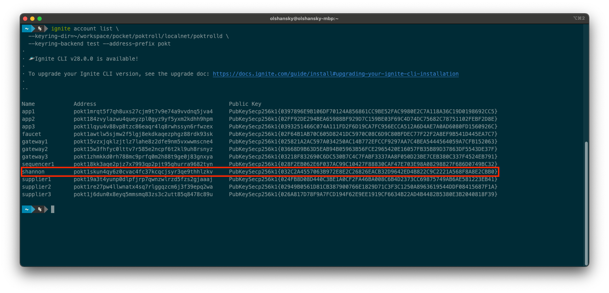

# Quickstart <!-- omit in toc -->

- [Install Dependencies](#install-dependencies)
- [Launch LocalNet](#launch-localnet)
  - [Clone the repository](#clone-the-repository)
  - [Prepare your environment](#prepare-your-environment)
  - [Create a k8s cluster](#create-a-k8s-cluster)
  - [Start up LocalNet](#start-up-localnet)
- [Interact with the chain](#interact-with-the-chain)
  - [Create a new Account](#create-a-new-account)
  - [Fund your account](#fund-your-account)
  - [Stake Shannon as an Application](#stake-shannon-as-an-application)
  - [Send a relay](#send-a-relay)
  - [Send a relay a shannon](#send-a-relay-a-shannon)
- [Explore the tools](#explore-the-tools)
  - [poktrolld](#poktrolld)
  - [Makefile](#makefile)
  - [Ignite](#ignite)

:::tip
The goal of this document is to get you up and running with a LocalNet and
end-to-end relay.

**If you encounter any problems**, the best way to get support
from the team is by creating a new [GitHub Issue here](https://github.com/pokt-network/pocket/issues/new/choose).
:::

## Install Dependencies

Install the following dependencies:

1. [Golang](https://go.dev/doc/install) - The language we use to implement the protocol
2. [Docker](https://docs.docker.com/get-docker/) - Containerization tool
3. [Ignite](https://docs.ignite.com/welcome/install) - Cosmos SDK CLI for building and deploying blockchains
4. [Kind](https://kind.sigs.k8s.io/#installation-and-usage) - k8s local cluster manager
5. [Helm](https://helm.sh/docs/intro/install/#through-package-managers) - k8s configuration and automation tool
6. [Tilt](https://docs.tilt.dev/install.html) - k8s local development tool & environment manager

:::note
You might already have these installed if you've followed the [localnet instructions](./infrastructure/localnet.md).
:::

## Launch LocalNet

This section will help you deploy a Celestia cluster, Pocket LocalNet in a k8s
cluster on your machine.

### Clone the repository

```bash
git clone https://github.com/pokt-network/poktroll.git
cd poktroll
```

### Prepare your environment

Generate mocks, compile the protobufs and verify that all the tests are passing by running:

```bash
make go_develop_and_test
```

### Create a k8s cluster

```bash
kind create cluster
```

### Start up LocalNet

```bash
make localnet_up
```

Visit [localhost:10350](http://localhost:10350) and wait until all the containers are 🟢.

If everything worked as expected, your screen should look similar to the following:


## Interact with the chain

This section is an opinionated walkthrough of a small number of interactions you
can have with the network so you get a feel of how to interact with the chain.

### Create a new Account

List all the accounts we get out of the box by running:

```bash
ignite account list \
  --keyring-dir=./localnet/poktrolld \
  --keyring-backend test --address-prefix pokt
```

And create a new account named `shannon` by running:

```bash
ignite account create shannon \
  --keyring-dir=./localnet/poktrolld \
  --keyring-backend test
```

If you re-run the command above, it should show up in the list.
Make sure to note its address under the `Address` column and export it as an
environment variable for convenience. For example:

```bash
export SHANNON_ADDRESS=pokt1skun4qy6z0cvac4fc37kcqcjsyr3qe9thhlzkv
```



### Fund your account

Query your account's balance by running:

```bash
poktrolld --home=./localnet/poktrolld \
  q bank balances $SHANNON_ADDRESS \
  --node tcp://127.0.0.1:36657
```

And you should see an empty balance:

```yaml
balances: []
pagination:
  next_key: null
  total: "0"
```

But if you look in our genesis file (found at `localnet/poktrolld/config/genesis.json`)
you'll find that our sequencer has a lot of POKT, so we can use some of that.

```bash
poktrolld --home=./localnet/poktrolld \
  tx bank send \
  sequencer1 $SHANNON_ADDRESS 420000000000069upokt \
  --node tcp://127.0.0.1:36657
```

And you'll find that Shannon is now rolling in POKT:

```yaml
balances:
  - amount: "420000000000069"
    denom: upokt
pagination:
  next_key: null
  total: "0"
```

### Stake Shannon as an Application

Run `make app_list` (a helper our team created) to see all the apps staked on the
network. There will be a default application, but `SHANNON_ADDRESS` won't be there.

In order to stake shannon as an app, we need to create a new config file and run
the stake command.

```bash
cat <<EOF >> shannon_app_config.yaml
service_ids:
 - anvil
EOF
```

:::note
Details on all the available configurations are still in progress and will be linked here once ready.
TODO(@red-0ne): Link to the document for all the config files once ready.
:::

We already have a supplier pre-configured (try running `make supplier_list`) to
supply services for anvil (an local ethereum testing node), so we can simply
reused that for simplicity.

Next, run the stake command:

```bash
poktrolld --home=./localnet/poktrolld \
  tx application stake-application 1000upokt \
  --config shannon_app_config.yaml \
  --keyring-backend test --from shannon --node tcp://127.0.0.1:36657
```

If you re-run, `make app_list` you should see that `SHANNON_ADDRESS` is now staked as an app.


### Send a relay

:::danger
Please run `make supplier1_stake && make app1_stake` before sending a relay.
This is related to some techdebt(#180) that will be fixed soon.
:::

If you look in `localnet/poktrolld/config/appgate_server_config.yaml`, you'll find
the configurations for an appgate server that is listening on port `42069`.

You can send a relay to the `anvil` service (i.e. locally running
ethereum node) like so:

```bash
curl -X POST -H "Content-Type: application/json" \
  --data '{"jsonrpc":"2.0","method":"eth_blockNumber","params":[],"id":1}' \
  http://localhost:42069/anvil
```

If everything worked as expected, you should see output similar to the following:

```json
{"jsonrpc":"2.0","id":1,"result":"0x61"}%
```

### Send a relay a shannon

:::danger
TODO(@Olshansk, @red-0ne, @okdas): This part is still a WIP and the last sentence
will likely throw an error.
:::

However, the appgate server above is not configured to sign relays on behalf of Shannon.

To do so, you'll need to create a similar configuration like so:

```yaml
cat <<EOF >> shannon_appgate_config.yaml
self_signing: true
signing_key: shannon
listening_endpoint: http://localhost:42042
query_node_url: tcp://127.0.0.1:36657
EOF
```

And the start the appgate server locally:

```bash
poktrolld --home=./localnet/poktrolld  appgate-server \
  --config shannon_appgate_config.yaml --keyring-backend test \
  --node tcp://127.0.0.1:36657
```

Repeat sending the relay to the new port:

```bash
curl -X POST -H "Content-Type: application/json" \
  --data '{"jsonrpc":"2.0","method":"eth_blockNumber","params":[],"id":1}' \
  http://localhost:42042/anvil
```

## Explore the tools

There are three primary tools you'll use to develop and interact with the network:

1. `poktrolld` - the Pocket Rollup Node
2. `make` - a collection of helpers to make your life easier
3. `ignite` - a tool to manage the local k8s cluster

:::tip

All of these are extensive and you will likely only need a small subset of their
functionality in your day-to-day development. However, knowing of their existence
will help you when you need to do something that you haven't done before.
:::

### poktrolld

Run `poktrolld --help` in order to explore all the different. You will likely
spend most of your time with either `poktrolld query --help` or `poktrolld tx --help`.

### Makefile

Run `make` in order to see all the helpers our team has developed to
improve our development experience.

### Ignite

Run `ignite --help` in order to explore all the different commands.

```

Things to add:

```

flow: curl (client) -> AppGateServer -> Supplier -> Anvil
defaut: localhost -> k8s -> k8s -> k8s
quickstart: localhost -> localhost -.-> k8s -> k8s

```

1. Update /etc/hosts
127.0.0.1       anvil
127.0.0.1       relayminers


TODO(@okdas): avoid restarting celestia when restarting localnet
TODO(@Olshansk): A script that runs all the things at once
```
