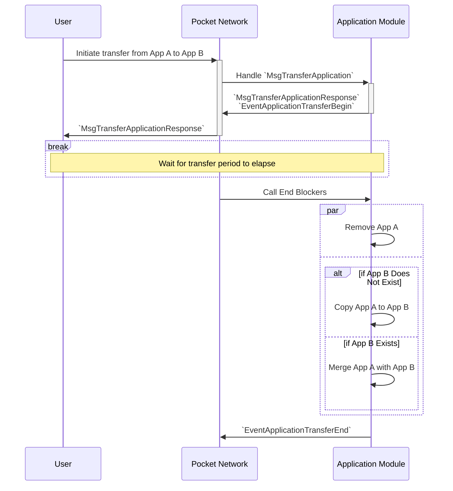
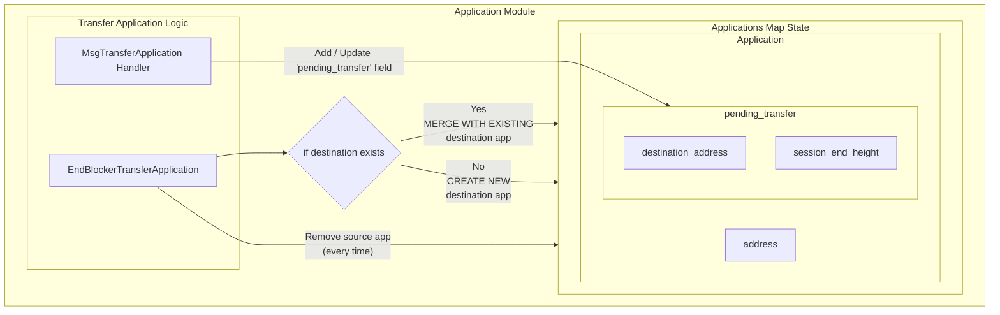

# Transferring an Application <!-- omit in toc -->

- [How to Transfer an Application](#how-to-transfer-an-application)
- [How it Works](#how-it-works)
  - [Application Transfer Sequence](#application-transfer-sequence)
  - [Application Module State Access](#application-module-state-access)
  - [Why is There an Transfer Period?](#why-is-there-an-transfer-period)
- [Gotchas \& Troubleshooting](#gotchas--troubleshooting)
  - [Unstaking - Can I unstake an application which is pending transfer?](#unstaking---can-i-unstake-an-application-which-is-pending-transfer)
  - [Transferred to Wrong Destination - Can I recover from this?](#transferred-to-wrong-destination---can-i-recover-from-this)

## How to Transfer an Application

See `poktrolld tx application transfer --help`:

```bash
Usage:
    poktrolld tx application transfer [source app address] [destination app address] [flags]
```

## How it Works

### Application Transfer Sequence



### Application Module State Access



### Why is There an Transfer Period?

1. **Simplify account** settlement complexities
2. [**Weak subjectivity**](https://blog.ethereum.org/2014/11/25/proof-stake-learned-love-weak-subjectivity): adversarial behaviour + unstake + run away

## Gotchas & Troubleshooting

### Unstaking - Can I unstake an application which is pending transfer?

Applications which are pending transfer cannot be unstaked.

:::warning
Attempting to unstake an application which is pending transfer, will result in an error.
:::

### Transferred to Wrong Destination - Can I recover from this?

If you've mistakenly transferred an application the wrong destination, **so long as you have authority over the destination, recovery is possible**:

1. **Note the destination application's current configuration**

   ```bash
   poktrolld query application show-application <app_address>
   ```

   Example output:

   ```yaml
   application:
     address: pokt1ad28jdap2zfanjd7hpkh984yveney6k9a42man
     delegatee_gateway_addresses: []
     pending_transfer: null
     pending_undelegations: {}
     service_configs:
       - service_id: anvil
       - service_id: rest
       - service_id: ollama
         stake:
         amount: "1000068"
         denom: upokt
         unstake_session_end_height: "0"
   ```

2. **Unstake the destination application**

   ```bash
   poktrolld tx application unstake <app_address> --from <key_name>
   ```

   The application's `unstake_session_end_height` will be set to the current session end height and can be queried with the same command:

   ```bash
   poktrolld query application show-application <app_address>

   # OR More specifically, using `jq` or `yq`
   poktrolld query application show-application <app_address> | yq .application.unstake_session_end_height
   poktrolld query application show-application <app_address> -o json | jq .application.unstake_session_end_height
   ```

3. **Wait for the application unbonding period to elapse**

   The application unbonding period is a governance parameter which in terms of sessions **after** the end height of the session in which the application was unstaked.
   Its value can be queried with:

   ```bash
   poktrolld query shared params

   # OR More specifically, using `jq` or `yq`
   poktrolld query shared params | yq .params.application_unbonding_period_sessions
   poktrolld query shared params -o json | jq .params.application_unbonding_period_sessions
   ```

   The current height can be queried with:

   ```bash
   poktrolld query block

   # OR More specifically, using `jq` or `yq`
   poktrolld query block | yq .header.height
   poktrolld query block -o json | tail -n -1 | jq .header.height
   ```

4. **Re-stake the destination application** with its original or expected configuration and stake

   ```bash
   poktrolld tx application stake <app_address> --config <wrong_destination_restore_config_path> --from <key_name>
   ```

5. **Stake the correct/intended destination application** with the transferred sources configuration and stake

   ```bash
   poktrolld tx application stake <app_address> --config <intended_destination_config_path> --from <key_name>
   ```
